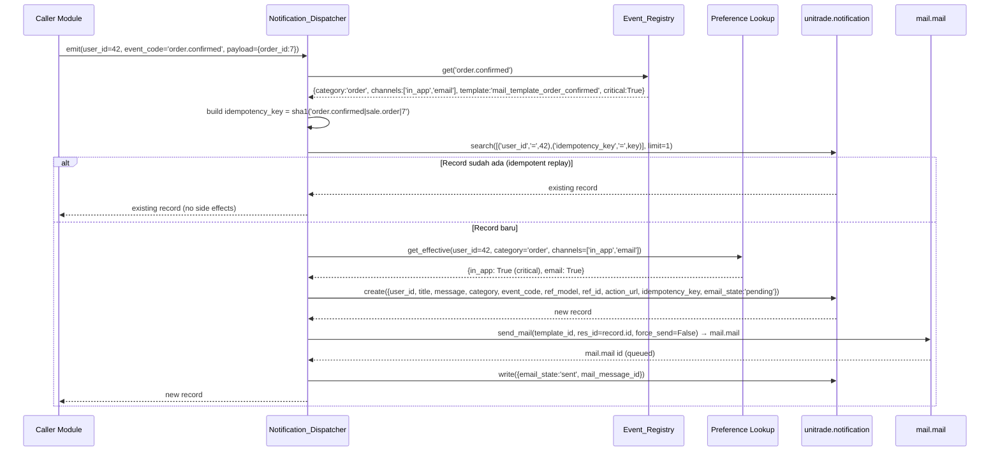
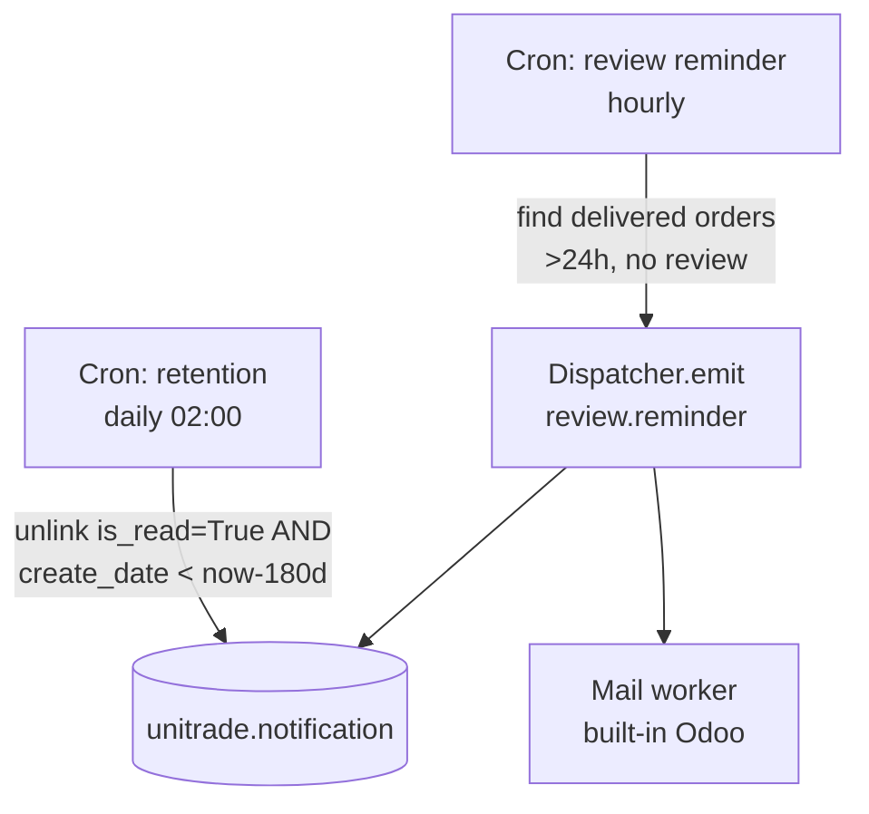
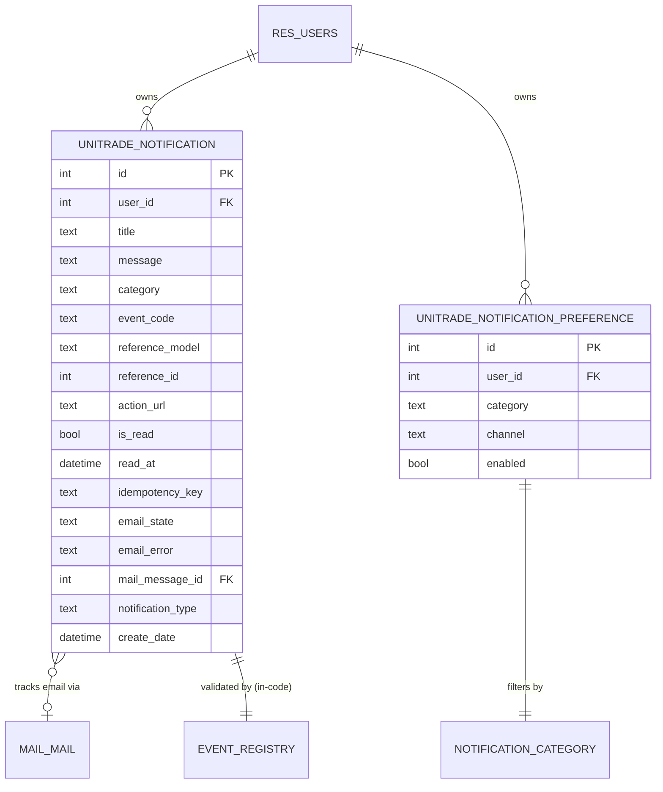

# Design Document — UniTrade Notification System

## Overview

UniTrade Notification System adalah ekstensi modul `unitrade_notification` pada Odoo 17 yang menyediakan satu pusat notifikasi terpadu untuk marketplace C2C UniTrade. Desain berangkat dari kondisi modul saat ini yang baru memiliki model dasar `unitrade.notification` (lima tipe: order, payment, delivery, chat, system), satu mail template (`mail_template_order_confirmed`), dan belum punya dispatcher, preferensi user, notification center, ataupun cakupan event lengkap.

Desain ini menambahkan:

- Ekstensi model `unitrade.notification` (kategori 7-nilai, idempotency key, action_url tervalidasi, email_state, indeks performa).
- Model baru `unitrade.notification.preference` untuk pengaturan on/off per (kategori, channel) per user.
- `Notification_Dispatcher` — entry point tunggal `emit(user_id, event_code, payload)` di model `unitrade.notification` yang menjalankan validasi event, idempotency check, preference check, pembuatan record in-app, dan queueing email via `mail.mail`.
- `Notification_Center` di rute `/my/notifications` (list, filter kategori, mark/mark-all-read, delete) dan `/my/notifications/settings`.
- `Notification_Bell` di navbar — OWL component dengan polling 60 detik ke `/my/notifications/unread_count`, dropdown 5 terbaru.
- Coverage event 7 kategori (account, seller, order, payment, chat, review, system) lengkap dengan mail templates.
- Security: `ir.rule` per-user, validasi `action_url` whitelist, sanitasi payload sensitif.
- Konfigurasi via `ir.config_parameter` (`unitrade.notification.email_from`, `unitrade.notification.broadcast_batch_size`, `unitrade.notification.allowed_url_prefixes`).
- Performance: 2 indeks komposit, retention cron 180 hari, mail queueing non-blocking.

Scope sengaja dibatasi: dua channel (`in_app`, `email`) — tidak ada realtime via `bus.bus` pada iterasi ini, badge counter di-update via polling. Field lama `notification_type` dipertahankan untuk backward compatibility dan diisi otomatis dari `category`.

### Design Principles

1. **Single source of truth**: hanya `Notification_Dispatcher.emit()` yang membuat `Notification_Record`. Modul lain tidak boleh `create()` langsung.
2. **Event-driven via registry**: setiap event_code terdaftar di registry pusat (`EVENT_REGISTRY`) — dispatcher menolak event yang tidak terdaftar.
3. **Idempotent by design**: `idempotency_key = sha1(event_code|reference_model|reference_id|optional_discriminator)` mencegah duplikasi pada retry/webhook re-delivery.
4. **Preference-aware**: dispatcher selalu cek preferensi sebelum kirim, kecuali kategori kritis (`account`, `order`, `payment`) tetap menerima in-app.
5. **Non-blocking email**: email selalu dikirim via `mail.mail` queue, bukan SMTP sinkron — request HTTP tidak terblok.
6. **Defense in depth**: `ir.rule` membatasi akses, controller juga memvalidasi `user_id`, dan `action_url` melewati URL whitelist.

## Architecture

### Module Layout

```
unitrade_notification/
├── __init__.py                          # import models, controllers
├── __manifest__.py                      # depends: mail, unitrade_seller, unitrade_payment, unitrade_chat, unitrade_review
├── models/
│   ├── __init__.py
│   ├── notification.py                  # unitrade.notification (extended) + emit()
│   ├── notification_preference.py       # unitrade.notification.preference
│   └── event_registry.py                # EVENT_REGISTRY dict, CRITICAL_CATEGORIES, helpers
├── controllers/
│   ├── __init__.py
│   └── main.py                          # /my/notifications routes, unread_count, mark/delete, settings
├── data/
│   ├── ir_config_parameter.xml          # default email_from placeholder, batch size
│   ├── ir_cron.xml                      # retention cron + review reminder cron
│   ├── mail_template.xml                # existing order_confirmed + 12 new templates
│   └── notification_event_data.xml      # (optional) seed records
├── security/
│   ├── ir.model.access.csv              # ACL untuk 2 model
│   └── notification_security.xml        # ir.rule per-user
├── static/
│   └── src/
│       ├── js/
│       │   ├── notification_bell.js     # OWL component
│       │   └── notification_service.js  # polling + mark read RPC
│       ├── xml/
│       │   └── notification_bell.xml    # OWL template
│       └── scss/
│           └── notification.scss        # supplemental, mostly tw- classes inline
└── views/
    ├── notification_assets.xml          # assets bundle web.assets_frontend
    ├── notification_templates.xml       # QWeb: notification center, dropdown, settings
    └── notification_admin_views.xml     # backend list/form, filtered failed view, retry button
```

### High-Level Component Diagram

```mermaid
flowchart LR
    subgraph Callers["Caller Modules"]
        A[unitrade_account]
        S[unitrade_seller]
        O[unitrade_order]
        P[unitrade_payment<br/>Midtrans webhook]
        C[unitrade_chat]
        R[unitrade_review]
        Adm[Admin announcement]
    end

    subgraph Core["unitrade_notification"]
        D[Notification_Dispatcher<br/>emit(user_id, event_code, payload)]
        REG[Event_Registry]
        PREF[Notification_Preference]
        REC[(unitrade.notification)]
        TPL[mail.template per event]
    end

    subgraph Mail["Odoo Mail"]
        MM[(mail.mail queue)]
        MW[Mail worker / cron]
        SMTP[SMTP server]
    end

    subgraph UI["User-facing"]
        BELL[Notification_Bell<br/>OWL component]
        CENTER[Notification_Center<br/>/my/notifications]
        SETTINGS[/my/notifications/settings]
    end

    A --> D
    S --> D
    O --> D
    P --> D
    C --> D
    R --> D
    Adm --> D

    D -->|validate| REG
    D -->|check| PREF
    D -->|create / get-existing| REC
    D -->|render+enqueue| TPL
    TPL --> MM
    MW --> MM
    MW --> SMTP

    BELL -->|poll 60s| CENTER
    BELL -->|RPC| REC
    CENTER -->|read/write own| REC
    SETTINGS -->|read/write| PREF
```

### Emit Sequence (Happy Path + Idempotent Replay)



### Cron and Background Jobs



### Trust Boundaries

- **HTTP layer**: controller validates `request.env.user.id` matches notification owner before any read/write/unlink. 403 Forbidden on mismatch.
- **ORM layer**: `ir.rule` enforces `user_id == env.user.id` for non-admin groups (defense-in-depth).
- **Dispatcher boundary**: dispatcher is invoked from trusted server-side code only. Webhooks (e.g. Midtrans payment) call dispatcher inside their already-authenticated handler.
- **`sudo()` policy**: dispatcher uses `sudo()` only when emitting to other users (e.g., seller notification triggered by buyer's order action) — explicitly justified per call site.

## Components and Interfaces

### Notification_Dispatcher (model method on `unitrade.notification`)

Public API:

```python
@api.model
def emit(self, user_id, event_code, payload=None, channels=None, idempotency_discriminator=None):
    """
    Emit one notification for one user.

    :param user_id: int — target res.users id
    :param event_code: str — must exist in EVENT_REGISTRY
    :param payload: dict — context for title/message rendering and email template
        Common keys: reference_model, reference_id, action_url, title_override,
                     message_override, extra (dict for template rendering)
    :param channels: list[str] | None — override registry channels (subset of ['in_app','email'])
    :param idempotency_discriminator: str | None — extra discriminator appended to key
    :return: recordset of unitrade.notification (one record, possibly pre-existing)
    :raises ValueError: if event_code not in registry
    """

@api.model
def broadcast(self, event_code, payload=None, user_domain=None, batch_size=None):
    """
    Emit the same event to many users in batches.
    Used for system.announcement.
    Honors `unitrade.notification.broadcast_batch_size`.
    """

def action_retry_email(self):
    """Backend action: re-enqueue email for failed records."""

def action_mark_read(self):
    """Already exists; preserved. Sets is_read=True, read_at=now()."""

@api.model
def mark_all_as_read(self, user_id):
    """Bulk update is_read=True for all unread records of user_id."""
```

Internal helpers (private, prefixed `_`):

- `_build_idempotency_key(event_code, payload, discriminator)` — sha1 hex digest, deterministic.
- `_render_title_and_message(event_code, payload)` — pulls from registry default + payload overrides.
- `_validate_action_url(url)` — only allows `/`-prefixed paths or hostnames in `unitrade.notification.allowed_url_prefixes`.
- `_get_email_from()` — reads `ir.config_parameter` first, then `company.email`.
- `_send_email_via_template(record, template_xmlid)` — wraps `template.send_mail(record.id, force_send=False)`, sets `email_state` & `mail_message_id`, catches exceptions to set `failed`.

### Event_Registry (`models/event_registry.py`)

A module-level `dict` constant used by dispatcher. Single source for "what events exist".

```python
EVENT_REGISTRY = {
    # account
    'account.welcome':              {'category': 'account', 'channels': ['in_app', 'email'], 'template': 'unitrade_notification.mail_template_account_welcome',           'critical': True},
    'account.password_reset':       {'category': 'account', 'channels': ['email'],           'template': 'unitrade_notification.mail_template_account_password_reset',    'critical': True},
    # seller
    'seller.application_received':  {'category': 'seller',  'channels': ['in_app', 'email'], 'template': 'unitrade_notification.mail_template_seller_application_received','critical': False},
    'seller.approved':              {'category': 'seller',  'channels': ['in_app', 'email'], 'template': 'unitrade_notification.mail_template_seller_approved',           'critical': False},
    'seller.rejected':              {'category': 'seller',  'channels': ['in_app', 'email'], 'template': 'unitrade_notification.mail_template_seller_rejected',           'critical': False},
    # order
    'order.new_for_seller':         {'category': 'order',   'channels': ['in_app', 'email'], 'template': 'unitrade_notification.mail_template_order_new_for_seller',      'critical': True},
    'order.confirmed':              {'category': 'order',   'channels': ['in_app', 'email'], 'template': 'unitrade_notification.mail_template_order_confirmed',           'critical': True},
    'order.shipped':                {'category': 'order',   'channels': ['in_app', 'email'], 'template': 'unitrade_notification.mail_template_order_shipped',             'critical': True},
    'order.delivered':              {'category': 'order',   'channels': ['in_app'],          'template': None,                                                            'critical': True},
    'order.cancelled':              {'category': 'order',   'channels': ['in_app', 'email'], 'template': 'unitrade_notification.mail_template_order_cancelled',           'critical': True},
    # payment
    'payment.success':              {'category': 'payment', 'channels': ['in_app', 'email'], 'template': 'unitrade_notification.mail_template_payment_success',           'critical': True},
    'payment.pending':              {'category': 'payment', 'channels': ['in_app', 'email'], 'template': 'unitrade_notification.mail_template_payment_pending',           'critical': True},
    'payment.failed':               {'category': 'payment', 'channels': ['in_app', 'email'], 'template': 'unitrade_notification.mail_template_payment_failed',            'critical': True},
    'payment.expired':              {'category': 'payment', 'channels': ['in_app', 'email'], 'template': 'unitrade_notification.mail_template_payment_expired',           'critical': True},
    # chat
    'chat.new_message':             {'category': 'chat',    'channels': ['in_app'],          'template': None,                                                            'critical': False},
    # review
    'review.reminder':              {'category': 'review',  'channels': ['in_app'],          'template': None,                                                            'critical': False},
    'review.new_for_seller':        {'category': 'review',  'channels': ['in_app'],          'template': None,                                                            'critical': False},
    # system
    'system.announcement':          {'category': 'system',  'channels': ['in_app', 'email'], 'template': 'unitrade_notification.mail_template_system_announcement',      'critical': False},
}

CRITICAL_CATEGORIES = {'account', 'order', 'payment'}
```

The registry is intentionally kept as Python data (not a model) because (a) it's deployment-time config, (b) misconfigurations should be caught at module load, and (c) tests can monkey-patch easily.

### Notification_Preference

Default preference resolution rule (used by both dispatcher and settings page):

```
effective_enabled(user, category, channel) :=
    if category in CRITICAL_CATEGORIES and channel == 'in_app':
        True   # cannot be disabled
    else:
        record = pref.search([(user_id, category, channel)], limit=1)
        record.enabled if record else True   # default-on if missing
```

Settings page (`/my/notifications/settings`) on first visit calls `_ensure_default_preferences(user_id)` which creates rows for every (category, channel) pair from `EVENT_REGISTRY` channels.

### Controllers (`controllers/main.py`)

| Route | Method | Auth | Type | Purpose |
|---|---|---|---|---|
| `/my/notifications` | GET | `user` | `http` | Render notification center page (list, filter, paginated) |
| `/my/notifications/unread_count` | GET | `user` | `json` | Returns `{count: int}` for bell badge polling |
| `/my/notifications/recent` | GET | `user` | `json` | Returns 5 latest as JSON for bell dropdown |
| `/my/notifications/<int:nid>/read` | POST | `user` | `json` | Mark single notification read |
| `/my/notifications/read_all` | POST | `user` | `json` | Mark all unread as read |
| `/my/notifications/<int:nid>/delete` | POST | `user` | `json` | Delete single notification (owner-only) |
| `/my/notifications/settings` | GET / POST | `user` | `http` | Render and save preferences |

Every controller method:

1. Resolves `user = request.env.user`. If `user._is_public()` → redirect to `/web/login`.
2. For routes operating on a specific `nid`: fetch with `request.env['unitrade.notification'].browse(nid).exists()` and check `record.user_id.id == user.id` (or admin group). On mismatch → `werkzeug.exceptions.Forbidden` (403).
3. Logs via `_logger.info` for write ops.

### Notification_Bell (OWL component)

- Mounted in website navbar via `web.assets_frontend` bundle.
- On mount: fetch `/my/notifications/unread_count`, render badge.
- `setInterval(60_000)` re-fetches; cleared on unmount.
- Click bell → fetch `/my/notifications/recent`, render dropdown (max 5 + "Lihat semua" + "Pengaturan" links).
- Click an item → POST `/my/notifications/<id>/read`, then `window.location = action_url` if present.
- Tailwind `tw-` prefix throughout. Badge hidden via `tw-hidden` when count is 0; shows `99+` when count > 99 (computed client-side).

### Notification_Center page

Server-rendered QWeb (`website.layout`). Uses tabs/dropdown for category filter. Pagination via `?page=N&category=order`. Buttons (mark read, delete, mark-all) submit to JSON RPC endpoints listed above; page re-renders or updates DOM via small inline OWL/JS. Tailwind `tw-` prefix; palette from `unitrade_theme`.

### Admin views (`notification_admin_views.xml`)

- Backend list view of `unitrade.notification` filtered by `email_state='failed'` for admins.
- Form view exposing `email_state`, `email_error`, retry button (`action_retry_email`).
- Restricted to `unitrade_seller.group_unitrade_admin` and `base.group_system`.

## Data Models

### `unitrade.notification` (extended)

```python
class UnitradeNotification(models.Model):
    _name = 'unitrade.notification'
    _description = 'UniTrade System Notification'
    _order = 'create_date desc, id desc'

    user_id           = fields.Many2one('res.users', required=True, index=True, ondelete='cascade')
    title             = fields.Char(required=True)
    message           = fields.Text()
    category          = fields.Selection([
        ('account', 'Akun'), ('seller', 'Seller'), ('order', 'Pesanan'),
        ('payment', 'Pembayaran'), ('chat', 'Chat'), ('review', 'Review'),
        ('system', 'Sistem'),
    ], required=True, index=True)
    event_code        = fields.Char(required=True, index=True)
    reference_model   = fields.Char()
    reference_id      = fields.Integer()
    action_url        = fields.Char()
    is_read           = fields.Boolean(default=False, index=True)
    read_at           = fields.Datetime()
    idempotency_key   = fields.Char(index=True)
    email_state       = fields.Selection([
        ('not_applicable', 'Not Applicable'), ('pending', 'Pending'),
        ('sent', 'Sent'), ('failed', 'Failed'),
    ], default='not_applicable')
    email_error       = fields.Text()
    mail_message_id   = fields.Many2one('mail.mail', ondelete='set null')
    notification_type = fields.Selection([
        ('order','Pesanan'), ('payment','Pembayaran'), ('delivery','Pengiriman'),
        ('chat','Chat'), ('system','Sistem'),
    ])  # backward-compat; auto-mapped from category in create()

    _sql_constraints = [
        ('uniq_user_idempotency',
         'UNIQUE(user_id, idempotency_key)',
         'Notifikasi duplikat untuk user yang sama tidak diperbolehkan.'),
    ]

    def init(self):
        # Composite indexes via SQL (Odoo cr.execute) since field-level index covers single column only.
        tools.create_index(self._cr, 'unitrade_notif_user_isread_idx',
                           self._table, ['user_id', 'is_read'])
        tools.create_index(self._cr, 'unitrade_notif_user_cat_date_idx',
                           self._table, ['user_id', 'category', 'create_date'])
```

**Backward compatibility mapping** (executed in overridden `create()`):

| `category`  | `notification_type` |
|---|---|
| `order`     | `order` |
| `payment`   | `payment` |
| `chat`      | `chat` |
| `system`    | `system` |
| `account`, `seller`, `review` | `system` (fallback, since old enum doesn't have these) |
| explicit `notification_type` in vals | preserved (caller wins) |

### `unitrade.notification.preference`

```python
class UnitradeNotificationPreference(models.Model):
    _name = 'unitrade.notification.preference'
    _description = 'UniTrade Notification Preference'
    _rec_name = 'category'

    user_id  = fields.Many2one('res.users', required=True, index=True, ondelete='cascade')
    category = fields.Selection(SAME_7_VALUES, required=True)
    channel  = fields.Selection([('in_app', 'In-App'), ('email', 'Email')], required=True)
    enabled  = fields.Boolean(default=True)

    _sql_constraints = [
        ('uniq_user_cat_chan',
         'UNIQUE(user_id, category, channel)',
         'Preferensi unik per (user, kategori, channel).'),
    ]
```

### Entity Relationship



### Indexes (Summary)

| Index | Columns | Purpose |
|---|---|---|
| `unitrade_notification_user_id_index` (auto, from `index=True`) | `user_id` | Generic lookup |
| `unitrade_notif_user_isread_idx` | `user_id, is_read` | Unread counter `/unread_count` (Req 9.3) |
| `unitrade_notif_user_cat_date_idx` | `user_id, category, create_date` | Notification center filter+sort (Req 9.2) |
| Unique `uniq_user_idempotency` | `user_id, idempotency_key` | Idempotency (Req 1.4) |
| Unique `uniq_user_cat_chan` | `user_id, category, channel` | Preference key |

### Data Integrity Rules

- `event_code` must be a key in `EVENT_REGISTRY`. Enforced in dispatcher; unknown codes raise `ValueError` and never reach DB.
- `category` must equal `EVENT_REGISTRY[event_code]['category']`; dispatcher overwrites any caller-supplied value to keep them in sync.
- `idempotency_key` is computed by dispatcher; not user-supplied.
- `action_url` is validated via `_validate_action_url`. Disallowed values are stripped (set to `False`) and a warning is logged — record still created.

### Configuration Parameters (`ir.config_parameter`)

| Key | Default | Used by |
|---|---|---|
| `unitrade.notification.email_from` | `''` (falls back to `company.email`) | `_get_email_from` (Req 6.5, 8.1) |
| `unitrade.notification.broadcast_batch_size` | `200` | `broadcast()` (Req 8.2) |
| `unitrade.notification.allowed_url_prefixes` | `'/'` | `_validate_action_url` (Req 7.4) |
| `unitrade.notification.retention_days` | `180` | retention cron (Req 9.4) |


## Correctness Properties

*A property is a characteristic or behavior that should hold true across all valid executions of a system — essentially, a formal statement about what the system should do. Properties serve as the bridge between human-readable specifications and machine-verifiable correctness guarantees.*

The following properties were derived from prework analysis of the requirements. Per-event integration scenarios in Requirement 5 are intentionally implemented as example-based unit tests at each caller site (covered by Testing Strategy below); the universal invariants of the dispatcher itself are formalized here.

### Property 1: Emit Idempotency

*For any* tuple `(user_id, event_code, reference_model, reference_id, idempotency_discriminator)` where `event_code ∈ EVENT_REGISTRY`, calling `Notification_Dispatcher.emit(...)` two or more times produces exactly one `Notification_Record` for that user, and every call returns the same record id.

**Validates: Requirements 1.4, 1.5, 1.6, 10.1**

### Property 2: Category-to-Type Backward Mapping

*For any* `event_code ∈ EVENT_REGISTRY`, the resulting `Notification_Record` has a non-null `notification_type` consistent with the mapping table where `category ∈ {order, payment, chat, system}` maps directly and `category ∈ {account, seller, review}` maps to `system`. When the caller provides an explicit `notification_type` in `vals`, it is preserved.

**Validates: Requirements 1.7**

### Property 3: Default Preferences Seeding Idempotence

*For any* `user_id` with no existing preference rows, calling `_ensure_default_preferences(user_id)` once creates exactly one row per supported `(category, channel)` pair (all `enabled=True`); calling it any number of additional times produces no new rows and modifies no existing ones.

**Validates: Requirements 2.2**

### Property 4: Preference Enforcement With Critical Override

*For any* `event_code ∈ EVENT_REGISTRY` and `user_id`:
- If `category ∉ CRITICAL_CATEGORIES` and the preference for `(user_id, category, 'in_app')` is `enabled=False`, then `emit` does NOT create an in-app `Notification_Record`.
- If `category ∈ CRITICAL_CATEGORIES`, then `emit` always creates an in-app `Notification_Record` regardless of preference.
- For the `email` channel, `emit` enqueues a `mail.mail` if and only if the registry channels include `'email'` AND the preference for `(user_id, category, 'email')` is `enabled=True`.

**Validates: Requirements 2.4, 2.5, 10.5**

### Property 5: List Query Invariants

*For any* user `U`, any backing dataset of `Notification_Record`s across multiple users, and any pagination parameters `(page, category_filter)`, the list returned by the notification center query satisfies:
- Every record `r` in the result has `r.user_id == U.id` (isolation).
- If `category_filter ≠ 'all'`, every record has `r.category == category_filter` (filter correctness).
- The result is sorted by `create_date` descending, ties broken by `id` descending (ordering).
- `len(result) ≤ 20` (page size).

**Validates: Requirements 3.1, 3.2, 4.1, 4.4, 9.1, 10.2**

### Property 6: Mark-as-Read Invariants

*For any* user `U` and any state of their notifications:
- Calling `action_mark_read` on an unread record `r` owned by `U` results in `r.is_read == True` and `r.read_at` set to a non-null datetime; subsequent calls on the same record do not modify `read_at`.
- After `mark_all_as_read(U)`, the unread counter for `U` equals `0`.
- Calling `mark_all_as_read(U)` again immediately produces no further writes (idempotent), and unread counters of any other user are unchanged.

**Validates: Requirements 3.3, 3.4, 10.3**

### Property 7: Deletion Ownership and Consistency

*For any* `Notification_Record` `r` and any user `U`:
- If `U.id == r.user_id`, the delete controller endpoint succeeds, `r` no longer appears in subsequent list queries for `U`, and the unread counter for `U` decreases by exactly `1` if `r.is_read == False` (otherwise unchanged).
- If `U.id ≠ r.user_id` and `U` is not in the admin group, the delete controller raises a `403 Forbidden` and `r` continues to exist.

**Validates: Requirements 3.5, 3.6, 10.4**

### Property 8: Bell Badge Rendering

*For any* non-negative integer `count`, the `Notification_Bell` badge rendering function produces:
- The badge is hidden when `count == 0`.
- The badge displays `str(count)` when `1 ≤ count ≤ 99`.
- The badge displays `'99+'` when `count > 99`.

**Validates: Requirements 4.2, 4.3**

### Property 9: Chat Grouping Window

*For any* sequence of `chat.new_message` emit calls for the same `(chat_id, recipient_id)` arriving within a 10-minute window where the recipient is not currently viewing the chat, exactly one `Notification_Record` exists for that `(chat_id, recipient_id, window)` pair. A new emit after the 10-minute window has elapsed produces a new record.

**Validates: Requirements 5.12**

### Property 10: Review Reminder Uniqueness

*For any* `(buyer_id, order_id)` pair where the order has been delivered and 24 hours have elapsed without a buyer review, running the review-reminder cron any number of times produces exactly one `review.reminder` notification for that pair.

**Validates: Requirements 5.13**

### Property 11: Email Lifecycle State Machine

*For any* `event_code` whose registry entry includes channel `'email'` and whose target user has the email preference enabled:
- Successful enqueue to `mail.mail` results in `email_state ∈ {'pending', 'sent'}` and `mail_message_id` set.
- An exception during enqueue results in `email_state == 'failed'` and `email_error` populated with the stacktrace.
- Calling `action_retry_email` on a failed record transitions `email_state` to either `'sent'` (success) or `'failed'` (still failing) and updates `mail_message_id` accordingly. The state never regresses from `'sent'` back to `'pending'`.

**Validates: Requirements 6.6, 8.4, 8.5**

### Property 12: Email From Resolution

*For any* configuration of `ir.config_parameter` `unitrade.notification.email_from` (set to a non-empty value, set to empty, or absent), `_get_email_from()` returns the parameter value when non-empty, otherwise the active company's `email`, otherwise raises a configured fallback. The function is pure with respect to the configuration snapshot.

**Validates: Requirements 6.5, 8.1**

### Property 13: User Isolation via `ir.rule`

*For any* two distinct non-admin users `U1` and `U2`, and any `Notification_Record` `r` owned by `U2`, an ORM read or write performed under `U1`'s context (`env(user=U1)`) cannot retrieve or modify `r`. Search returns an empty recordset; explicit write or unlink raises `AccessError`.

**Validates: Requirements 7.1**

### Property 14: Sensitive Payload Scrubbing

*For any* `payload` dict supplied to `emit`, the rendered `title`, `message`, and email body do not contain values associated with sensitive keys (e.g., `password`, `password_reset_token`, `api_key`, `midtrans_server_key`). The dispatcher strips such keys from the rendering context before invoking templates.

**Validates: Requirements 7.2**

### Property 15: Unknown Event Rejection

*For any* string `code` that is not a key in `EVENT_REGISTRY`, calling `emit(user_id, code, payload)` raises `ValueError`, logs a `WARNING` via `_logger`, and creates no `Notification_Record`.

**Validates: Requirements 7.3**

### Property 16: Action URL Whitelist

*For any* string `url` candidate, `_validate_action_url(url)` returns:
- `url` unchanged when `url` starts with `'/'` (relative internal path).
- `url` unchanged when `url` is an absolute URL whose scheme is `https` and whose host is in `unitrade.notification.allowed_url_prefixes`.
- `False` (and a warning is logged) for every other input, including malformed URLs, `javascript:` URIs, and external hosts not in the allowlist.

**Validates: Requirements 7.4**

### Property 17: Emit Logging

*For any* successful or skipped `emit` call, exactly one `_logger.info` record is produced whose message contains `user_id`, `event_code`, and a result token in `{'created', 'skipped', 'duplicate'}`.

**Validates: Requirements 8.3**

### Property 18: Retention Cron Correctness

*For any* mix of `Notification_Record`s with varying `(is_read, create_date)` values, after running the retention cron with retention threshold `T = unitrade.notification.retention_days` (default 180):
- All records with `is_read == True` AND `create_date < now() - T days` are deleted.
- All other records (unread, or read-but-younger) are preserved unchanged.

**Validates: Requirements 9.4**

### Property 19: Non-Blocking Email Enqueue

*For any* event whose registry channels include `'email'`, the dispatcher invokes `template.send_mail(..., force_send=False)` so that the actual SMTP transmission is delegated to Odoo's mail worker. The dispatcher's `emit` returns within a bounded time independent of SMTP latency.

**Validates: Requirements 9.5**

## Error Handling

### Error Categories and Responses

| Error | Where | User-facing | Logged | DB State |
|---|---|---|---|---|
| Unknown `event_code` | dispatcher | n/a (caller bug) | `WARNING` with stacktrace | no record |
| Duplicate `idempotency_key` | dispatcher | n/a | `INFO` `result=duplicate` | existing record returned |
| Disabled preference | dispatcher | n/a | `INFO` `result=skipped` | no record (or no email) |
| Invalid `action_url` | dispatcher | n/a | `WARNING` | record created with `action_url=False` |
| Mail enqueue failure | dispatcher | n/a | `WARNING` with stacktrace | `email_state='failed'`, `email_error` populated |
| Mail send failure (later, in worker) | mail worker | n/a | Odoo built-in | `mail.mail` state captured separately; we sync via cron or admin retry |
| Forbidden access (controller) | `/my/notifications/<id>/*` | 403 page | `WARNING` with `user_id`, `record_id` | no change |
| Public user accessing center | controller | redirect to `/web/login` | none | none |
| `IntegrityError` on insert (race condition on idempotency) | dispatcher | n/a | `INFO`, retry as duplicate | re-fetch existing record |

### Race Conditions and Concurrency

The unique constraint `uniq_user_idempotency` is the authoritative concurrency guard. The dispatcher implementation:

1. Optimistic search-then-create.
2. Wrap `create()` in a savepoint.
3. On `IntegrityError` whose `pgcode='23505'`, rollback to savepoint and re-search by `(user_id, idempotency_key)`. Return the now-existing record.

This pattern is the standard Odoo-friendly idempotent insert and avoids serializing all dispatcher calls.

### Error Recovery

- **Failed emails**: surfaced in admin view filtered by `email_state='failed'`. Manual retry button calls `action_retry_email` which re-renders the template and re-enqueues. After 3 retries with stable failure, the record stays `failed` for human review (no auto-retry loop).
- **Broadcast partial failure**: `broadcast()` processes batches inside try/except per batch. Failures in one batch log `WARNING` and continue to the next; failed records stay with `email_state='failed'` for retry.
- **Cron failure**: standard Odoo cron behavior — failure logs traceback, next scheduled run retries.

## Testing Strategy

### Test Inventory

| Layer | Library | Approx. count | Purpose |
|---|---|---|---|
| Unit (Python `TransactionCase`) | `odoo.tests.common` | ~30 examples | Per-event integration: each Requirement 5 event_code calling dispatcher correctly; ACL CSV existence; field schema; mail template xmlid resolution |
| Property-based | `hypothesis` (Python) | 19 properties × ≥100 iterations | Properties listed in Correctness Properties section |
| Controller (`HttpCase`) | `odoo.tests.common.HttpCase` | ~10 examples | `/my/notifications` GET/POST flows, 403 enforcement, settings save, bell endpoints |
| Frontend (QUnit/OWL) | `web.tests.qunit` | ~3 | Bell render rule (Property 8 client-side); polling interval config; dropdown click-through |
| Integration (smoke) | `TransactionCase` | ~5 | Postgres index existence; cron registration; manifest depends valid |

### Property-Based Testing Approach

- **Library**: [`hypothesis`](https://hypothesis.readthedocs.io/) — chosen because the project is Python/Odoo and `hypothesis` integrates cleanly with `unittest.TestCase` (parent of Odoo's `TransactionCase`). Run inside Odoo test runner with `-i unitrade_notification --test-enable`.
- **Iteration count**: `@hypothesis.settings(max_examples=100, deadline=None)` minimum on every property test (deadline disabled because Odoo ORM in transactional fixtures can be slow).
- **Strategies** (located in `tests/strategies.py`):
  - `event_codes()` → `st.sampled_from(list(EVENT_REGISTRY.keys()))`
  - `non_critical_event_codes()` / `critical_event_codes()`
  - `payloads()` → `st.fixed_dictionaries({'reference_model': st.text(), 'reference_id': st.integers(min_value=1), 'extra': st.dictionaries(...)})`
  - `urls()` → mix of valid relative paths, https URLs in/out of allowlist, malformed strings, `javascript:` schemes
  - `counts()` → `st.integers(min_value=0, max_value=10_000)` for badge rendering
  - `notification_states()` → composite strategies that pre-create a population of records via Odoo ORM in fixture phase
- **Side effects**: properties that need DB state use `@pytest.fixture` style setup inside the `setUp` of `TransactionCase`. Each `@given` invocation runs inside a savepoint that is rolled back, so state generated by hypothesis does not leak between iterations.
- **Mocks**: `mail.mail.send` is mocked to avoid real SMTP. SMTP latency mocking for Property 19 uses a `time.sleep` wrapper that is bounded.

### PBT Tag Format

Each property test is tagged with a comment line linking it to the design property:

```python
# Feature: unitrade-notification-system, Property 1: Emit Idempotency
@given(user_id=st.integers(min_value=1), event_code=event_codes(), payload=payloads())
@settings(max_examples=100, deadline=None)
def test_emit_idempotency(self, user_id, event_code, payload):
    ...
```

### Unit Tests

- **Per-event integration** (Requirements 5.1–5.15): one `test_event_<code>` per registry entry verifying that the corresponding caller-side hook (e.g., `unitrade_payment.controllers.midtrans` Midtrans webhook handler) calls `dispatcher.emit` with the expected `event_code`, `user_id` (buyer or seller), and payload keys. Implemented as mocks of `unitrade.notification.emit` to assert call args; no real cross-module integration is required at this layer.
- **Schema/SMOKE tests**: assert all required fields exist on `unitrade.notification`; assert all 7 categories present; assert all `EVENT_REGISTRY` template xmlids resolve; assert `ir.model.access.csv` rows exist; assert composite indexes exist in `pg_indexes`.
- **Controller examples** (Requirements 3.x, 4.x): `HttpCase` flows with logged-in user; assert HTTP status, redirect targets, JSON shape; assert 403 on cross-user access.
- **Frontend QUnit**: minimal — assert OWL component instantiates with `pollInterval=60000` and that the badge text computation matches Property 8 (also covered server-side).

### Why PBT Applies Here

Most of the dispatcher's contract is "for all events / for all users / for all preferences, the following invariants hold." This is the textbook PBT use case: pure-ish business logic with a large input space (event × user × preference state × idempotency tuple). Hypothesis-generated inputs reliably surface edge cases (empty strings, tricky unicode in payloads, large counts, simultaneous duplicates, etc.) that example-based tests miss.

The features that are NOT property-based:
- **Tailwind/UI styling** (Req 3.7) — visual rule, snapshot/manual review.
- **Performance budgets** (Req 9.2, 9.3) — benchmarks, not properties.
- **Polling interval** (Req 4.6) — frontend timer config, configuration smoke test.
- **Per-event integration callers** (Req 5.1–5.15) — concrete scenarios, example-based unit tests with mocks.
- **Mail template visual layout** (Req 6.4) — grep/snapshot tests for footer link presence.

### Coverage Mapping

| Requirement | Test type | Covered by |
|---|---|---|
| 1.1, 1.2, 1.3, 1.8 | SMOKE | schema_test |
| 1.4, 1.5, 1.6 | PROPERTY | Property 1 |
| 1.7 | PROPERTY | Property 2 |
| 2.1 | SMOKE | schema_test |
| 2.2 | PROPERTY | Property 3 |
| 2.3 | EXAMPLE | HttpCase settings flow |
| 2.4, 2.5 | PROPERTY | Property 4 |
| 3.1, 3.2 | PROPERTY | Property 5 |
| 3.3, 3.4 | PROPERTY | Property 6 |
| 3.5, 3.6 | PROPERTY | Property 7 |
| 3.7 | SMOKE | grep template |
| 4.1, 4.4 | PROPERTY | Property 5 |
| 4.2, 4.3 | PROPERTY | Property 8 |
| 4.5 | EXAMPLE | HttpCase click-through |
| 4.6 | SMOKE | QUnit config |
| 5.1–5.15 | EXAMPLE | per-event mock tests (15 tests) |
| 5.12 | PROPERTY | Property 9 |
| 5.13 | PROPERTY | Property 10 |
| 6.1, 6.2, 6.3 | SMOKE | template_xmlid_test |
| 6.4 | SMOKE | grep settings link |
| 6.5 | PROPERTY | Property 12 |
| 6.6 | PROPERTY | Property 11 |
| 7.1 | PROPERTY | Property 13 |
| 7.2 | PROPERTY | Property 14 |
| 7.3 | PROPERTY | Property 15 |
| 7.4 | PROPERTY | Property 16 |
| 8.1 | PROPERTY | Property 12 |
| 8.2 | EXAMPLE | broadcast batch helper test |
| 8.3 | PROPERTY | Property 17 |
| 8.4 | PROPERTY | Property 11 |
| 8.5 | PROPERTY + SMOKE | Property 11 + view_xmlid_test |
| 9.1 | SMOKE | pg_indexes_test |
| 9.2, 9.3 | benchmark | optional out-of-suite |
| 9.4 | PROPERTY | Property 18 |
| 9.5 | PROPERTY | Property 19 |
| 10.1 | PROPERTY | Property 1 |
| 10.2 | PROPERTY | Property 5 |
| 10.3 | PROPERTY | Property 6 |
| 10.4 | PROPERTY | Property 7 |
| 10.5 | PROPERTY | Property 4 |

### Test Execution

```powershell
# From workspace root, with Odoo dev addons path configured:
.\odoo-bin -c odoo.conf -d unitrade_test -i unitrade_notification --test-enable --stop-after-init --log-level=test
```

Hypothesis configuration is read from `tests/conftest.py`: `settings.register_profile('odoo', max_examples=100, deadline=None)`; `settings.load_profile('odoo')`.
