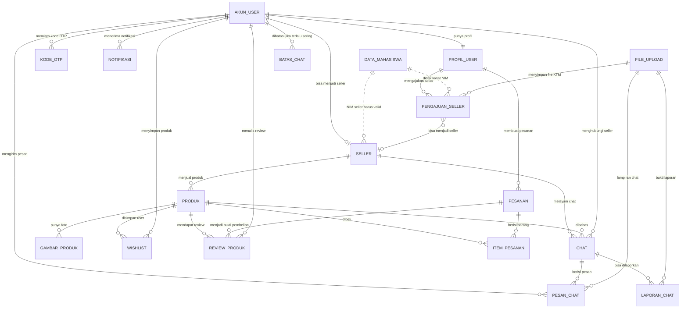
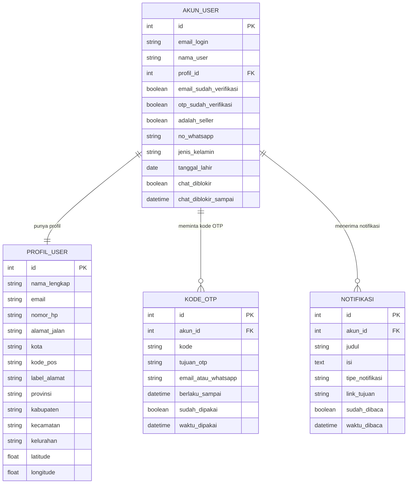
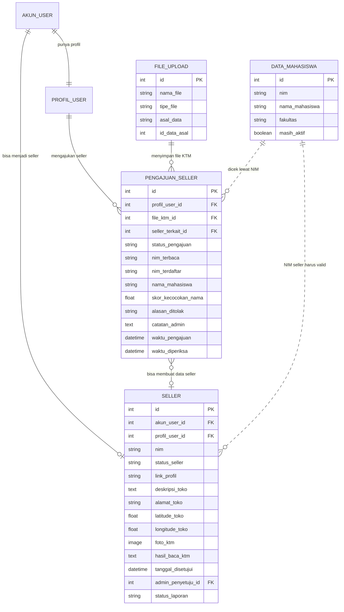
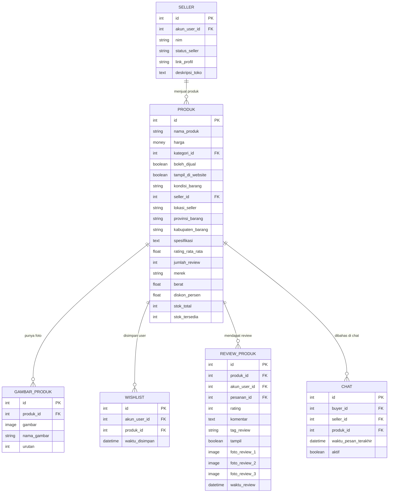
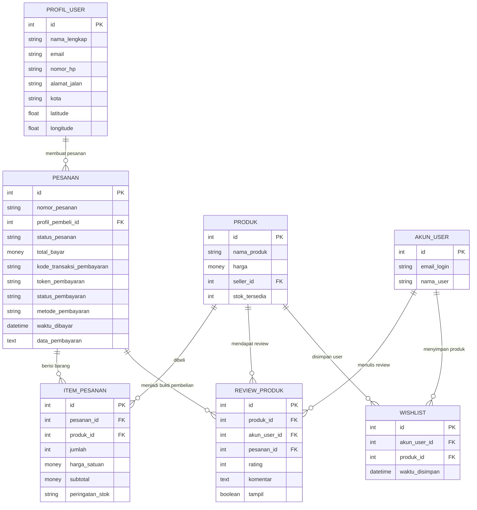
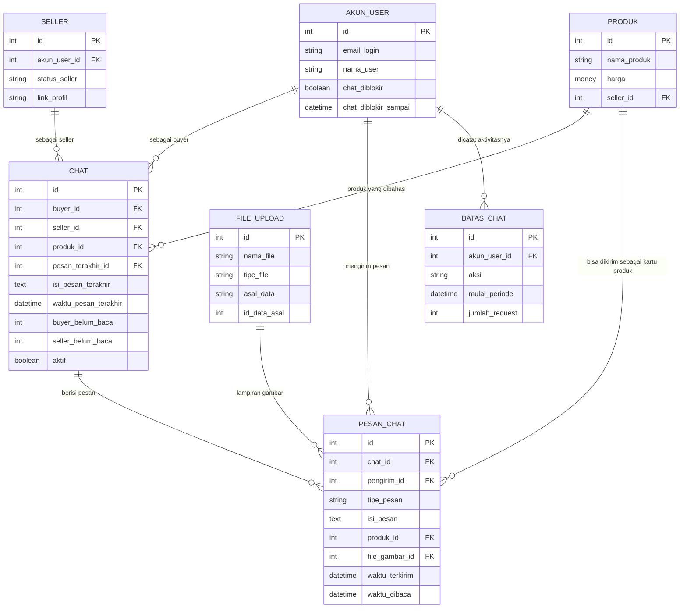
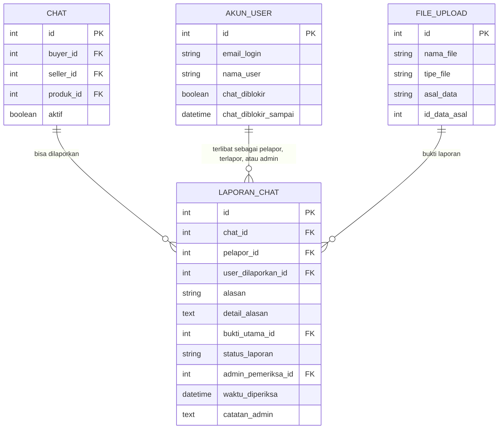

# ERD UniTrade Marketplace

Dokumen ini menjelaskan hubungan data utama di project UniTrade dengan bahasa yang lebih umum dan mudah dibaca. Diagram dibuat dengan Mermaid, jadi jika file ini di-upload ke GitHub, diagram akan tampil otomatis.

Catatan agar mudah dibaca:

- Nama seperti `AKUN_USER` dibaca sebagai "Akun User". Garis bawah hanya dipakai agar format diagram bisa dibaca Mermaid.
- Saya hanya menampilkan data penting yang membantu memahami fitur, bukan semua kolom bawaan sistem.
- Relasi yang diberi label "dicek lewat NIM" berarti datanya dicocokkan berdasarkan aturan bisnis.

## Cara Membaca ERD

| Simbol | Arti sederhana |
| --- | --- |
| `||` | Satu data wajib ada |
| `o|` | Boleh kosong, maksimal satu |
| `o{` | Boleh kosong, bisa banyak |
| `}|` | Minimal satu, bisa banyak |

Contoh: `AKUN_USER ||--o{ KODE_OTP` artinya satu akun bisa meminta banyak kode OTP, tetapi satu kode OTP hanya milik satu akun.

## Kamus Nama Data

| Nama di diagram | Arti mudahnya |
| --- | --- |
| `AKUN_USER` | Data akun untuk login, register, dan hak akses |
| `PROFIL_USER` | Data pribadi user, alamat, nomor HP, dan lokasi |
| `KODE_OTP` | Kode verifikasi untuk email, WhatsApp, atau reset password |
| `NOTIFIKASI` | Pesan pemberitahuan untuk user |
| `DATA_MAHASISWA` | Data mahasiswa UNISA untuk validasi NIM |
| `PENGAJUAN_SELLER` | Pengajuan user untuk menjadi seller |
| `SELLER` | Data toko atau akun penjual yang sudah disetujui |
| `PRODUK` | Barang yang dijual di marketplace |
| `GAMBAR_PRODUK` | Foto tambahan untuk produk |
| `PESANAN` | Transaksi pembelian |
| `ITEM_PESANAN` | Daftar barang di dalam satu pesanan |
| `REVIEW_PRODUK` | Ulasan pembeli untuk produk |
| `WISHLIST` | Produk yang disimpan user |
| `CHAT` | Percakapan antara buyer dan seller |
| `PESAN_CHAT` | Isi pesan di dalam chat |
| `BATAS_CHAT` | Catatan pembatas aktivitas chat agar tidak spam |
| `LAPORAN_CHAT` | Laporan pelanggaran chat |
| `FILE_UPLOAD` | File atau gambar yang diunggah user |

## 1. ERD Besar UniTrade

Diagram ini menunjukkan hubungan utama antar fitur.

## 2. Akun, Profil, OTP, dan Notifikasi

Bagian ini dipakai untuk fitur register, login, verifikasi akun, reset password, edit profil, dan notifikasi.

Alur data sederhananya:

1. User membuat akun, lalu sistem menyimpan `AKUN_USER` dan `PROFIL_USER`.
2. Saat verifikasi atau reset password, sistem membuat `KODE_OTP`.
3. Jika ada informasi penting, sistem membuat `NOTIFIKASI` untuk akun tersebut.

## 3. Seller, Mahasiswa, dan Verifikasi KTM

Bagian ini dipakai untuk fitur daftar seller, upload KTM, pengecekan NIM, dan persetujuan seller oleh admin.

Alur data sederhananya:

1. User mengirim pengajuan seller melalui `PENGAJUAN_SELLER`.
2. File KTM disimpan sebagai `FILE_UPLOAD`.
3. NIM dari KTM dicocokkan ke `DATA_MAHASISWA`.
4. Jika valid dan admin menyetujui, user mendapatkan data `SELLER`.

## 4. Produk Marketplace

Bagian ini dipakai untuk fitur tambah produk, tampilkan produk, filter pencarian, wishlist, review, dan chat produk.

Alur data sederhananya:

1. Seller membuat `PRODUK`.
2. Foto tambahan produk disimpan di `GAMBAR_PRODUK`.
3. User bisa menyimpan produk ke `WISHLIST`.
4. Setelah membeli, user bisa menulis `REVIEW_PRODUK`.
5. Produk juga bisa menjadi topik awal di `CHAT`.

## 5. Pesanan, Pembayaran, Review, dan Wishlist

Bagian ini dipakai untuk checkout, pembayaran, daftar barang yang dibeli, wishlist, dan review setelah pembelian.

Alur data sederhananya:

1. Buyer membuat `PESANAN`.
2. Barang yang dibeli disimpan sebagai `ITEM_PESANAN`.
3. Status pembayaran disimpan di `PESANAN`.
4. Jika pesanan valid, buyer bisa membuat `REVIEW_PRODUK`.
5. Produk yang belum dibeli bisa disimpan ke `WISHLIST`.

## 6. Chat Buyer dan Seller

Bagian ini dipakai untuk fitur chat produk, kirim pesan, kirim gambar, status belum dibaca, dan pembatasan spam.

Alur data sederhananya:

1. Buyer membuka chat dengan seller untuk satu produk.
2. Sistem membuat `CHAT`.
3. Setiap pesan masuk ke `PESAN_CHAT`.
4. Jika pesan berisi gambar, file gambar masuk ke `FILE_UPLOAD`.
5. Aktivitas chat dicatat di `BATAS_CHAT` untuk mencegah spam.

## 7. Laporan Chat dan Moderasi

Bagian ini dipakai saat user melaporkan pesan atau percakapan yang bermasalah.

Alur data sederhananya:

1. User membuat `LAPORAN_CHAT` untuk satu `CHAT`.
2. Laporan menyimpan siapa pelapor dan siapa user yang dilaporkan.
3. Bukti gambar disimpan sebagai `FILE_UPLOAD`.
4. Admin memeriksa laporan, mengubah status, dan bisa memblokir chat user jika perlu.

## Ringkasan Relasi Utama

| Data utama | Terhubung ke | Penjelasan sederhana |
| --- | --- | --- |
| Akun User | Profil User | Satu akun punya satu profil |
| Akun User | Kode OTP | Satu akun bisa meminta banyak OTP |
| Akun User | Seller | Satu akun bisa punya satu data seller |
| Profil User | Pengajuan Seller | Satu profil bisa mengajukan verifikasi seller |
| Pengajuan Seller | File Upload | Pengajuan seller menyimpan file KTM |
| Data Mahasiswa | Pengajuan Seller | NIM dari KTM dicek ke data mahasiswa |
| Seller | Produk | Satu seller bisa menjual banyak produk |
| Produk | Gambar Produk | Satu produk bisa punya banyak foto |
| Profil User | Pesanan | Satu profil buyer bisa membuat banyak pesanan |
| Pesanan | Item Pesanan | Satu pesanan berisi banyak barang |
| Produk | Review Produk | Satu produk bisa punya banyak review |
| Akun User | Wishlist | Satu akun bisa menyimpan banyak produk |
| Chat | Pesan Chat | Satu chat berisi banyak pesan |
| Chat | Laporan Chat | Satu chat bisa memiliki laporan |
| File Upload | Pesan atau Laporan | File bisa dipakai sebagai lampiran atau bukti |

