# Flowchart Fitur UniTrade

Dokumen ini merangkum alur fitur yang sudah terlihat ada di project UniTrade. Bahasa dibuat lebih sederhana agar mudah dibaca oleh tim non-teknis.

Cara membaca diagram:

- Kotak berarti langkah yang terjadi.
- Belah ketupat berarti ada pilihan atau kondisi.
- Panah menunjukkan alur dari satu langkah ke langkah berikutnya.

Catatan singkat:

- Fitur pembayaran Midtrans sudah punya proses buat transaksi dan webhook pembayaran.
- Fitur notifikasi sudah punya data notifikasi dan pengaturan preferensi, tetapi belum terlihat halaman inbox notifikasi khusus.

## Ringkasan Fitur

| Fitur | Status dari project |
| --- | --- |
| Login dan OTP | Ada |
| Register | Ada |
| Lupa password | Ada |
| Google login | Ada |
| Profil user | Ada |
| Alamat dengan Mapbox | Ada |
| Pengaturan akun | Ada |
| Pesanan saya | Ada |
| Pencarian dan filter produk | Ada |
| Detail produk | Ada |
| Keranjang dan cek stok | Ada |
| Wishlist | Ada |
| Review produk | Ada |
| Daftar seller | Ada |
| Verifikasi KTM dengan OCR | Ada |
| Profil publik seller | Ada |
| Dashboard seller | Ada |
| Chat buyer dan seller | Ada |
| Laporan chat | Ada |
| Pembayaran Midtrans | Ada sebagian |
| Notifikasi | Ada sebagian |
| Homepage, navbar, FAQ, legal | Ada |

## 1. Login dan Verifikasi OTP

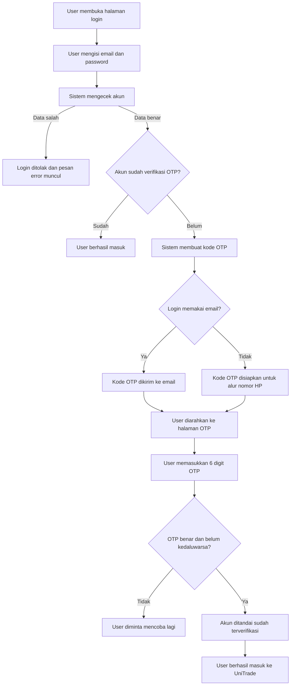
```mermaid
flowchart TD
    A["User membuka halaman login"] --> B["User mengisi email dan password"]
    B --> C["Sistem mengecek akun"]
    C -->|Data salah| D["Login ditolak dan pesan error muncul"]
    C -->|Data benar| E{"Akun sudah verifikasi OTP?"}
    E -->|Sudah| F["User berhasil masuk"]
    E -->|Belum| G["Sistem membuat kode OTP"]
    G --> H{"Login memakai email?"}
    H -->|Ya| I["Kode OTP dikirim ke email"]
    H -->|Tidak| J["Kode OTP disiapkan untuk alur nomor HP"]
    I --> K["User diarahkan ke halaman OTP"]
    J --> K
    K --> L["User memasukkan 6 digit OTP"]
    L --> M{"OTP benar dan belum kedaluwarsa?"}
    M -->|Tidak| N["User diminta mencoba lagi"]
    M -->|Ya| O["Akun ditandai sudah terverifikasi"]
    O --> P["User berhasil masuk ke UniTrade"]
```

## 2. Register Akun Baru

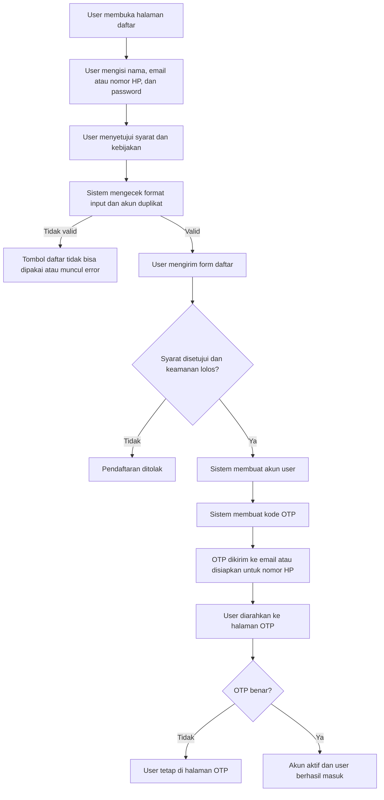
```mermaid
flowchart TD
    A["User membuka halaman daftar"] --> B["User mengisi nama, email atau nomor HP, dan password"]
    B --> C["User menyetujui syarat dan kebijakan"]
    C --> D["Sistem mengecek format input dan akun duplikat"]
    D -->|Tidak valid| E["Tombol daftar tidak bisa dipakai atau muncul error"]
    D -->|Valid| F["User mengirim form daftar"]
    F --> G{"Syarat disetujui dan keamanan lolos?"}
    G -->|Tidak| H["Pendaftaran ditolak"]
    G -->|Ya| I["Sistem membuat akun user"]
    I --> J["Sistem membuat kode OTP"]
    J --> K["OTP dikirim ke email atau disiapkan untuk nomor HP"]
    K --> L["User diarahkan ke halaman OTP"]
    L --> M{"OTP benar?"}
    M -->|Tidak| N["User tetap di halaman OTP"]
    M -->|Ya| O["Akun aktif dan user berhasil masuk"]
```

## 3. Lupa Password

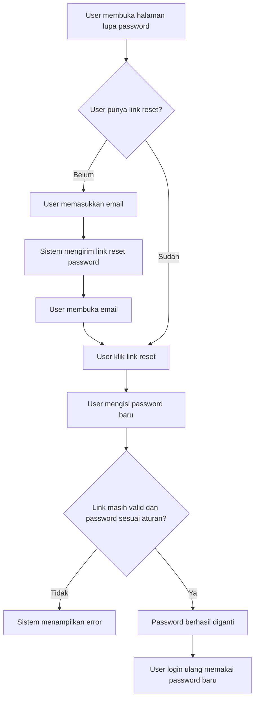
```mermaid
flowchart TD
    A["User membuka halaman lupa password"] --> B{"User punya link reset?"}
    B -->|Belum| C["User memasukkan email"]
    C --> D["Sistem mengirim link reset password"]
    D --> E["User membuka email"]
    E --> F["User klik link reset"]
    B -->|Sudah| F
    F --> G["User mengisi password baru"]
    G --> H{"Link masih valid dan password sesuai aturan?"}
    H -->|Tidak| I["Sistem menampilkan error"]
    H -->|Ya| J["Password berhasil diganti"]
    J --> K["User login ulang memakai password baru"]
```

## 4. Login dengan Google

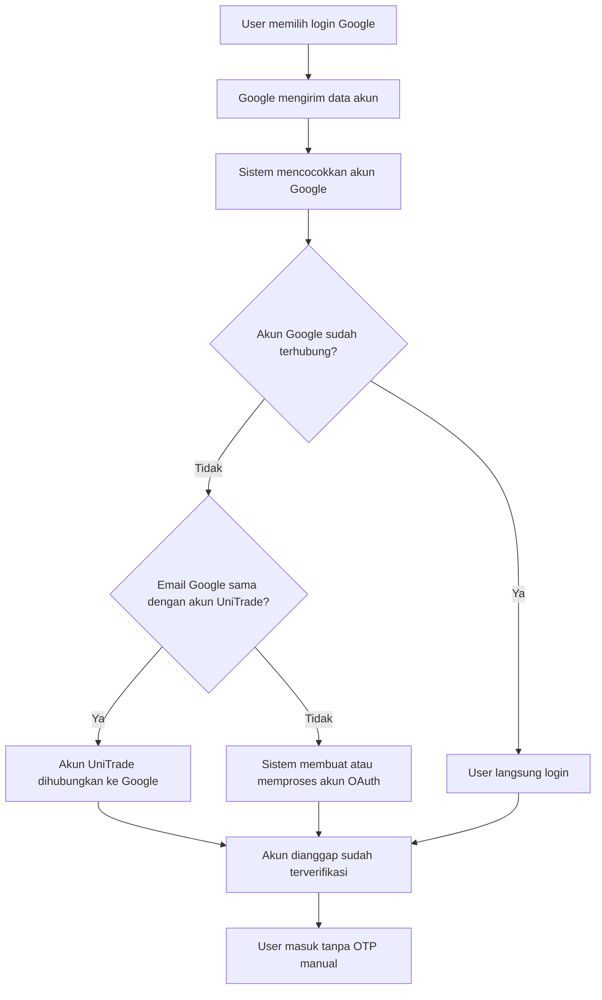
```mermaid
flowchart TD
    A["User memilih login Google"] --> B["Google mengirim data akun"]
    B --> C["Sistem mencocokkan akun Google"]
    C --> D{"Akun Google sudah terhubung?"}
    D -->|Ya| E["User langsung login"]
    D -->|Tidak| F{"Email Google sama dengan akun UniTrade?"}
    F -->|Ya| G["Akun UniTrade dihubungkan ke Google"]
    F -->|Tidak| H["Sistem membuat atau memproses akun OAuth"]
    G --> I["Akun dianggap sudah terverifikasi"]
    H --> I
    E --> I
    I --> J["User masuk tanpa OTP manual"]
```

## 5. Profil User

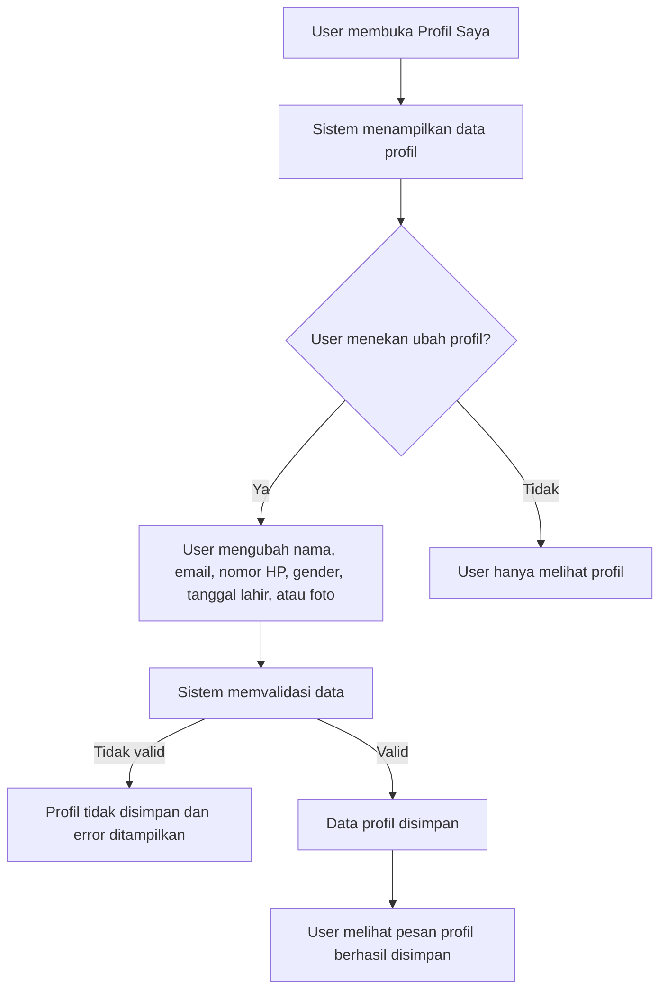
```mermaid
flowchart TD
    A["User membuka Profil Saya"] --> B["Sistem menampilkan data profil"]
    B --> C{"User menekan ubah profil?"}
    C -->|Ya| D["User mengubah nama, email, nomor HP, gender, tanggal lahir, atau foto"]
    D --> E["Sistem memvalidasi data"]
    E -->|Tidak valid| F["Profil tidak disimpan dan error ditampilkan"]
    E -->|Valid| G["Data profil disimpan"]
    G --> H["User melihat pesan profil berhasil disimpan"]
    C -->|Tidak| I["User hanya melihat profil"]
```

## 6. Alamat User dengan Mapbox

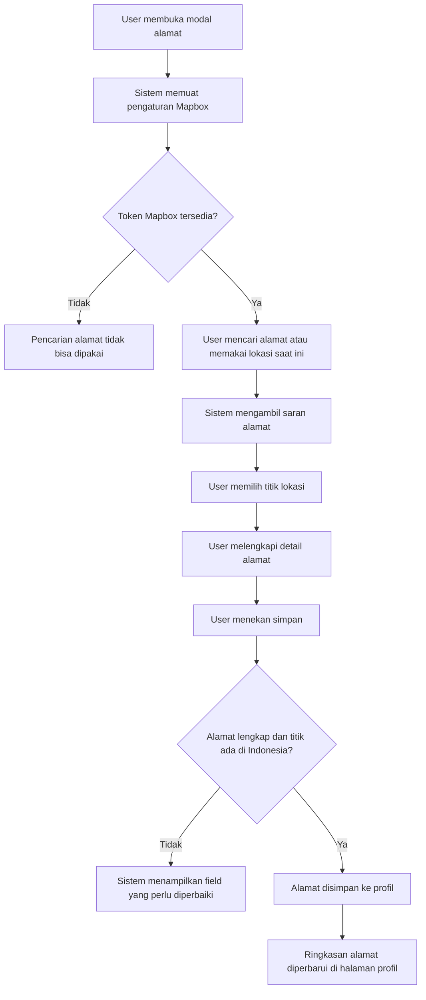
```mermaid
flowchart TD
    A["User membuka modal alamat"] --> B["Sistem memuat pengaturan Mapbox"]
    B --> C{"Token Mapbox tersedia?"}
    C -->|Tidak| D["Pencarian alamat tidak bisa dipakai"]
    C -->|Ya| E["User mencari alamat atau memakai lokasi saat ini"]
    E --> F["Sistem mengambil saran alamat"]
    F --> G["User memilih titik lokasi"]
    G --> H["User melengkapi detail alamat"]
    H --> I["User menekan simpan"]
    I --> J{"Alamat lengkap dan titik ada di Indonesia?"}
    J -->|Tidak| K["Sistem menampilkan field yang perlu diperbaiki"]
    J -->|Ya| L["Alamat disimpan ke profil"]
    L --> M["Ringkasan alamat diperbarui di halaman profil"]
```

## 7. Pengaturan Akun

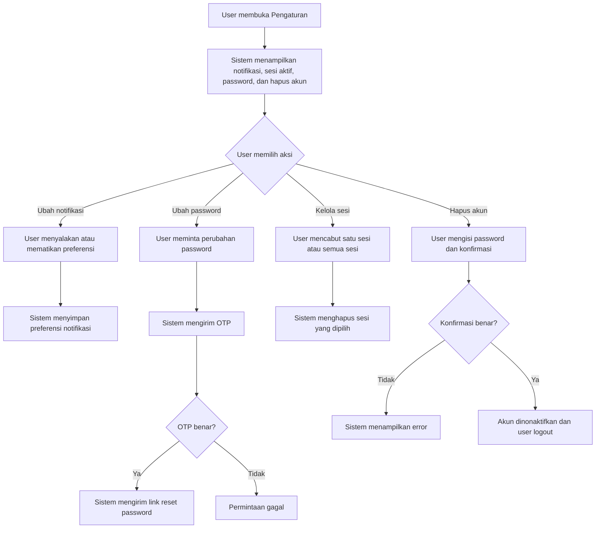
```mermaid
flowchart TD
    A["User membuka Pengaturan"] --> B["Sistem menampilkan notifikasi, sesi aktif, password, dan hapus akun"]
    B --> C{"User memilih aksi"}
    C -->|Ubah notifikasi| D["User menyalakan atau mematikan preferensi"]
    D --> E["Sistem menyimpan preferensi notifikasi"]
    C -->|Ubah password| F["User meminta perubahan password"]
    F --> G["Sistem mengirim OTP"]
    G --> H{"OTP benar?"}
    H -->|Ya| I["Sistem mengirim link reset password"]
    H -->|Tidak| J["Permintaan gagal"]
    C -->|Kelola sesi| K["User mencabut satu sesi atau semua sesi"]
    K --> L["Sistem menghapus sesi yang dipilih"]
    C -->|Hapus akun| M["User mengisi password dan konfirmasi"]
    M --> N{"Konfirmasi benar?"}
    N -->|Tidak| O["Sistem menampilkan error"]
    N -->|Ya| P["Akun dinonaktifkan dan user logout"]
```

## 8. Pesanan Saya

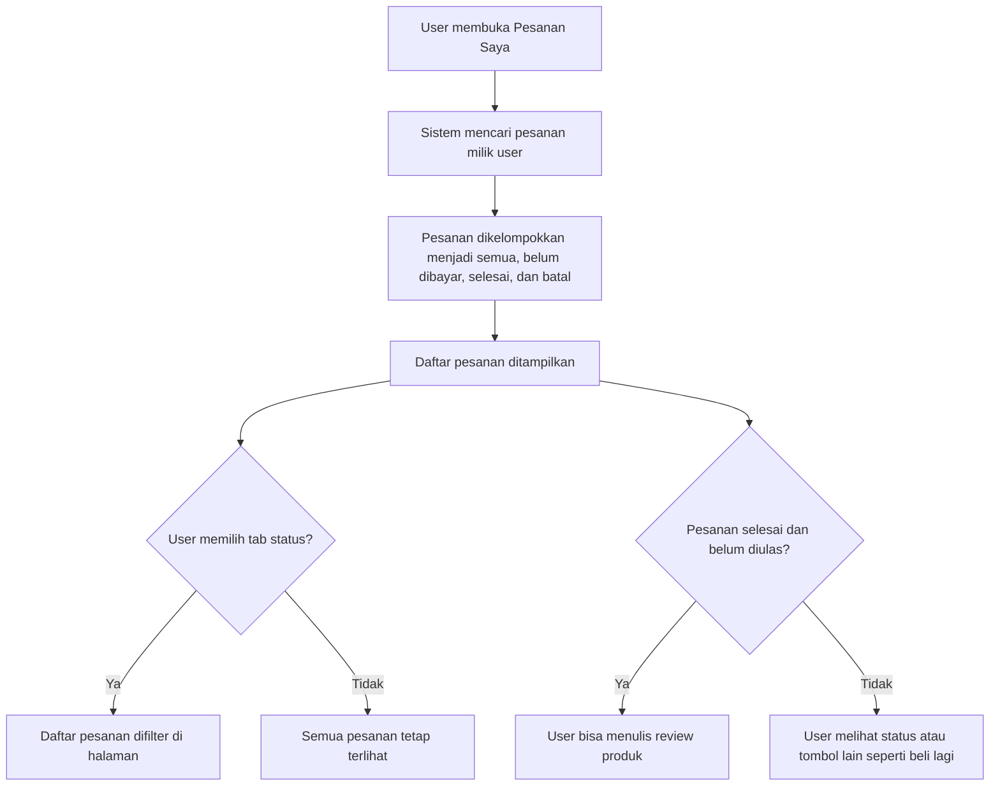
```mermaid
flowchart TD
    A["User membuka Pesanan Saya"] --> B["Sistem mencari pesanan milik user"]
    B --> C["Pesanan dikelompokkan menjadi semua, belum dibayar, selesai, dan batal"]
    C --> D["Daftar pesanan ditampilkan"]
    D --> E{"User memilih tab status?"}
    E -->|Ya| F["Daftar pesanan difilter di halaman"]
    E -->|Tidak| G["Semua pesanan tetap terlihat"]
    D --> H{"Pesanan selesai dan belum diulas?"}
    H -->|Ya| I["User bisa menulis review produk"]
    H -->|Tidak| J["User melihat status atau tombol lain seperti beli lagi"]
```

## 9. Pencarian dan Filter Produk

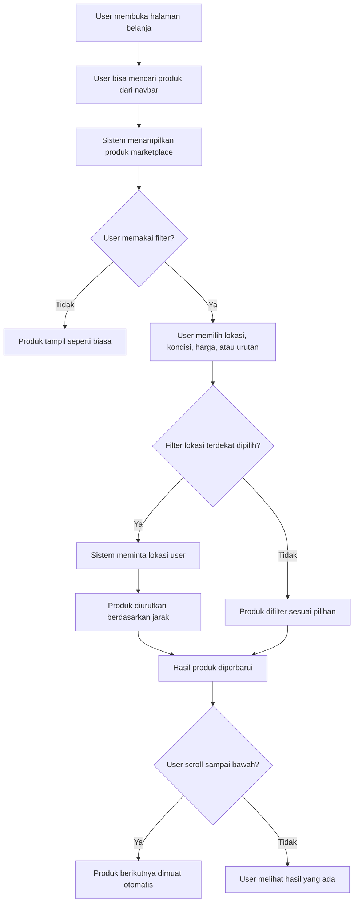
```mermaid
flowchart TD
    A["User membuka halaman belanja"] --> B["User bisa mencari produk dari navbar"]
    B --> C["Sistem menampilkan produk marketplace"]
    C --> D{"User memakai filter?"}
    D -->|Tidak| E["Produk tampil seperti biasa"]
    D -->|Ya| F["User memilih lokasi, kondisi, harga, atau urutan"]
    F --> G{"Filter lokasi terdekat dipilih?"}
    G -->|Ya| H["Sistem meminta lokasi user"]
    H --> I["Produk diurutkan berdasarkan jarak"]
    G -->|Tidak| J["Produk difilter sesuai pilihan"]
    I --> K["Hasil produk diperbarui"]
    J --> K
    K --> L{"User scroll sampai bawah?"}
    L -->|Ya| M["Produk berikutnya dimuat otomatis"]
    L -->|Tidak| N["User melihat hasil yang ada"]
```

## 10. Detail Produk dan Keranjang

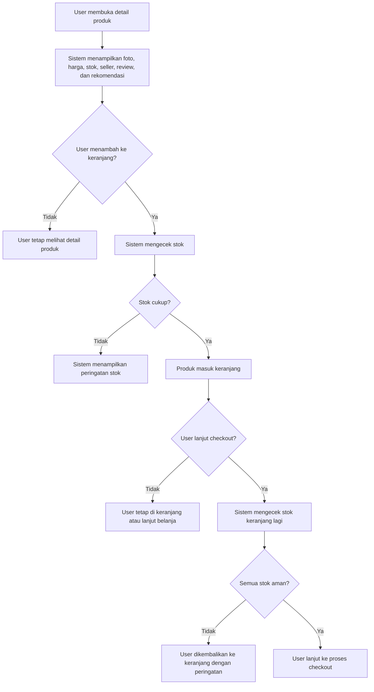
```mermaid
flowchart TD
    A["User membuka detail produk"] --> B["Sistem menampilkan foto, harga, stok, seller, review, dan rekomendasi"]
    B --> C{"User menambah ke keranjang?"}
    C -->|Tidak| D["User tetap melihat detail produk"]
    C -->|Ya| E["Sistem mengecek stok"]
    E --> F{"Stok cukup?"}
    F -->|Tidak| G["Sistem menampilkan peringatan stok"]
    F -->|Ya| H["Produk masuk keranjang"]
    H --> I{"User lanjut checkout?"}
    I -->|Tidak| J["User tetap di keranjang atau lanjut belanja"]
    I -->|Ya| K["Sistem mengecek stok keranjang lagi"]
    K --> L{"Semua stok aman?"}
    L -->|Tidak| M["User dikembalikan ke keranjang dengan peringatan"]
    L -->|Ya| N["User lanjut ke proses checkout"]
```

## 11. Wishlist

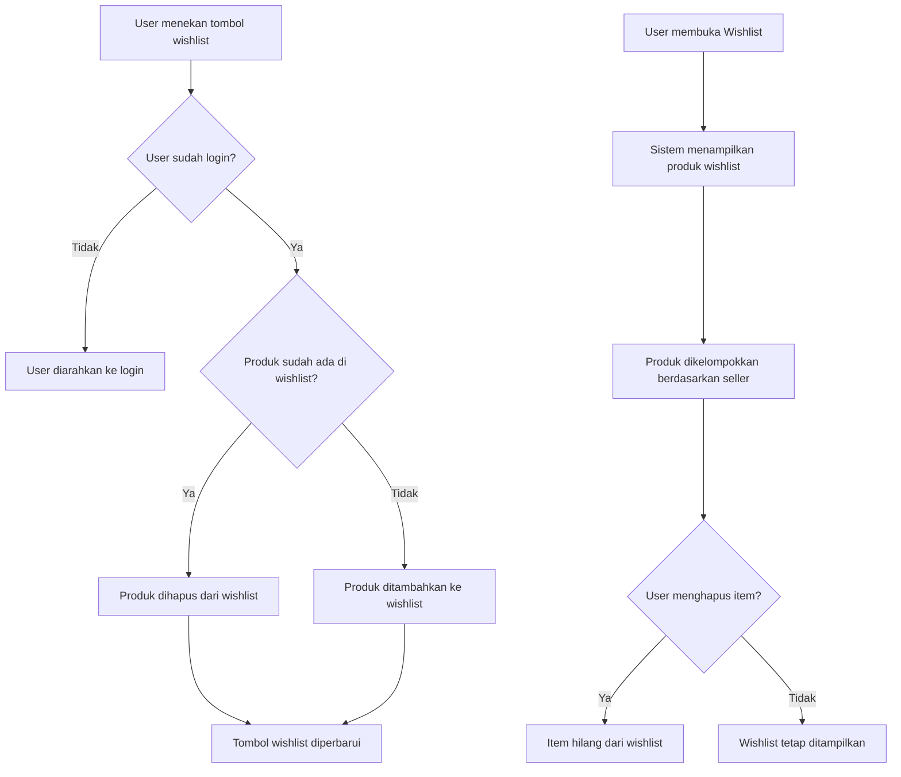
```mermaid
flowchart TD
    A["User menekan tombol wishlist"] --> B{"User sudah login?"}
    B -->|Tidak| C["User diarahkan ke login"]
    B -->|Ya| D{"Produk sudah ada di wishlist?"}
    D -->|Ya| E["Produk dihapus dari wishlist"]
    D -->|Tidak| F["Produk ditambahkan ke wishlist"]
    E --> G["Tombol wishlist diperbarui"]
    F --> G
    H["User membuka Wishlist"] --> I["Sistem menampilkan produk wishlist"]
    I --> J["Produk dikelompokkan berdasarkan seller"]
    J --> K{"User menghapus item?"}
    K -->|Ya| L["Item hilang dari wishlist"]
    K -->|Tidak| M["Wishlist tetap ditampilkan"]
```

## 12. Review Produk

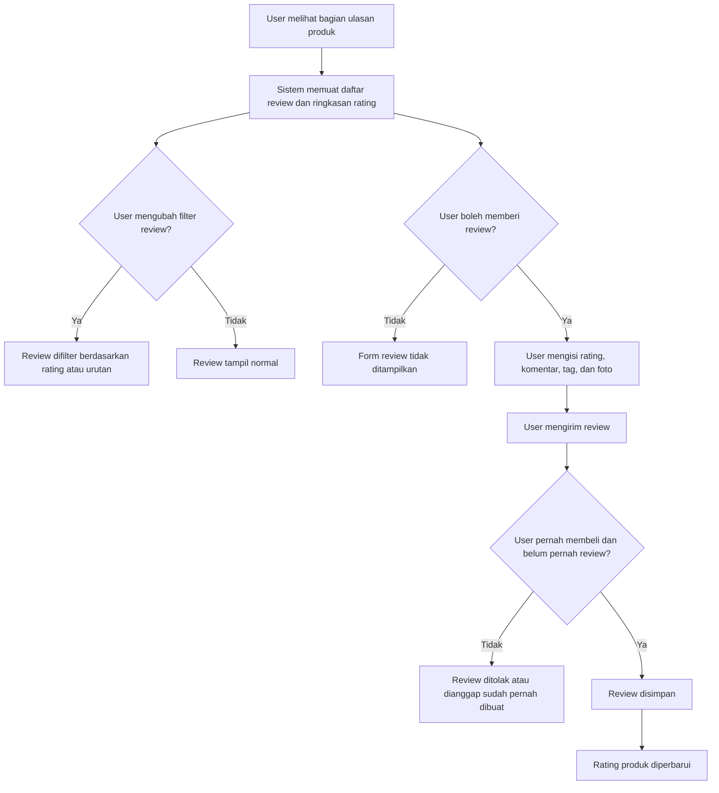
```mermaid
flowchart TD
    A["User melihat bagian ulasan produk"] --> B["Sistem memuat daftar review dan ringkasan rating"]
    B --> C{"User mengubah filter review?"}
    C -->|Ya| D["Review difilter berdasarkan rating atau urutan"]
    C -->|Tidak| E["Review tampil normal"]
    B --> F{"User boleh memberi review?"}
    F -->|Tidak| G["Form review tidak ditampilkan"]
    F -->|Ya| H["User mengisi rating, komentar, tag, dan foto"]
    H --> I["User mengirim review"]
    I --> J{"User pernah membeli dan belum pernah review?"}
    J -->|Tidak| K["Review ditolak atau dianggap sudah pernah dibuat"]
    J -->|Ya| L["Review disimpan"]
    L --> M["Rating produk diperbarui"]
```

## 13. Daftar Seller dan Verifikasi KTM

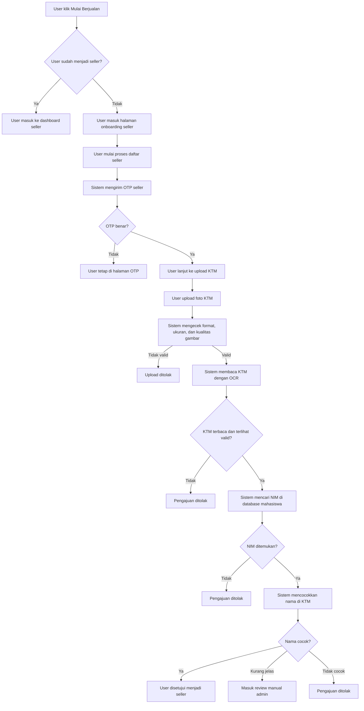
```mermaid
flowchart TD
    A["User klik Mulai Berjualan"] --> B{"User sudah menjadi seller?"}
    B -->|Ya| C["User masuk ke dashboard seller"]
    B -->|Tidak| D["User masuk halaman onboarding seller"]
    D --> E["User mulai proses daftar seller"]
    E --> F["Sistem mengirim OTP seller"]
    F --> G{"OTP benar?"}
    G -->|Tidak| H["User tetap di halaman OTP"]
    G -->|Ya| I["User lanjut ke upload KTM"]
    I --> J["User upload foto KTM"]
    J --> K["Sistem mengecek format, ukuran, dan kualitas gambar"]
    K -->|Tidak valid| L["Upload ditolak"]
    K -->|Valid| M["Sistem membaca KTM dengan OCR"]
    M --> N{"KTM terbaca dan terlihat valid?"}
    N -->|Tidak| O["Pengajuan ditolak"]
    N -->|Ya| P["Sistem mencari NIM di database mahasiswa"]
    P --> Q{"NIM ditemukan?"}
    Q -->|Tidak| R["Pengajuan ditolak"]
    Q -->|Ya| S["Sistem mencocokkan nama di KTM"]
    S --> T{"Nama cocok?"}
    T -->|Ya| U["User disetujui menjadi seller"]
    T -->|Kurang jelas| V["Masuk review manual admin"]
    T -->|Tidak cocok| W["Pengajuan ditolak"]
```

## 14. Review Manual Seller

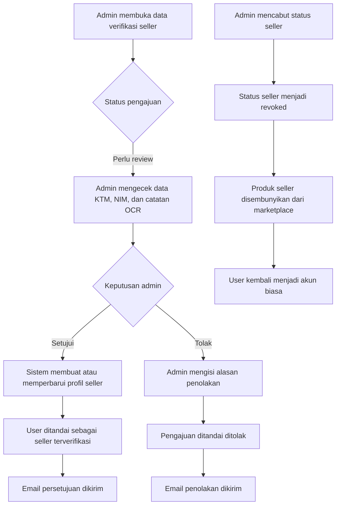
```mermaid
flowchart TD
    A["Admin membuka data verifikasi seller"] --> B{"Status pengajuan"}
    B -->|Perlu review| C["Admin mengecek data KTM, NIM, dan catatan OCR"]
    C --> D{"Keputusan admin"}
    D -->|Setujui| E["Sistem membuat atau memperbarui profil seller"]
    E --> F["User ditandai sebagai seller terverifikasi"]
    F --> G["Email persetujuan dikirim"]
    D -->|Tolak| H["Admin mengisi alasan penolakan"]
    H --> I["Pengajuan ditandai ditolak"]
    I --> J["Email penolakan dikirim"]
    K["Admin mencabut status seller"] --> L["Status seller menjadi revoked"]
    L --> M["Produk seller disembunyikan dari marketplace"]
    M --> N["User kembali menjadi akun biasa"]
```

## 15. Profil Publik Seller

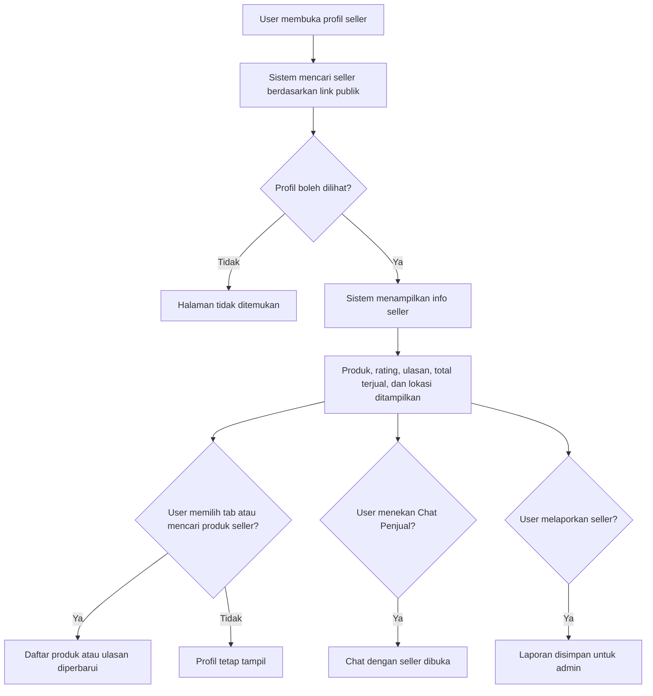
```mermaid
flowchart TD
    A["User membuka profil seller"] --> B["Sistem mencari seller berdasarkan link publik"]
    B --> C{"Profil boleh dilihat?"}
    C -->|Tidak| D["Halaman tidak ditemukan"]
    C -->|Ya| E["Sistem menampilkan info seller"]
    E --> F["Produk, rating, ulasan, total terjual, dan lokasi ditampilkan"]
    F --> G{"User memilih tab atau mencari produk seller?"}
    G -->|Ya| H["Daftar produk atau ulasan diperbarui"]
    G -->|Tidak| I["Profil tetap tampil"]
    F --> J{"User menekan Chat Penjual?"}
    J -->|Ya| K["Chat dengan seller dibuka"]
    F --> L{"User melaporkan seller?"}
    L -->|Ya| M["Laporan disimpan untuk admin"]
```

## 16. Dashboard Seller

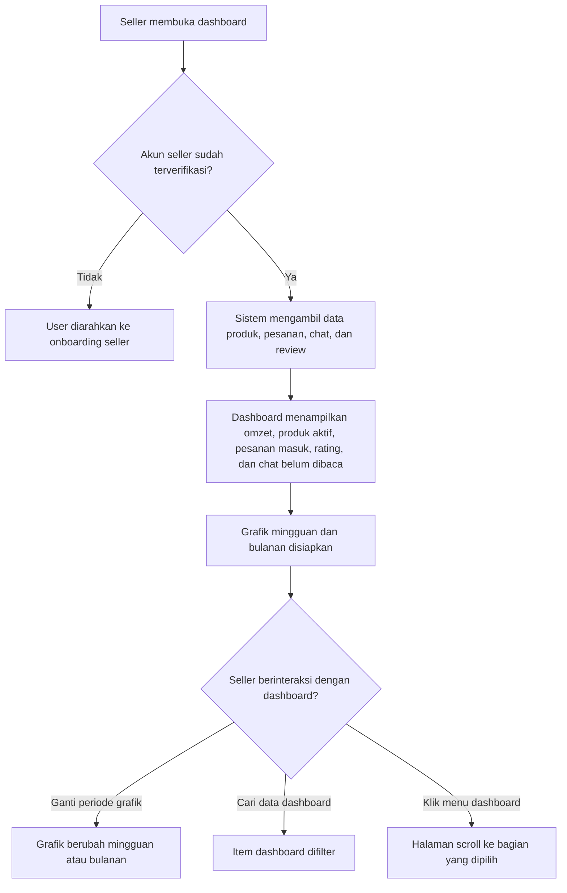
```mermaid
flowchart TD
    A["Seller membuka dashboard"] --> B{"Akun seller sudah terverifikasi?"}
    B -->|Tidak| C["User diarahkan ke onboarding seller"]
    B -->|Ya| D["Sistem mengambil data produk, pesanan, chat, dan review"]
    D --> E["Dashboard menampilkan omzet, produk aktif, pesanan masuk, rating, dan chat belum dibaca"]
    E --> F["Grafik mingguan dan bulanan disiapkan"]
    F --> G{"Seller berinteraksi dengan dashboard?"}
    G -->|Ganti periode grafik| H["Grafik berubah mingguan atau bulanan"]
    G -->|Cari data dashboard| I["Item dashboard difilter"]
    G -->|Klik menu dashboard| J["Halaman scroll ke bagian yang dipilih"]
```

## 17. Chat Buyer dan Seller

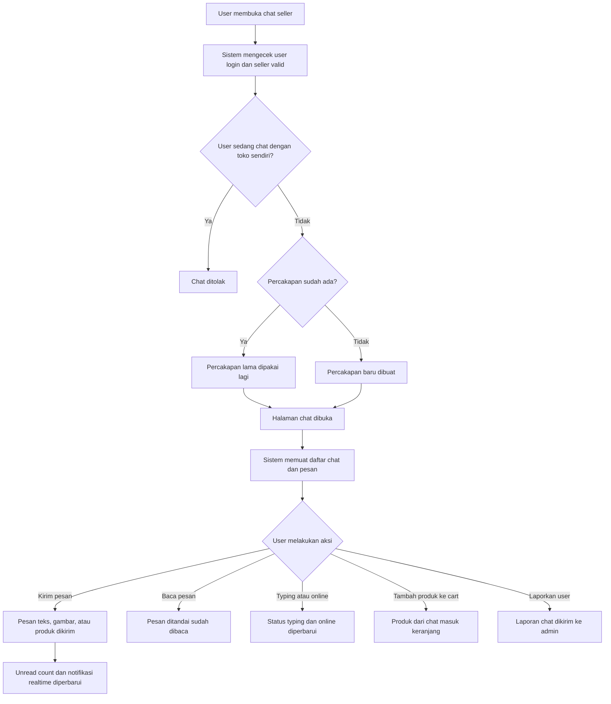
```mermaid
flowchart TD
    A["User membuka chat seller"] --> B["Sistem mengecek user login dan seller valid"]
    B --> C{"User sedang chat dengan toko sendiri?"}
    C -->|Ya| D["Chat ditolak"]
    C -->|Tidak| E{"Percakapan sudah ada?"}
    E -->|Ya| F["Percakapan lama dipakai lagi"]
    E -->|Tidak| G["Percakapan baru dibuat"]
    F --> H["Halaman chat dibuka"]
    G --> H
    H --> I["Sistem memuat daftar chat dan pesan"]
    I --> J{"User melakukan aksi"}
    J -->|Kirim pesan| K["Pesan teks, gambar, atau produk dikirim"]
    K --> L["Unread count dan notifikasi realtime diperbarui"]
    J -->|Baca pesan| M["Pesan ditandai sudah dibaca"]
    J -->|Typing atau online| N["Status typing dan online diperbarui"]
    J -->|Tambah produk ke cart| O["Produk dari chat masuk keranjang"]
    J -->|Laporkan user| P["Laporan chat dikirim ke admin"]
```

## 18. Moderasi Laporan Chat

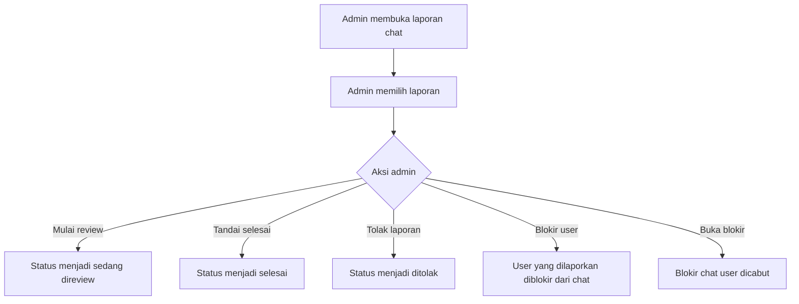
```mermaid
flowchart TD
    A["Admin membuka laporan chat"] --> B["Admin memilih laporan"]
    B --> C{"Aksi admin"}
    C -->|Mulai review| D["Status menjadi sedang direview"]
    C -->|Tandai selesai| E["Status menjadi selesai"]
    C -->|Tolak laporan| F["Status menjadi ditolak"]
    C -->|Blokir user| G["User yang dilaporkan diblokir dari chat"]
    C -->|Buka blokir| H["Blokir chat user dicabut"]
```

## 19. Pembayaran Midtrans

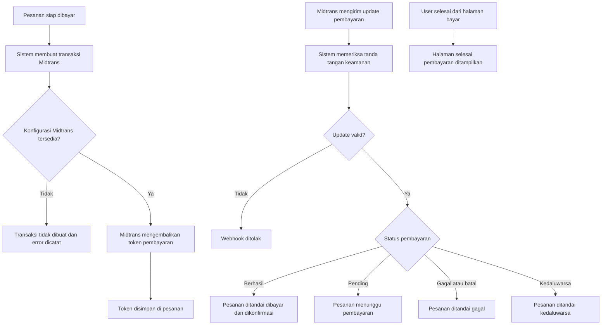
```mermaid
flowchart TD
    A["Pesanan siap dibayar"] --> B["Sistem membuat transaksi Midtrans"]
    B --> C{"Konfigurasi Midtrans tersedia?"}
    C -->|Tidak| D["Transaksi tidak dibuat dan error dicatat"]
    C -->|Ya| E["Midtrans mengembalikan token pembayaran"]
    E --> F["Token disimpan di pesanan"]
    G["Midtrans mengirim update pembayaran"] --> H["Sistem memeriksa tanda tangan keamanan"]
    H --> I{"Update valid?"}
    I -->|Tidak| J["Webhook ditolak"]
    I -->|Ya| K{"Status pembayaran"}
    K -->|Berhasil| L["Pesanan ditandai dibayar dan dikonfirmasi"]
    K -->|Pending| M["Pesanan menunggu pembayaran"]
    K -->|Gagal atau batal| N["Pesanan ditandai gagal"]
    K -->|Kedaluwarsa| O["Pesanan ditandai kedaluwarsa"]
    P["User selesai dari halaman bayar"] --> Q["Halaman selesai pembayaran ditampilkan"]
```

## 20. Notifikasi dan Preferensi Email

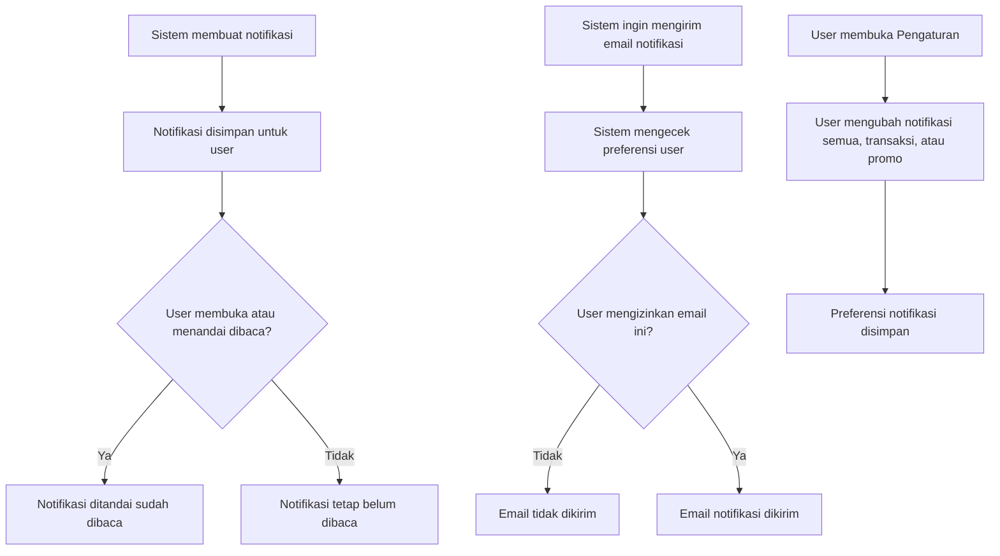
```mermaid
flowchart TD
    A["Sistem membuat notifikasi"] --> B["Notifikasi disimpan untuk user"]
    B --> C{"User membuka atau menandai dibaca?"}
    C -->|Ya| D["Notifikasi ditandai sudah dibaca"]
    C -->|Tidak| E["Notifikasi tetap belum dibaca"]
    F["Sistem ingin mengirim email notifikasi"] --> G["Sistem mengecek preferensi user"]
    G --> H{"User mengizinkan email ini?"}
    H -->|Tidak| I["Email tidak dikirim"]
    H -->|Ya| J["Email notifikasi dikirim"]
    K["User membuka Pengaturan"] --> L["User mengubah notifikasi semua, transaksi, atau promo"]
    L --> M["Preferensi notifikasi disimpan"]
```

## 21. Homepage, Navbar, FAQ, dan Legal

```mermaid
flowchart TD
    A["User membuka homepage"] --> B["Sistem mengambil produk yang tampil di website"]
    B --> C["Produk terbaik dipilih berdasarkan rating dan penjualan"]
    C --> D["Homepage menampilkan hero, kategori, produk, dan ajakan jualan"]
    E["User memakai navbar"] --> F{"User memilih menu"}
    F -->|Cari produk| G["User masuk ke halaman belanja"]
    F -->|Keranjang| H["User membuka keranjang"]
    F -->|Profil| I["User membuka profil, pesanan, wishlist, atau pengaturan"]
    F -->|Mulai Berjualan| J["User masuk onboarding seller"]
    K["User membuka Bantuan atau Syarat"] --> L["Sistem menampilkan FAQ dan kebijakan"]
```
