# Activity Diagram Fitur Utama UniTrade-Oddo

Dokumen ini merangkum activity diagram fitur utama UniTrade-Oddo berdasarkan pembacaan struktur repository dan kode pada modul berikut:

- `unitrade_theme`
- `unitrade_seller`
- `unitrade_product_ext`
- `unitrade_payment`
- `unitrade_wishlist`
- `unitrade_review`
- `unitrade_chat`
- `unitrade_notification`
- `unitrade_admin`
- `unitrade_cs_ai`
- `unitrade_delivery`
- `unitrade_dispute`

Catatan pembacaan:

- Diagram disusun dari controller, model, dan hook yang ditemukan di kode.
- Diagram diperiksa ulang terhadap alur aplikasi saat ini pada 12 Juni 2026, terutama cabang OTP, seller onboarding, listing fee produk, Midtrans, escrow, refund, delivery, chat, customer service, notifikasi, review, dan dashboard admin.
- Bagian yang tidak terlihat lengkap di kode ditandai dengan status `perlu konfirmasi`.
- Diagram ditampilkan sebagai SVG dari folder `docs/diagrams/svg/` agar dapat muncul sebagai preview gambar di Markdown.
- Source PlantUML setiap diagram disimpan di folder `docs/diagrams/plantuml/` dan tetap memakai swimlane `|Aktor|`.
- Jika perlu render ulang dengan PlantUML resmi, jalankan `plantuml -tsvg -o ../svg docs/diagrams/plantuml/*.puml` dari root repository.
- Dokumen ini hanya dokumentasi; tidak mengubah alur aplikasi.

## 1. Register

### Deskripsi singkat

Fitur register membuat akun pengguna baru melalui halaman signup, memvalidasi input dasar, mencatat persetujuan syarat layanan, lalu mengirim OTP email sebelum akun dianggap terverifikasi.

### Aktor yang terlibat

- Pengunjung
- Sistem UniTrade
- Odoo Auth
- Email OTP

### Alur aktivitas

1. Pengunjung membuka halaman signup.
2. Sistem menampilkan form pendaftaran.
3. Pengunjung mengisi email, password, dan menyetujui syarat layanan.
4. Sistem memvalidasi signup, recaptcha, email, dan persetujuan.
5. Jika valid, Odoo membuat akun pengguna.
6. Sistem mencatat terms acceptance dan security activity.
7. Sistem membuat OTP, mengirim email, menyimpan sesi OTP, lalu mengarahkan pengguna ke halaman verifikasi OTP.
8. Jika tidak valid, sistem menampilkan kembali form signup dengan pesan kesalahan.

### Activity diagram PlantUML

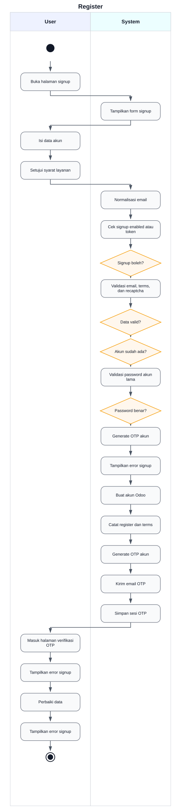

Source PlantUML: [diagrams/plantuml/01-register.puml](diagrams/plantuml/01-register.puml)

### File/kode terkait

- `unitrade_theme/controllers/controllers.py`: route `/web/signup`, `_generate_and_redirect_otp`
- `unitrade_theme/models/otp.py`: `generate_otp`, `rate_limit_status`
- `unitrade_theme/models/res_users.py`: field OTP, terms acceptance, security activity

## 2. Login

### Deskripsi singkat

Fitur login memakai mekanisme login Odoo, tetapi menambahkan normalisasi email, pencatatan aktivitas keamanan, dan kewajiban OTP untuk user portal yang belum terverifikasi.

### Aktor yang terlibat

- Pengguna terdaftar
- Sistem UniTrade
- Odoo Auth
- Email OTP

### Alur aktivitas

1. Pengguna membuka halaman login.
2. Pengguna mengisi kredensial.
3. Sistem menormalisasi email dan memanggil login Odoo.
4. Jika kredensial salah, halaman login menampilkan error.
5. Jika login berhasil dan user portal belum terverifikasi OTP, sistem logout sementara, membuat OTP, lalu mengarahkan ke halaman verifikasi.
6. Jika OTP sudah terverifikasi, sistem mencatat aktivitas login dan pengguna masuk ke aplikasi.

### Activity diagram PlantUML

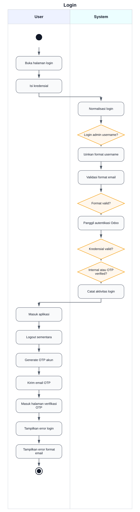

Source PlantUML: [diagrams/plantuml/02-login.puml](diagrams/plantuml/02-login.puml)

### File/kode terkait

- `unitrade_theme/controllers/controllers.py`: override `web_login`, `_generate_and_redirect_otp`
- `unitrade_theme/models/res_users.py`: `is_otp_verified`, security activity
- `unitrade_theme/models/otp.py`: OTP login

## 3. OTP

### Deskripsi singkat

OTP dipakai untuk verifikasi akun, seller onboarding, dan reset password dari halaman settings. Kode OTP dibuat per purpose, memiliki masa kedaluwarsa, rate limit, dan menandai OTP lama sebagai tidak aktif.

### Aktor yang terlibat

- Pengguna
- Sistem UniTrade
- Model OTP
- Email

### Alur aktivitas

1. Sistem menerima permintaan OTP untuk user dan purpose tertentu.
2. Sistem memeriksa rate limit.
3. Sistem menonaktifkan OTP lama yang belum digunakan.
4. Sistem membuat kode OTP enam digit dengan masa berlaku lima menit.
5. Sistem mengirim email OTP dan menyimpan informasi OTP di session.
6. Pengguna mengirim kode OTP.
7. Sistem memvalidasi format, masa berlaku, dan status OTP.
8. Jika valid, sistem menjalankan aksi sesuai purpose.
9. Jika tidak valid, sistem mengembalikan error dan pengguna dapat meminta resend sesuai rate limit.

### Activity diagram PlantUML

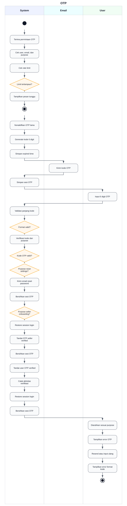

Source PlantUML: [diagrams/plantuml/03-otp.puml](diagrams/plantuml/03-otp.puml)

### File/kode terkait

- `unitrade_theme/models/otp.py`: `generate_otp`, `verify_otp`, `rate_limit_status`
- `unitrade_theme/controllers/controllers.py`: `/web/verify-otp`, `/web/verify-otp/submit`, `/web/resend-otp`, `/web/send-otp-email`
- `unitrade_seller/controllers/seller_verification.py`: `/seller-onboarding/start`

## 4. Reset Password

### Deskripsi singkat

Reset password tersedia dari halaman publik dan dari settings akun. Halaman publik memakai flow reset Odoo dengan recaptcha, sedangkan flow dari settings meminta OTP terlebih dahulu sebelum sistem mengirim email reset.

### Aktor yang terlibat

- Pengguna
- Sistem UniTrade
- Odoo Auth
- Email

### Alur aktivitas

1. Pengguna membuka halaman reset password atau meminta reset dari settings.
2. Sistem memvalidasi recaptcha untuk flow publik.
3. Jika request publik tanpa token, sistem memanggil reset password Odoo untuk mengirim email.
4. Jika request publik dengan token, sistem memproses perubahan password.
5. Jika request dari settings, sistem mengirim OTP terlebih dahulu.
6. Setelah OTP settings valid, sistem memicu email reset password.

### Activity diagram PlantUML

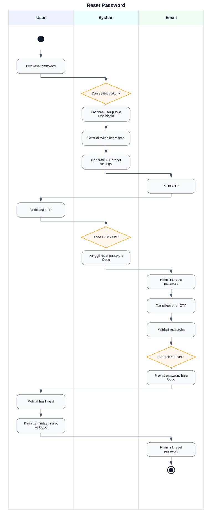

Source PlantUML: [diagrams/plantuml/04-reset-password.puml](diagrams/plantuml/04-reset-password.puml)

### File/kode terkait

- `unitrade_theme/controllers/controllers.py`: `/web/reset_password`, `/my/settings/password/request`, `/web/verify-otp/submit`
- `unitrade_theme/models/otp.py`: OTP purpose `settings_password_reset`

## 5. Profil User

### Deskripsi singkat

Profil user mencakup pembaruan data akun, data partner, alamat, koordinat Mapbox, preferensi notifikasi, sesi login, dan deaktivasi akun.

### Aktor yang terlibat

- Pengguna
- Sistem UniTrade
- Mapbox config dan geocode

### Alur aktivitas

1. Pengguna membuka halaman akun.
2. Sistem memuat data user dan partner.
3. Pengguna mengubah profil atau alamat.
4. Sistem memvalidasi request dan menyimpan data ke user atau partner.
5. Untuk alamat, sistem dapat memakai konfigurasi Mapbox dan menyimpan koordinat.
6. Pengguna dapat mengubah preferensi notifikasi, revoke session, atau meminta deaktivasi akun.

### Activity diagram PlantUML

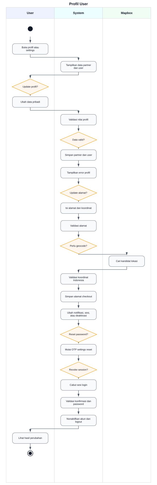

Source PlantUML: [diagrams/plantuml/05-profil-user.puml](diagrams/plantuml/05-profil-user.puml)

### File/kode terkait

- `unitrade_theme/controllers/controllers.py`: `/my/account`, `/my/account/address`, `/my/settings`, `/unitrade/mapbox/config`, `/unitrade/mapbox/geocode`
- `unitrade_theme/models/res_partner.py`: field alamat dan koordinat
- `unitrade_theme/models/res_users.py`: preferensi notifikasi, session, privacy, deactivation

## 6. Pengajuan Seller

### Deskripsi singkat

Pengajuan seller dimulai dari onboarding. Pengguna yang belum menjadi seller wajib melewati OTP seller onboarding sebelum masuk ke form verifikasi KTM.

### Aktor yang terlibat

- Calon seller
- Sistem UniTrade
- Email OTP

### Alur aktivitas

1. Calon seller membuka halaman seller onboarding.
2. Sistem memeriksa status ban marketplace dan status seller.
3. Jika user sudah seller terverifikasi, sistem mengarahkan ke dashboard seller.
4. Jika belum, user memulai onboarding.
5. Sistem membuat OTP dengan purpose seller onboarding.
6. Setelah OTP valid, sistem menyimpan session `seller_onboarding_otp_verified`.
7. Pengguna diarahkan ke halaman verifikasi seller.

### Activity diagram PlantUML

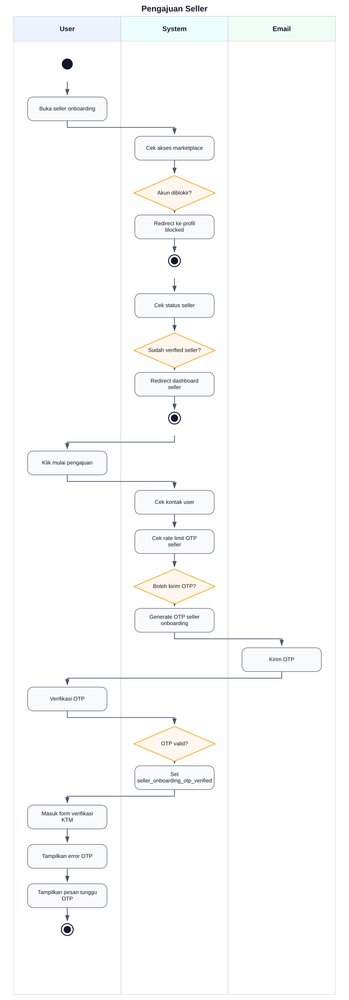

Source PlantUML: [diagrams/plantuml/06-pengajuan-seller.puml](diagrams/plantuml/06-pengajuan-seller.puml)

### File/kode terkait

- `unitrade_seller/controllers/seller_verification.py`: `/seller-onboarding`, `/seller-onboarding/start`, `/seller-verification`
- `unitrade_theme/controllers/controllers.py`: `/web/verify-otp/submit`
- `unitrade_seller/models/seller.py`: status seller dan sinkronisasi flag user

## 7. Verifikasi KTM

### Deskripsi singkat

Verifikasi KTM memvalidasi kampus, file upload, ukuran dan dimensi gambar, lalu menjalankan OCR KTM. Hasil OCR dapat langsung approved, masuk manual review, atau rejected.

### Aktor yang terlibat

- Calon seller
- Sistem UniTrade
- OCR KTM
- Admin
- Email

### Alur aktivitas

1. Calon seller membuka halaman verifikasi setelah OTP onboarding valid.
2. Sistem memuat data verifikasi terakhir dan daftar universitas.
3. Calon seller mengunggah KTM dan memilih universitas.
4. Sistem memvalidasi file, ukuran, dimensi, dan rate limit upload.
5. Sistem membuat attachment dan memproses OCR KTM.
6. Jika OCR approved dan NIM tidak duplikat, sistem membuat atau memperbarui seller sebagai verified.
7. Jika OCR perlu review manual, sistem menyimpan status manual review.
8. Jika OCR rejected atau NIM duplikat, sistem menolak pengajuan.
9. Sistem mengirim email sesuai hasil.

### Activity diagram PlantUML

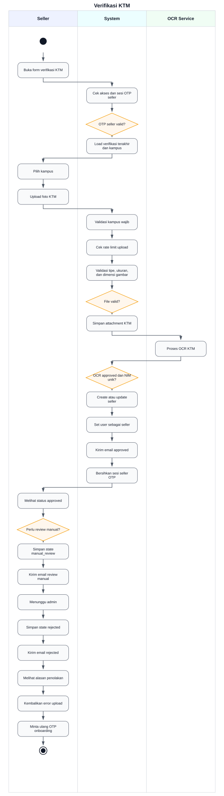

Source PlantUML: [diagrams/plantuml/07-verifikasi-ktm.puml](diagrams/plantuml/07-verifikasi-ktm.puml)

### File/kode terkait

- `unitrade_seller/controllers/seller_verification.py`: `/seller-verification`, `/seller-verification/submit`, `/unitrade/seller/verification-status`
- `unitrade_seller/models/seller_verification.py`: state verifikasi, approval, rejection
- `unitrade_seller/models/seller.py`: `action_verify`, `action_reject`, OCR helper

## 8. Approval Seller oleh Admin

### Deskripsi singkat

Admin dapat menyetujui atau menolak seller dan verifikasi KTM manual. Approval mengubah status seller, menyinkronkan flag user, mencatat audit, dan mengirim email.

### Aktor yang terlibat

- Admin UniTrade
- Calon seller
- Sistem UniTrade
- Email

### Alur aktivitas

1. Admin membuka dashboard seller atau KTM verification.
2. Sistem menampilkan pengajuan seller dan verifikasi manual.
3. Admin memilih approve atau reject.
4. Sistem memeriksa hak akses admin.
5. Untuk approval verifikasi KTM, sistem membuat atau memperbarui seller dan flag user.
6. Untuk rejection, sistem menyimpan alasan dan mereset flag seller jika diperlukan.
7. Sistem mencatat audit log dan mengirim notifikasi atau email.

### Activity diagram PlantUML

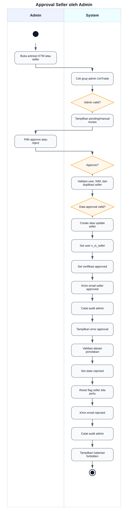

Source PlantUML: [diagrams/plantuml/08-approval-seller-oleh-admin.puml](diagrams/plantuml/08-approval-seller-oleh-admin.puml)

### File/kode terkait

- `unitrade_admin/controllers/admin_dashboard.py`: API approve dan reject seller atau verifikasi
- `unitrade_admin/models/admin_stats.py`: `admin_approve_seller`, `admin_reject_seller`, `admin_approve_verification`, `admin_reject_verification`
- `unitrade_seller/models/seller.py`: `action_verify`, `action_reject`, `action_revoke`
- `unitrade_seller/models/seller_verification.py`: `action_approve`, `action_reject`

## 9. Kelola Produk

### Deskripsi singkat

Seller terverifikasi dapat membuat, mengubah, mengarsipkan, dan menghapus produk marketplace. Jika listing fee aktif, produk diarahkan ke pembayaran listing fee sebelum publish.

### Aktor yang terlibat

- Seller
- Sistem UniTrade
- Payment listing fee

### Alur aktivitas

1. Seller membuka halaman produk seller.
2. Sistem memverifikasi akses dashboard seller.
3. Seller membuka form produk baru atau edit produk.
4. Sistem memuat kategori, kondisi, data produk, dan aturan listing fee.
5. Seller mengirim data produk.
6. Sistem membuat atau memperbarui produk seller.
7. Jika listing fee tidak diperlukan atau sudah nol, sistem memublikasikan produk.
8. Jika listing fee diperlukan, sistem mengarahkan seller ke pembayaran listing fee.
9. Seller dapat mengarsipkan atau menghapus produk sesuai route yang tersedia.

### Activity diagram PlantUML

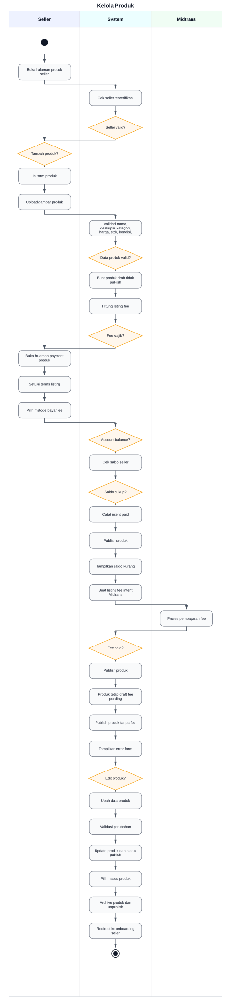

Source PlantUML: [diagrams/plantuml/09-kelola-produk.puml](diagrams/plantuml/09-kelola-produk.puml)

### File/kode terkait

- `unitrade_seller/controllers/main.py`: `/unitrade/seller/products`, create, update, delete, payment
- `unitrade_product_ext/models/product_template.py`: field marketplace, seller, listing fee, listing status
- `unitrade_payment/models/payment_intent.py`: `create_listing_fee_midtrans_payment`

## 10. Katalog Produk

### Deskripsi singkat

Katalog menampilkan produk marketplace yang lolos domain publik: saleable, published, seller verified untuk produk seller, store aktif, listing aktif, dan fee listing selesai bila diperlukan.

### Aktor yang terlibat

- Pengunjung
- Pembeli
- Sistem UniTrade

### Alur aktivitas

1. Pengunjung membuka katalog produk.
2. Sistem membaca keyword dan filter.
3. Sistem mencari produk marketplace dengan domain publik.
4. Sistem menyiapkan kategori, filter, dan daftar produk.
5. Sistem merender halaman katalog.

### Activity diagram PlantUML

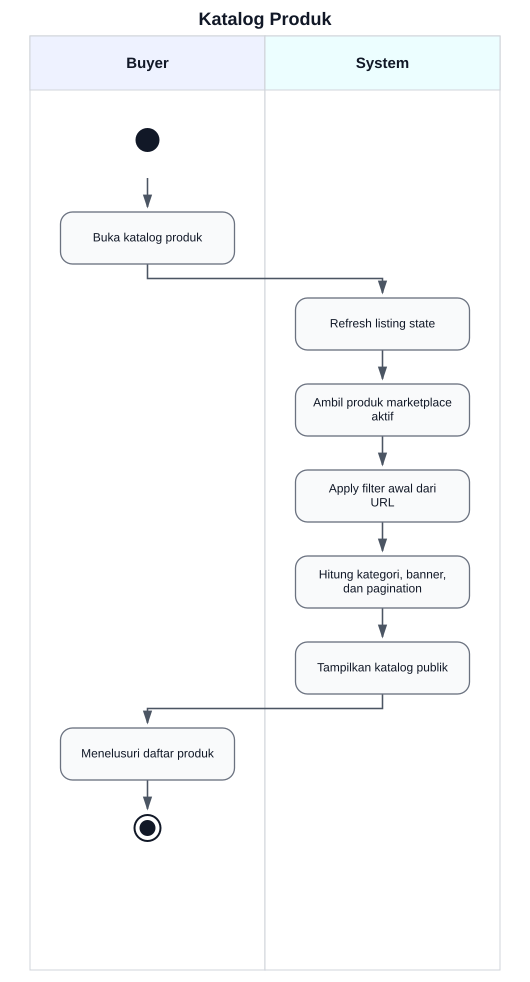

Source PlantUML: [diagrams/plantuml/10-katalog-produk.puml](diagrams/plantuml/10-katalog-produk.puml)

### File/kode terkait

- `unitrade_product_ext/controllers/main.py`: `/unitrade/products`, override `/shop`
- `unitrade_product_ext/models/product_template.py`: `_unitrade_public_active_domain`, `_unitrade_is_publicly_available`
- `unitrade_product_ext/views/`: template katalog

## 11. Detail Produk

### Deskripsi singkat

Detail produk menampilkan informasi produk, seller, review, dan produk serupa. Sistem memeriksa apakah produk dapat diakses publik, dengan pengecualian terbatas untuk konteks review historis.

### Aktor yang terlibat

- Pengunjung
- Pembeli
- Sistem UniTrade

### Alur aktivitas

1. Pengguna membuka detail produk.
2. Sistem memuat product template.
3. Sistem menyegarkan status listing bila diperlukan.
4. Sistem memeriksa ketersediaan publik produk.
5. Jika tidak tersedia dan bukan konteks review historis, sistem mengembalikan not found.
6. Jika tersedia, sistem memuat data review dan produk serupa.
7. Sistem merender halaman detail produk.

### Activity diagram PlantUML

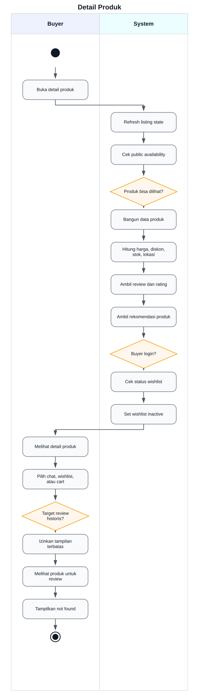

Source PlantUML: [diagrams/plantuml/11-detail-produk.puml](diagrams/plantuml/11-detail-produk.puml)

### File/kode terkait

- `unitrade_product_ext/controllers/main.py`: `/unitrade/product/<int:product_id>`, override product page
- `unitrade_product_ext/models/product_template.py`: availability dan rating fields
- `unitrade_review/models/review.py`: statistik rating produk

## 12. Pencarian dan Filter

### Deskripsi singkat

Pencarian dan filter produk mendukung keyword, kategori, kondisi, harga, lokasi, dan sorting. Pada filter lokasi terdekat, sistem memakai koordinat bila tersedia.

### Aktor yang terlibat

- Pengunjung
- Pembeli
- Sistem UniTrade

### Alur aktivitas

1. Pengguna mengirim keyword atau filter.
2. Sistem menormalisasi filter.
3. Sistem membangun domain pencarian marketplace.
4. Sistem mencari produk yang cocok.
5. Jika filter lokasi terdekat aktif dan koordinat tersedia, sistem menerapkan sorting jarak.
6. Sistem mengembalikan halaman atau fragment hasil filter.

### Activity diagram PlantUML

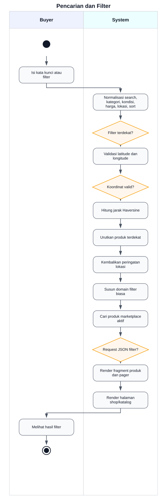

Source PlantUML: [diagrams/plantuml/12-pencarian-dan-filter.puml](diagrams/plantuml/12-pencarian-dan-filter.puml)

### File/kode terkait

- `unitrade_product_ext/controllers/main.py`: `_unitrade_normalized_shop_filters`, `_unitrade_filter_domain`, `_unitrade_apply_shop_filters`, `/unitrade/shop/filter`
- `unitrade_product_ext/models/product_template.py`: field lokasi seller dan produk

## 13. Wishlist

### Deskripsi singkat

Wishlist memungkinkan user login menyimpan produk. Toggle wishlist membuat atau menghapus record unik per user dan produk.

### Aktor yang terlibat

- Pembeli
- Sistem UniTrade

### Alur aktivitas

1. Pembeli membuka status wishlist atau halaman wishlist.
2. Sistem memeriksa login user.
3. Jika user publik, status wishlist dianggap tidak aktif.
4. Jika user login, sistem mencari record wishlist.
5. Saat toggle, sistem membuat record jika belum ada atau menghapus record jika sudah ada.
6. Sistem mengembalikan status terbaru.

### Activity diagram PlantUML

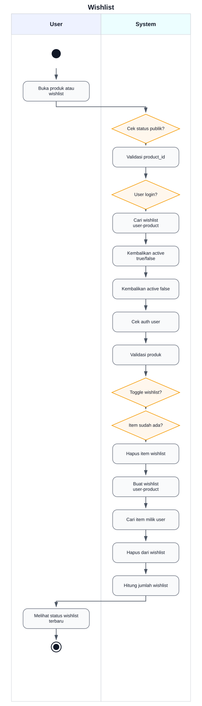

Source PlantUML: [diagrams/plantuml/13-wishlist.puml](diagrams/plantuml/13-wishlist.puml)

### File/kode terkait

- `unitrade_wishlist/controllers/main.py`: `/my/wishlist`, `/unitrade/wishlist/toggle`, `/unitrade/wishlist/status`, `/unitrade/wishlist/remove`
- `unitrade_wishlist/models/wishlist.py`: unique user dan product

## 14. Cart

### Deskripsi singkat

Cart memperluas alur WebsiteSale Odoo dengan validasi stok, validasi user yang diblokir marketplace, sinkronisasi harga diskon, dan peringatan stok sebelum checkout.

### Aktor yang terlibat

- Pembeli
- Sistem UniTrade
- Odoo WebsiteSale

### Alur aktivitas

1. Pembeli menambah atau memperbarui produk di cart.
2. Sistem memeriksa status marketplace user.
3. Sistem memvalidasi stok produk.
4. Sistem memperbarui cart melalui WebsiteSale.
5. Sistem menyinkronkan harga diskon bila berlaku.
6. Saat checkout, sistem memeriksa masalah stok.
7. Jika ada masalah, sistem menahan checkout dan menampilkan peringatan.

### Activity diagram PlantUML

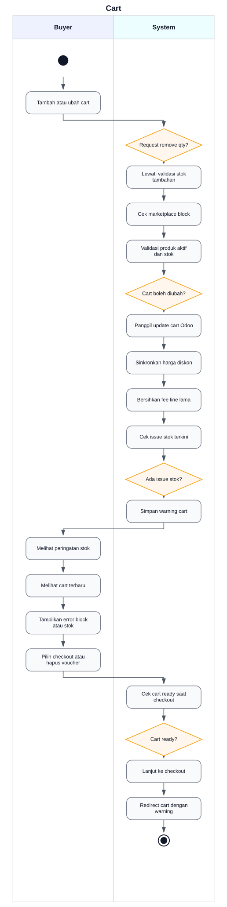

Source PlantUML: [diagrams/plantuml/14-cart.puml](diagrams/plantuml/14-cart.puml)

### File/kode terkait

- `unitrade_theme/controllers/cart.py`: stock validate, cart update, checkout guard, voucher remove
- `unitrade_product_ext/models/product_template.py`: field stok dan marketplace

## 15. Checkout

### Deskripsi singkat

Checkout menggabungkan validasi cart, alamat, metode pengiriman, voucher, dan metode pembayaran. Jika valid, sistem membuat payment intent Midtrans dan mengarahkan pembeli ke halaman instruksi.

### Aktor yang terlibat

- Pembeli
- Sistem UniTrade
- Midtrans
- Delivery

### Alur aktivitas

1. Pembeli membuka checkout.
2. Sistem menyiapkan order draft dan memvalidasi cart.
3. Pembeli memilih alamat, metode pengiriman, voucher, dan metode pembayaran.
4. Sistem menghitung ongkir dan total order.
5. Sistem memeriksa alamat, blocker shipping, dan status order.
6. Jika valid, sistem membuat pembayaran Midtrans.
7. Sistem mengarahkan pembeli ke halaman instruksi pembayaran.
8. Jika tidak valid, sistem menampilkan error pada halaman checkout.

### Activity diagram PlantUML

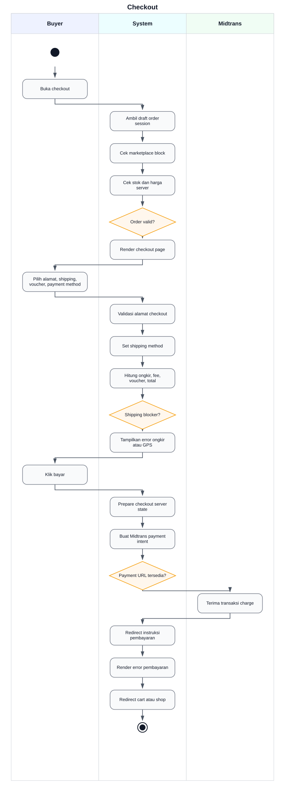

Source PlantUML: [diagrams/plantuml/15-checkout.puml](diagrams/plantuml/15-checkout.puml)

### File/kode terkait

- `unitrade_theme/controllers/checkout.py`: `/shop/checkout`, `/shop/payment`, `/unitrade/checkout/pay`, shipping dan voucher routes
- `unitrade_delivery/models/sale_order_shipping.py`: metode pickup dan GoSend, blocker GPS
- `unitrade_payment/models/sale_order.py`: amount checkout, payment intent

## 16. Pembayaran Midtrans

### Deskripsi singkat

Pembayaran Midtrans dibuat dari sale order draft. Sistem membuat `unitrade.payment.intent`, memanggil charge Midtrans, memproses webhook dengan signature dan idempotency, lalu mengubah order menjadi paid dan escrow held saat pembayaran sukses.

### Aktor yang terlibat

- Pembeli
- Sistem UniTrade
- Midtrans
- Escrow
- Delivery

### Alur aktivitas

1. Checkout memanggil pembuatan pembayaran Midtrans.
2. Sistem memeriksa order draft, server key, metode pembayaran, dan total.
3. Sistem membuat atau memakai payment intent pending.
4. Sistem memanggil Midtrans charge.
5. Pembeli membayar melalui instruksi Midtrans.
6. Midtrans mengirim webhook.
7. Sistem memvalidasi signature, idempotency, dan amount.
8. Jika transaksi paid, sistem menandai order paid, mengonfirmasi sale order, membuat escrow ledger, dan membuat delivery bila diperlukan.
9. Jika expired atau failed, sistem menandai status intent dan order sesuai hasil webhook.

### Activity diagram PlantUML

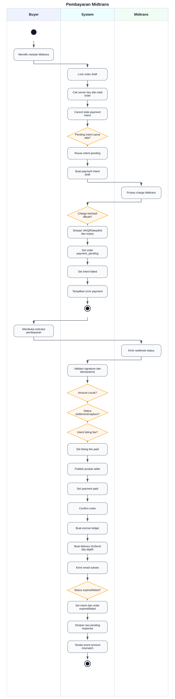

Source PlantUML: [diagrams/plantuml/16-pembayaran-midtrans.puml](diagrams/plantuml/16-pembayaran-midtrans.puml)

### File/kode terkait

- `unitrade_payment/models/sale_order.py`: `action_create_midtrans_payment`, `_unitrade_mark_midtrans_paid`
- `unitrade_payment/models/payment_intent.py`: model payment intent
- `unitrade_payment/controllers/main.py`: `/unitrade/payment/midtrans/webhook`, payment instructions, payment status
- `unitrade_payment/models/escrow_ledger.py`: escrow ledger creation

## 17. Status Pesanan

### Deskripsi singkat

Status pesanan menampilkan progres transaksi dari pembayaran, escrow, penyerahan barang, konfirmasi penerimaan, cancel, hingga refund. Seller dapat mengonfirmasi handoff, dan buyer dapat mengonfirmasi barang diterima.

### Aktor yang terlibat

- Pembeli
- Seller
- Sistem UniTrade
- Escrow

### Alur aktivitas

1. Pengguna membuka halaman status order.
2. Sistem memeriksa hak akses order.
3. Sistem membangun payload status order.
4. Seller dapat mengirim bukti handoff dan tracking.
5. Sistem menyimpan konfirmasi seller dan menandai delivery picked up.
6. Buyer dapat mengonfirmasi barang diterima dengan bukti bila diperlukan.
7. Jika seller dan buyer sudah konfirmasi, escrow menjadi releasable dan order dapat menjadi completed.
8. Jika masih dalam window cancel atau refund, sistem menyediakan aksi sesuai status.

### Activity diagram PlantUML

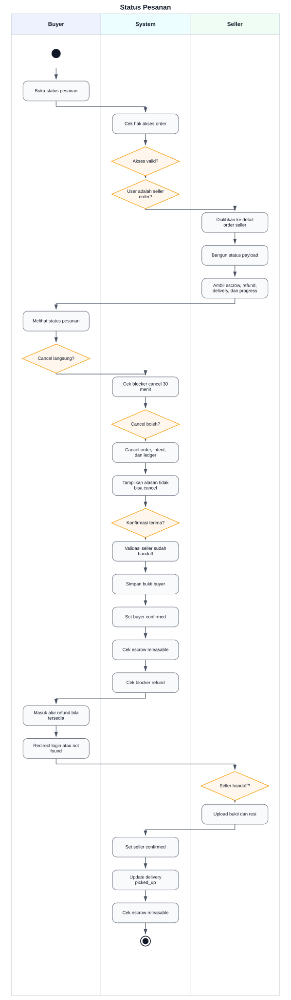

Source PlantUML: [diagrams/plantuml/17-status-pesanan.puml](diagrams/plantuml/17-status-pesanan.puml)

### File/kode terkait

- `unitrade_payment/controllers/main.py`: `/unitrade/order/status/<order_id>`, status data, confirm received, cancel, seller handoff
- `unitrade_payment/models/sale_order.py`: `unitrade_status_payload`, `action_unitrade_buyer_confirm_received`, `action_unitrade_cancel_by_buyer`
- `unitrade_payment/models/escrow_ledger.py`: seller confirmation, buyer confirmation, releasable

## 18. Chat Buyer-Seller

### Deskripsi singkat

Chat buyer-seller membuka atau memakai ulang conversation antara buyer dan seller terverifikasi. Sistem memvalidasi partisipan, membatasi pesan, mendukung attachment gambar, realtime bus, read status, presence, typing, add to cart, dan report.

### Aktor yang terlibat

- Pembeli
- Seller
- Sistem UniTrade
- Bus notification

### Alur aktivitas

1. Pembeli membuka chat dari seller atau produk.
2. Sistem memeriksa login, seller verified, toko aktif, dan bukan toko sendiri.
3. Sistem membuat atau mengambil conversation aktif.
4. Pengguna membuka bootstrap chat dan memuat pesan.
5. Pengguna mengirim teks, produk, atau attachment.
6. Sistem memvalidasi partisipan, panjang pesan, dan attachment.
7. Sistem membuat message, memperbarui unread count, dan mengirim event bus.
8. Pengguna dapat mark read, typing, presence, add to cart, atau report chat.

### Activity diagram PlantUML

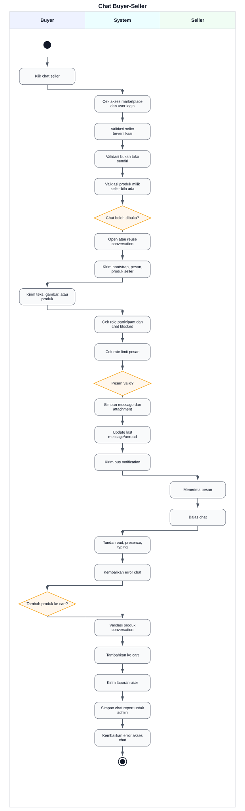

Source PlantUML: [diagrams/plantuml/18-chat-buyer-seller.puml](diagrams/plantuml/18-chat-buyer-seller.puml)

### File/kode terkait

- `unitrade_chat/controllers/main.py`: chat page, open, bootstrap, messages, send, cart add, report, read, presence, typing
- `unitrade_chat/models/chat.py`: conversation, message, report, rate limit
- `unitrade_notification/models/chat_hooks.py`: hook notifikasi chat

## 19. Live Chat dan Customer Service

### Deskripsi singkat

Customer service memiliki dua jalur: ticket berbasis kategori dan live chat berbasis sesi AI atau admin. AI dapat menjawab otomatis jika aktif, dan user dapat melakukan eskalasi ke admin.

### Aktor yang terlibat

- Pengguna
- Sistem UniTrade
- AI Customer Service
- Admin CS

### Alur aktivitas

1. Pengguna membuka halaman customer service.
2. Sistem menampilkan kategori, order terkait, ticket terbaru, atau sesi chat.
3. Pengguna membuat ticket atau mengirim pesan chat.
4. Jika live chat AI aktif, sistem membuat sesi `ai_active` dan menghasilkan balasan AI.
5. Jika user meminta eskalasi atau AI tidak dapat menangani, sistem membuat ticket dan mengubah sesi ke `waiting_admin`.
6. Admin mengambil sesi dari queue.
7. Admin membalas atau menutup sesi.
8. Ticket diperbarui menjadi in progress atau done sesuai aksi admin.

### Activity diagram PlantUML

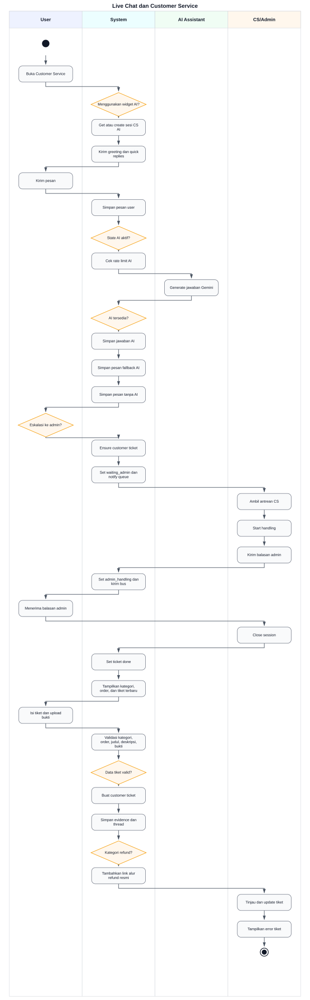

Source PlantUML: [diagrams/plantuml/19-live-chat-dan-customer-service.puml](diagrams/plantuml/19-live-chat-dan-customer-service.puml)

### File/kode terkait

- `unitrade_theme/controllers/customer_service.py`: customer service page, ticket create, ticket reply, evidence
- `unitrade_theme/models/customer_service.py`: `unitrade.customer.ticket`, thread message, evidence
- `unitrade_cs_ai/controllers/cs_portal.py`: chat session, send, escalate, history
- `unitrade_cs_ai/controllers/cs_admin.py`: admin queue, detail, reply, start, close
- `unitrade_cs_ai/models/cs_session.py`: state sesi AI dan admin
- `unitrade_cs_ai/models/cs_ai_service.py`: integrasi Gemini dan fallback

## 20. Notifikasi

### Deskripsi singkat

Notifikasi dibuat melalui event registry dan hook dari modul seller, sale order, payment, review, chat, dan customer service. Sistem memperhatikan scope user atau seller, preference, idempotency, dan email channel bila diaktifkan.

### Aktor yang terlibat

- Pengguna
- Seller
- Sistem UniTrade
- Email

### Alur aktivitas

1. Peristiwa aplikasi terjadi, seperti pembayaran sukses, seller approved, chat baru, atau review baru.
2. Hook modul memanggil emit notifikasi dengan event code.
3. Sistem memvalidasi event registry dan payload.
4. Sistem memeriksa preferensi user dan idempotency key.
5. Sistem membuat record notifikasi.
6. Jika channel email aktif dan diizinkan, sistem mengirim email.
7. User atau seller membaca notification center, recent list, unread count, mark read, read all, delete, atau settings.

### Activity diagram PlantUML

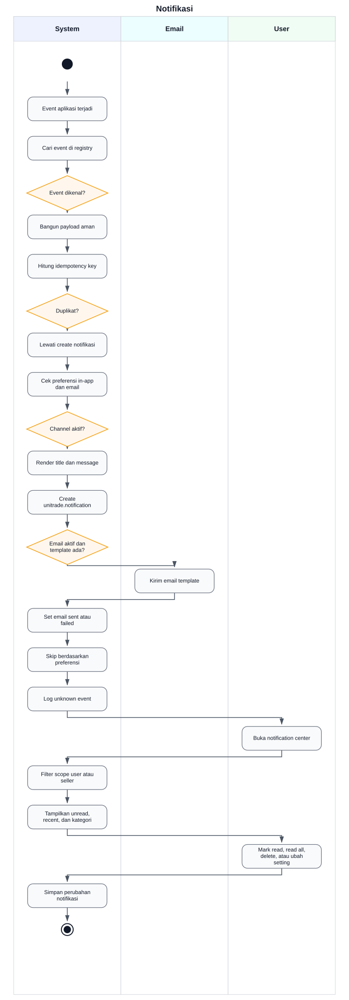

Source PlantUML: [diagrams/plantuml/20-notifikasi.puml](diagrams/plantuml/20-notifikasi.puml)

### File/kode terkait

- `unitrade_notification/models/notification.py`: `emit`, preference, mark read, delete
- `unitrade_notification/models/event_registry.py`: daftar event code
- `unitrade_notification/controllers/main.py`: notification center, unread count, recent, read, delete, settings
- `unitrade_notification/models/*_hooks.py`: hook seller, sale order, payment, review, chat

## 21. Review

### Deskripsi singkat

Review produk hanya dapat dibuat untuk order yang eligible, yaitu order selesai atau refunded sesuai logika model. Sistem mencegah duplikasi review per order dan produk, memperbarui statistik rating produk, serta mendukung helpful dan report.

### Aktor yang terlibat

- Pembeli
- Seller
- Sistem UniTrade
- Admin untuk report review

### Alur aktivitas

1. Pembeli membuka status review atau form review.
2. Sistem memeriksa apakah order dan produk eligible untuk review.
3. Pembeli mengirim rating, komentar, tag, dan gambar opsional.
4. Sistem memvalidasi rating dan duplikasi.
5. Sistem membuat atau memperbarui review visible.
6. Sistem memperbarui statistik rating produk.
7. User dapat menandai helpful atau melaporkan review.

### Activity diagram PlantUML

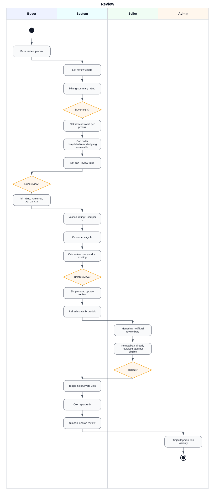

Source PlantUML: [diagrams/plantuml/21-review.puml](diagrams/plantuml/21-review.puml)

### File/kode terkait

- `unitrade_review/controllers/main.py`: `/unitrade/reviews/list`, status, create, helpful, report
- `unitrade_review/models/review.py`: review, helpful, report, eligibility order, rating stats
- `unitrade_notification/models/review_hooks.py`: notifikasi review untuk seller

## 22. Laporan, Dispute, dan Refund

### Deskripsi singkat

Refund dibuat sebagai dispute dengan bukti buyer, foto, dan link Google Drive. Escrow dipindah ke state disputed selama review. Seller dapat menyetujui, menolak, merespons, atau mengonfirmasi barang kembali. Admin mengambil keputusan final approve, reject, cancel, atau meminta bukti tambahan.

### Aktor yang terlibat

- Pembeli
- Seller
- Admin atau CS
- Sistem UniTrade
- Escrow

### Alur aktivitas

1. Pembeli membuka halaman pengajuan refund dari order.
2. Sistem memeriksa hak akses order, payment paid, order processing, escrow held atau disputed, dan tidak ada dispute aktif.
3. Pembeli mengirim reason, catatan minimal, foto bukti, video unboxing atau link Google Drive.
4. Sistem membuat `unitrade.dispute` dan evidence, lalu submit case.
5. Sistem mengubah escrow menjadi disputed dan order refund state menjadi submitted.
6. Admin dapat start review, meminta bukti buyer, atau meminta respons seller.
7. Seller dapat menyetujui refund, menolak dengan catatan, merespons dengan bukti, atau mengonfirmasi barang sudah kembali.
8. Jika seller menyetujui, buyer dapat mengirim bukti pengembalian barang.
9. Setelah masuk final review, admin approve atau reject.
10. Jika approved, order menjadi refunded, intent refunded, escrow refunded.
11. Jika rejected atau cancelled, escrow dikembalikan ke held.

### Activity diagram PlantUML

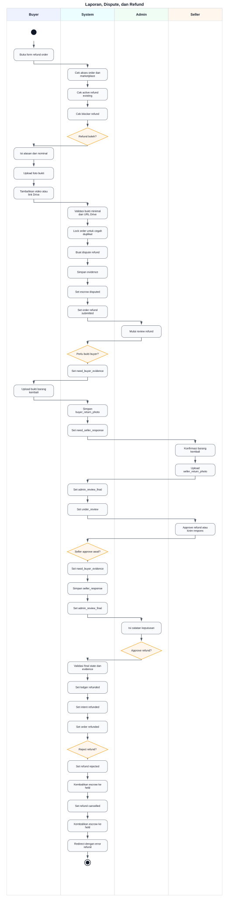

Source PlantUML: [diagrams/plantuml/22-laporan-dispute-dan-refund.puml](diagrams/plantuml/22-laporan-dispute-dan-refund.puml)

### File/kode terkait

- `unitrade_dispute/controllers/main.py`: refund create page, create refund, detail, return evidence, seller response, seller confirm return
- `unitrade_dispute/models/sale_order.py`: `x_refund_state`, `_unitrade_refund_blocker`, `action_unitrade_create_refund`
- `unitrade_dispute/models/dispute.py`: state dispute, `action_submit`, `action_start_review`, `action_need_buyer_evidence`, `action_need_seller_response`, `action_seller_approve_refund`, `action_seller_reject_refund`, `action_seller_respond`, `action_approve_refund`, `action_reject_refund`, `action_cancel`
- `unitrade_admin/controllers/admin_dashboard.py`: admin refunds page dan API action
- `unitrade_admin/models/admin_stats.py`: `admin_refund_action`
- `unitrade_seller/controllers/main.py`: seller refund pages dan seller refund decision

## 23. Delivery

### Deskripsi singkat

Delivery mendukung pickup dan GoSend. Kode yang ditemukan menghitung ongkir GoSend dengan tabel jarak lokal dan membuat record delivery setelah pembayaran berhasil. Webhook eksternal delivery dinyatakan tidak aktif, sehingga update status dilakukan manual melalui seller atau admin.

### Aktor yang terlibat

- Pembeli
- Seller
- Sistem UniTrade
- Admin

### Alur aktivitas

1. Pembeli memilih metode pengiriman di checkout.
2. Sistem menghitung ongkir berdasarkan metode.
3. Untuk pickup, ongkir nol.
4. Untuk GoSend, sistem membutuhkan koordinat buyer dan seller.
5. Jika GPS tidak lengkap, sistem memblokir payment.
6. Setelah order paid, sistem membuat record delivery GoSend secara idempotent.
7. Seller mengonfirmasi handoff dan dapat memperbarui tracking atau status delivery.
8. Admin dapat memantau delivery, tetapi API update admin mengembalikan pesan bahwa monitoring delivery dinonaktifkan dan diarahkan ke monitoring transaksi.

### Activity diagram PlantUML

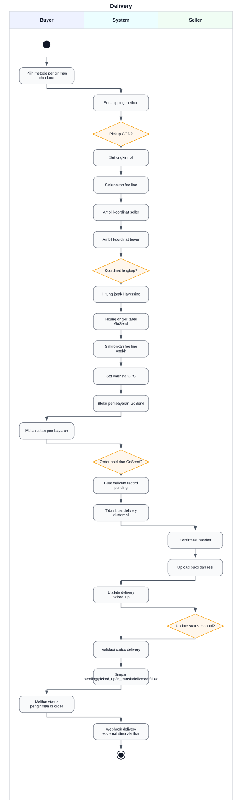

Source PlantUML: [diagrams/plantuml/23-delivery.puml](diagrams/plantuml/23-delivery.puml)

### File/kode terkait

- `unitrade_delivery/models/sale_order_shipping.py`: shipping method, ongkir, GPS blocker
- `unitrade_delivery/models/delivery.py`: `unitrade.delivery`, `_unitrade_create_for_order`, status delivery
- `unitrade_delivery/shipping_methods.py`: metode pickup dan GoSend, tabel ongkir
- `unitrade_delivery/controllers/main.py`: webhook delivery eksternal dinonaktifkan
- `unitrade_payment/controllers/main.py`: seller delivery update dan handoff
- `unitrade_admin/controllers/admin_dashboard.py`: API status delivery

## 24. Dashboard Admin

### Deskripsi singkat

Dashboard admin menyediakan ringkasan operasional, antrian, statistik, dan aksi untuk seller, verifikasi KTM, user, order, produk, voucher, customer service, live chat, refund, payout, audit log, announcement, report, dan settings.

### Aktor yang terlibat

- Admin UniTrade
- Sistem UniTrade

### Alur aktivitas

1. Admin membuka dashboard.
2. Sistem memeriksa hak akses admin.
3. Sistem membangun dashboard context dan statistik.
4. Admin memilih menu operasional.
5. Sistem menampilkan data sesuai menu.
6. Admin menjalankan aksi seperti approve seller, block user, update product, refund decision, payout action, announcement, atau export.
7. Sistem menjalankan action di model admin stats dan mencatat audit bila tersedia.

### Activity diagram PlantUML

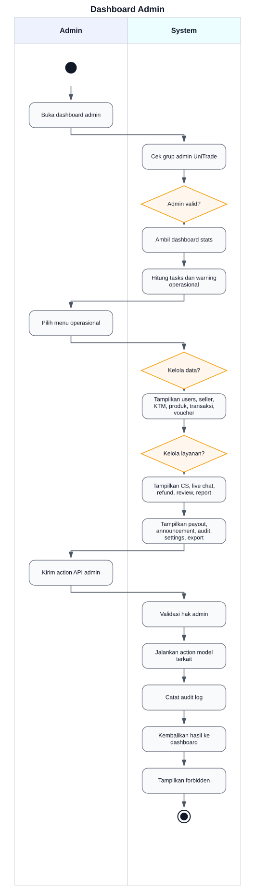

Source PlantUML: [diagrams/plantuml/24-dashboard-admin.puml](diagrams/plantuml/24-dashboard-admin.puml)

### File/kode terkait

- `unitrade_admin/controllers/admin_dashboard.py`: route dashboard, menu admin, dan API admin
- `unitrade_admin/models/admin_stats.py`: statistik, report, queue, action seller, product, order, refund, payout, voucher, announcement
- `unitrade_admin/models/audit_log.py`: audit log admin
- `unitrade_admin/models/res_config_settings.py`: settings marketplace dan payment

## 25. Payout dan Escrow

### Deskripsi singkat

Escrow dibuat setelah pembayaran order berhasil. Dana seller ditahan dalam ledger sampai seller mengonfirmasi handoff dan buyer mengonfirmasi penerimaan. Jika kedua konfirmasi terpenuhi, ledger menjadi releasable. Payout yang terdeteksi di kode adalah payout manual admin; payout gateway otomatis dinonaktifkan dan perlu konfirmasi bila ingin dipakai.

### Aktor yang terlibat

- Pembeli
- Seller
- Admin UniTrade
- Sistem UniTrade
- Escrow

### Alur aktivitas

1. Pembayaran order sukses.
2. Sistem membuat escrow ledger per seller dan menahan dana.
3. Seller mengonfirmasi handoff dengan bukti.
4. Buyer mengonfirmasi barang diterima, atau sistem melakukan auto-confirm melalui cron setelah batas waktu dari handoff seller.
5. Jika konfirmasi seller dan buyer sudah tersedia, ledger menjadi releasable.
6. Admin membuat payout manual dari ledger releasable milik seller yang sama.
7. Sistem memvalidasi ledger, status payment paid, tidak ada dispute aktif, dan ledger belum payout.
8. Admin menandai payout ready bila data rekening seller lengkap.
9. Admin melakukan transfer manual dan mengisi reference atau bukti transfer.
10. Admin menandai payout paid.
11. Sistem mengubah ledger menjadi released dan payout status succeeded.
12. Jika payout dibatalkan sebelum paid, sistem melepas reservasi ledger.

### Activity diagram PlantUML

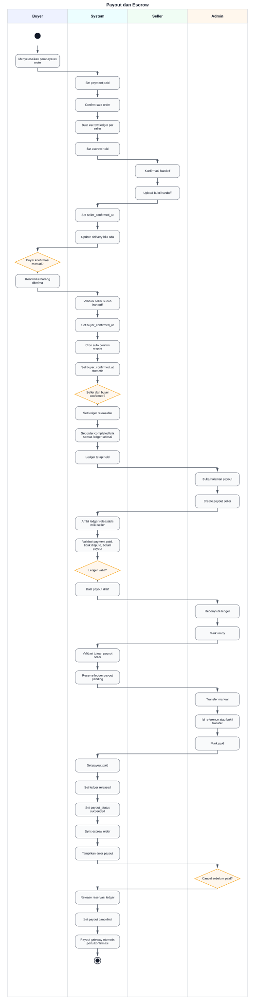

Source PlantUML: [diagrams/plantuml/25-payout-dan-escrow.puml](diagrams/plantuml/25-payout-dan-escrow.puml)

### File/kode terkait

- `unitrade_payment/models/escrow_ledger.py`: escrow held, releasable, released, dispute, manual payout action
- `unitrade_payment/models/seller_payout.py`: payout manual, validation, ready, paid, cancel
- `unitrade_payment/models/sale_order.py`: escrow state dan order state setelah payment paid
- `unitrade_admin/controllers/admin_dashboard.py`: `/unitrade/admin/payouts`, `/unitrade/admin/api/payouts/action`
- `unitrade_admin/models/admin_stats.py`: `get_payouts_page`, `admin_run_payout_action`

## Ringkasan Deteksi

### Fitur yang berhasil diperiksa ulang

Semua fitur berikut sudah diperiksa ulang terhadap kode project saat ini, dirapikan menjadi PlantUML Activity Diagram dengan swimlane `|Aktor|`, disimpan sebagai source `.puml`, dan ditampilkan melalui preview SVG:

- Register
- Login
- OTP
- Reset password
- Profil user
- Pengajuan seller
- Verifikasi KTM
- Approval seller oleh admin
- Kelola produk
- Katalog produk
- Detail produk
- Pencarian dan filter
- Wishlist
- Cart
- Checkout
- Pembayaran Midtrans
- Status pesanan
- Chat buyer-seller
- Live chat dan customer service
- Notifikasi
- Review
- Laporan, dispute, dan refund
- Delivery
- Dashboard admin
- Payout dan escrow

### Fitur yang belum jelas atau perlu konfirmasi

- Payout otomatis melalui gateway tidak terdeteksi sebagai alur aktif. Kode `action_create_xendit_payout` dan simulasi payout langsung menyatakan payout gateway dinonaktifkan, sedangkan payout aktif adalah payout manual admin.
- Integrasi GoSend eksternal atau webhook delivery tidak terdeteksi sebagai alur aktif. Kode delivery memakai tabel ongkir lokal dan controller delivery menyatakan webhook eksternal dinonaktifkan.
- Xendit checkout dan webhook ditemukan di modul payment, tetapi alur checkout utama yang dipakai controller mengarah ke Midtrans. Perlu konfirmasi apakah Xendit masih menjadi opsi aktif untuk pembeli.
- DOKU disebut dalam struktur provider payment, tetapi tidak terlihat sebagai alur checkout aktif dari route checkout yang dipindai. Perlu konfirmasi bila DOKU harus didokumentasikan sebagai fitur aktif.
