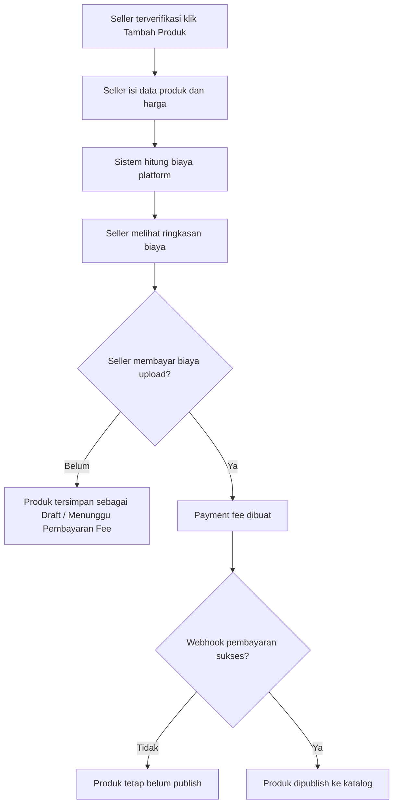
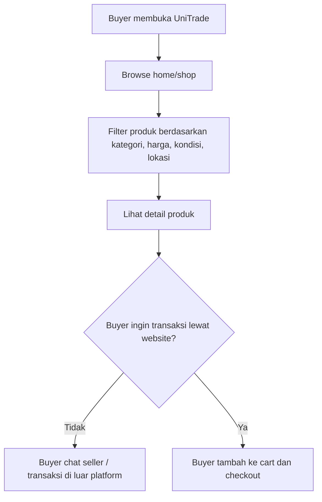
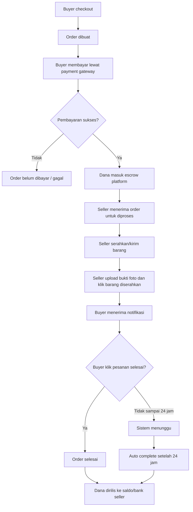
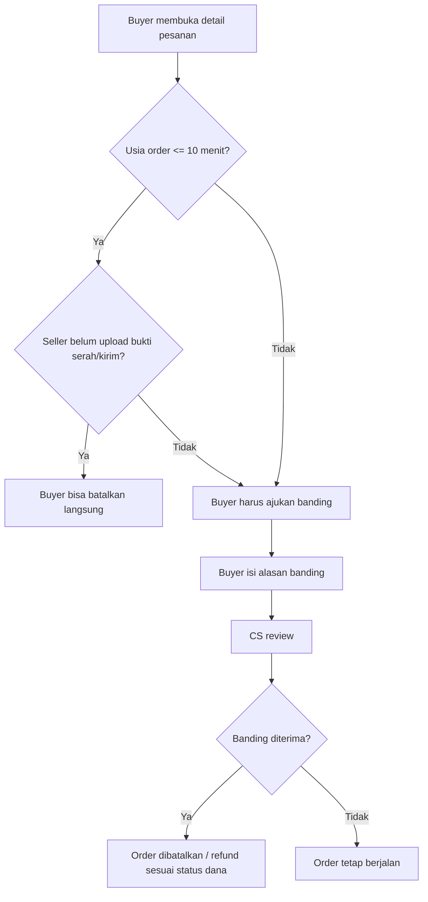
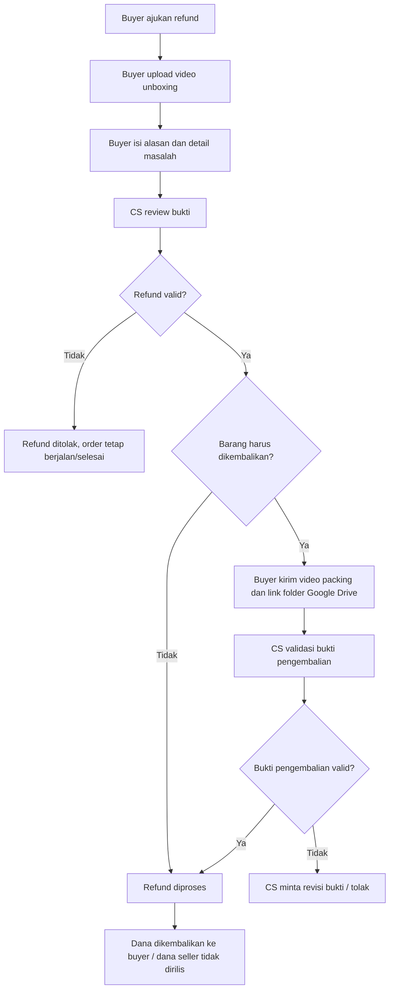

# UniTrade Student Catalog Marketplace Plan

Tanggal: 2026-05-10
Status: Draft konsep baru dengan keputusan MVP
Target platform: Odoo 17, Website Sale, custom modules UniTrade

## 0. Keputusan MVP yang Sudah Ditetapkan

Keputusan berikut menjadi dasar implementasi berikutnya:

- Mode katalog tetap diizinkan. Buyer dapat chat seller dan melakukan transaksi di luar website.
- Produk yang dipakai untuk transaksi luar website wajib menampilkan label bahwa transaksi tersebut tidak dilindungi escrow/refund UniTrade.
- Produk seller tidak boleh publish sebelum biaya upload produk dibayar.
- Payout seller dimulai secara manual oleh admin agar risiko finansial lebih rendah.
- Checkout website tetap menjadi jalur resmi yang mendapat proteksi UniTrade: escrow, bukti serah/kirim, konfirmasi selesai, banding, dan refund.

## 0.1 Dokumentasi Per Fitur

Detail implementasi per fitur disimpan dalam folder:

`docs/plans/unitrade-student-marketplace-features/`

Daftar dokumen:

- [Feature Gap and Roadmap](unitrade-student-marketplace-features/00-feature-gap-and-roadmap.md)
- [Catalog Mode and Protection Label](unitrade-student-marketplace-features/01-catalog-mode-protection-label.md)
- [Seller Product Upload Fee](unitrade-student-marketplace-features/02-seller-product-upload-fee.md)
- [Checkout Escrow Order Flow](unitrade-student-marketplace-features/03-checkout-escrow-order-flow.md)
- [Cancel Window and Appeal](unitrade-student-marketplace-features/04-cancel-window-and-appeal.md)
- [Refund Dispute Evidence](unitrade-student-marketplace-features/05-refund-dispute-evidence.md)
- [Manual Seller Payout](unitrade-student-marketplace-features/06-manual-seller-payout.md)
- [Notification Center](unitrade-student-marketplace-features/07-notification-center.md)
- [Legal Policy Update](unitrade-student-marketplace-features/08-legal-policy-update.md)

## 1. Ringkasan Konsep

UniTrade diarahkan menjadi wadah katalog dan marketplace untuk mahasiswa UNISA Yogyakarta yang ingin memasarkan produk. Semua user terdaftar dapat menjadi pembeli, tetapi hanya mahasiswa yang sudah lolos verifikasi KTM yang boleh menjadi seller.

Konsep utama:

- UniTrade menjadi katalog produk mahasiswa.
- Seller wajib verifikasi KTM sebelum bisa upload produk.
- Setiap upload produk dikenakan biaya platform berdasarkan harga produk.
- Produk dapat dipakai untuk promosi katalog dan chat seller.
- Pembeli dapat memilih transaksi lewat website atau lanjut komunikasi dengan seller.
- Transaksi luar website harus diberi label bahwa tidak ada proteksi escrow/refund UniTrade.
- Jika pembeli checkout dan bayar lewat website, transaksi masuk alur proteksi platform: pembayaran ditahan, seller memproses pesanan, seller upload bukti serah/kirim, pembeli konfirmasi selesai, lalu dana seller dirilis.
- Jika pembeli tidak klik pesanan selesai dalam 24 jam setelah seller upload bukti serah/kirim, sistem dapat menyelesaikan pesanan otomatis.
- Pembatalan bebas hanya tersedia sampai 10 menit setelah checkout.
- Setelah 10 menit, pembatalan harus melalui banding.
- Refund wajib menyertakan video unboxing. Jika barang harus dikembalikan, pembeli wajib menyertakan video packing dan link folder Google Drive sebagai bukti.

## 2. Prinsip Produk

### 2.1 Katalog dan Marketplace

UniTrade tidak memaksa semua transaksi dibayar lewat website. Platform mendukung dua mode:

1. Mode katalog
   - Produk tampil di katalog.
   - Buyer bisa melihat detail produk, chat seller, wishlist, dan melihat profil seller.
   - Transaksi dapat terjadi di luar website.
   - Proteksi escrow, refund, dan status order UniTrade tidak berlaku untuk transaksi di luar website.
   - UI wajib menampilkan label perlindungan yang jelas sebelum buyer chat/transaksi luar website.

2. Mode checkout website
   - Buyer checkout dan membayar lewat UniTrade.
   - Dana ditahan oleh platform sampai pesanan selesai.
   - Sistem menyediakan status pesanan, bukti serah/kirim, refund, banding, dan payout seller.
   - Review hanya diberikan untuk transaksi yang tercatat di website.

Keputusan MVP: aktifkan dua mode, tetapi beri label jelas bahwa proteksi UniTrade hanya berlaku untuk checkout website.

### 2.2 Seller Mahasiswa Terverifikasi

Syarat seller:

- User harus login.
- User harus verifikasi OTP/email.
- User mengajukan seller onboarding.
- User upload KTM.
- Sistem OCR membaca NIM dan nama.
- Data dicocokkan dengan database mahasiswa.
- Jika OCR yakin, seller dapat disetujui otomatis atau masuk review admin sesuai threshold.
- Jika OCR tidak yakin, status masuk review manual.
- Seller wajib mengisi profil toko dan rekening bank sebelum menerima payout.

## 3. Biaya Platform Per Upload Produk

Biaya platform dibayar seller setiap kali upload produk agar produk bisa dipublikasikan. Biaya dihitung dari harga produk dalam Rupiah.

Keputusan MVP: fee upload produk wajib lunas sebelum produk publish di katalog.

### 3.1 Tabel Tarif

| Rentang harga produk | Tarif platform | Contoh biaya |
| --- | ---: | ---: |
| Rp1 - Rp50.000 | 2,5% - 3% | Rp50.000 x 3% = Rp1.500 |
| Rp50.001 - Rp100.000 | 5% | Rp80.000 x 5% = Rp4.000 |
| Rp100.001 - Rp500.000 | 7% | Rp250.000 x 7% = Rp17.500 |
| Rp500.001 ke atas | 10% | Rp800.000 x 10% = Rp80.000 |

Catatan keputusan:

- Rentang Rp1 - Rp50.000 masih perlu diputuskan fixed 2,5%, fixed 3%, atau configurable 2,5% sampai 3%.
- Rekomendasi teknis: simpan tarif sebagai konfigurasi admin agar bisa diubah tanpa edit kode.
- Rekomendasi bisnis: gunakan 3% sebagai default awal untuk tier Rp1 - Rp50.000, kecuali ada kebijakan promo.
- Biaya dibulatkan ke Rupiah utuh. Jika perlu tampilan lebih rapi, biaya dapat dibulatkan ke atas ke kelipatan Rp100.

### 3.2 Alur Fee Upload Produk

### 3.3 Aturan Fee Produk

- Produk baru tidak langsung publish sebelum fee upload lunas.
- Jika seller mengubah harga produk ke tier lebih tinggi, sistem menghitung selisih fee dan meminta pembayaran tambahan sebelum perubahan publish.
- Jika seller menurunkan harga produk, fee yang sudah dibayar tidak otomatis dikembalikan kecuali ada kebijakan admin.
- Jika produk ditolak admin karena melanggar aturan, status produk menjadi rejected. Refund fee listing perlu diputuskan oleh kebijakan platform.
- Fee upload berbeda dari komisi transaksi. Untuk konsep saat ini, fee upload adalah biaya utama yang dibayar seller saat listing.

## 4. Alur User Utama

### 4.1 Buyer Melihat Katalog

### 4.2 Checkout Website dengan Proteksi Dana

### 4.3 Pembatalan Pesanan

Aturan:

- Buyer dapat membatalkan pesanan sendiri maksimal 10 menit setelah checkout.
- Pembatalan langsung hanya boleh jika seller belum upload bukti serah/kirim.
- Setelah 10 menit, buyer harus membuat banding pembatalan.
- Admin/CS memutuskan banding berdasarkan status seller, bukti, chat, dan alasan pembatalan.

## 5. Refund dan Banding

### 5.1 Syarat Refund

Refund hanya dapat diajukan untuk transaksi checkout website. Transaksi di luar website tidak masuk proteksi UniTrade.

Pembeli wajib menyertakan:

- Video unboxing tanpa potongan sebagai bukti utama.
- Foto pendukung jika ada.
- Alasan refund yang jelas.
- Jika barang wajib dikembalikan, pembeli wajib membuat video packing.
- Jika diminta CS, pembeli mengunggah bukti ke folder Google Drive dan mengirim link folder di form banding.

### 5.2 Alur Refund

### 5.3 Status Refund/Banding

Status yang dibutuhkan:

- `draft`: form belum lengkap.
- `submitted`: diajukan buyer.
- `under_review`: sedang dicek CS.
- `need_buyer_evidence`: CS meminta bukti tambahan dari buyer.
- `need_seller_response`: CS meminta klarifikasi seller.
- `approved`: refund disetujui.
- `rejected`: refund ditolak.
- `resolved`: kasus selesai.

### 5.4 Kebijakan Refund yang Perlu Ditampilkan

Halaman legal/FAQ perlu menambahkan kebijakan:

- Refund hanya berlaku untuk checkout website.
- Video unboxing wajib untuk klaim barang rusak, tidak sesuai, atau kurang.
- Video harus memperlihatkan paket masih tertutup sebelum dibuka.
- Video tidak boleh terpotong atau diedit.
- Klaim tanpa video unboxing dapat ditolak.
- Untuk pengembalian barang, video packing wajib.
- Link Google Drive harus bisa diakses CS.
- CS berhak meminta bukti tambahan dari buyer atau seller.
- Jika buyer tidak merespons permintaan bukti dalam batas waktu tertentu, kasus dapat ditutup.
- Jika seller terbukti melanggar, dana tidak dirilis dan seller dapat dikenai sanksi.

## 6. Seller Payout dan Escrow

### 6.1 Prinsip Dana

- Uang buyer tidak langsung masuk ke seller.
- Dana ditahan sebagai escrow platform setelah pembayaran sukses.
- Dana seller dirilis setelah pesanan selesai atau auto complete 24 jam.
- Jika ada banding/refund aktif, payout ditahan sampai kasus selesai.
- Pada MVP, payout dilakukan manual oleh admin.

### 6.2 Data Rekening Seller

Seller wajib mengisi:

- Nama pemilik rekening.
- Nama bank.
- Nomor rekening.
- Status verifikasi rekening.

Keputusan MVP:

- Simpan data rekening di profil seller.
- Payout awal dilakukan manual oleh admin.
- Payout otomatis dapat menjadi fase lanjutan setelah flow transaksi stabil.

## 6.3 Fitur yang Harus Dibuat / Belum Dibuat

Daftar ini merangkum gap dari project saat ini terhadap konsep baru.

| Area | Status saat ini | Fitur yang harus dibuat |
| --- | --- | --- |
| Label proteksi katalog | Belum ada label eksplisit | Label pada detail produk, chat CTA, cart/checkout, dan FAQ bahwa transaksi luar website tidak dilindungi escrow/refund |
| Seller product CRUD website | Belum siap untuk seller normal | Form tambah/edit produk dari website, upload gambar, status draft/fee pending/published |
| Fee upload produk | Belum ada | Tier fee, kalkulasi fee, pembayaran fee, status fee, publish setelah fee paid |
| Checkout website penuh | Ada sebagian | Midtrans Snap dari website, payment intent, status pembayaran yang terhubung ke order |
| Escrow order | Belum ada | Ledger dana masuk, dana tertahan, dana rilis, dana refund |
| Seller bukti serah/kirim | Belum ada | Upload foto bukti, catatan, timestamp, status handoff uploaded |
| Konfirmasi pesanan selesai | Belum ada | Tombol buyer klik selesai dan cron auto complete 24 jam |
| Cancel 10 menit | Belum ada | Cancel langsung sebelum 10 menit dan belum ada bukti seller |
| Banding cancel | Belum ada | Form banding setelah 10 menit atau setelah seller upload bukti |
| Refund evidence | Belum ada | Video unboxing wajib, video packing, link Google Drive |
| CS dispute dashboard | Belum ada | Review bukti, approve/reject, minta bukti tambahan |
| Manual payout seller | Belum ada | Data rekening seller, saldo siap cair, admin payout, audit log |
| Notification center | Ada model, belum ada UI | Inbox notifikasi dan event notifikasi transaksi |
| Kebijakan refund | Belum lengkap | Halaman legal/FAQ untuk katalog, escrow, refund, unboxing, packing, Google Drive |

## 7. Perubahan Modul Odoo yang Dibutuhkan

### 7.1 `unitrade_seller`

Perubahan:

- Tambah data rekening seller.
- Tambah halaman seller product CRUD dari website.
- Tambah status seller payout eligibility.
- Tambah dashboard pendapatan yang membedakan:
  - Dana tertahan.
  - Dana siap dicairkan.
  - Dana sudah dicairkan.
  - Order sedang banding/refund.

### 7.2 `unitrade_product_ext`

Perubahan:

- Tambah status listing produk:
  - `draft`
  - `fee_pending`
  - `published`
  - `rejected`
  - `archived`
- Tambah field:
  - `x_listing_fee_rate`
  - `x_listing_fee_amount`
  - `x_listing_fee_status`
  - `x_listing_fee_payment_id`
  - `x_listing_fee_paid_at`
- Produk hanya publish jika seller terverifikasi dan fee upload lunas.

### 7.3 `unitrade_payment`

Perubahan:

- Dukung dua jenis pembayaran:
  - Listing fee seller.
  - Checkout order buyer.
- Tambah payment intent internal agar setiap pembayaran punya tipe dan referensi.
- Tambah escrow ledger untuk order checkout:
  - dana masuk
  - dana ditahan
  - dana dirilis ke seller
  - refund ke buyer
- Integrasikan Midtrans Snap/checkout UI dari website.
- Webhook harus update payment intent, order, listing fee, dan escrow.

### 7.4 `unitrade_delivery`

Perubahan:

- Tambah bukti serah/kirim seller:
  - foto bukti
  - catatan pengiriman
  - timestamp seller klik diserahkan/dikirim
- Tambah batas waktu auto complete 24 jam.
- Tracking GoSend tetap dapat menjadi fase lanjutan.

### 7.5 Modul Baru: `unitrade_dispute`

Modul baru direkomendasikan untuk banding/refund.

Model utama:

- `unitrade.dispute`
- `unitrade.dispute.evidence`
- `unitrade.dispute.message` atau gunakan chatter Odoo.

Field penting:

- order
- buyer
- seller
- product/order line
- reason
- status
- unboxing video attachment
- packing video attachment
- google_drive_url
- admin decision
- refund amount
- deadline response buyer/seller

### 7.6 `unitrade_notification`

Perubahan:

- Buat halaman inbox notifikasi user.
- Kirim notifikasi untuk:
  - fee upload berhasil
  - produk berhasil publish
  - order masuk
  - pembayaran berhasil
  - seller upload bukti serah/kirim
  - buyer perlu konfirmasi pesanan
  - auto complete akan berjalan
  - banding/refund dibuat
  - CS meminta bukti tambahan
  - refund disetujui/ditolak
  - dana seller siap dicairkan

## 8. UI/UX yang Dibutuhkan

### 8.1 Untuk Seller

Halaman:

- Dashboard seller.
- Tambah produk.
- Edit produk.
- Preview fee upload sebelum bayar.
- Pembayaran fee upload.
- Daftar produk dengan status fee dan publish.
- Detail order seller.
- Upload bukti serah/kirim.
- Daftar payout/saldo.
- Form rekening bank.
- Daftar dispute/refund yang membutuhkan respons seller.

### 8.2 Untuk Buyer

Halaman:

- Detail produk dengan pilihan chat seller dan checkout website.
- Checkout dengan informasi proteksi UniTrade.
- Detail pesanan.
- Tombol batal sebelum 10 menit.
- Tombol ajukan banding setelah 10 menit.
- Tombol pesanan selesai.
- Form refund dengan upload video unboxing.
- Form bukti pengembalian dengan link Google Drive.
- Tracking status refund.

### 8.3 Untuk Admin/CS

Halaman:

- Konfigurasi tarif platform.
- Review seller verification.
- Review produk jika dibutuhkan.
- Monitoring pembayaran listing fee.
- Monitoring escrow order.
- Review banding/refund.
- Validasi bukti video/link Google Drive.
- Keputusan refund.
- Payout seller.
- Audit log aktivitas.

## 9. State Machine Order Website

Status order platform yang disarankan:

- `draft`: cart/checkout belum bayar.
- `payment_pending`: menunggu pembayaran buyer.
- `paid_escrow`: buyer sudah bayar, dana ditahan.
- `processing`: seller memproses pesanan.
- `handoff_uploaded`: seller upload bukti serah/kirim.
- `buyer_confirmation_pending`: menunggu buyer klik selesai.
- `completed`: buyer klik selesai atau auto complete 24 jam.
- `cancelled`: order dibatalkan.
- `dispute_open`: banding/refund aktif.
- `refund_approved`: refund disetujui.
- `refund_rejected`: refund ditolak.
- `refunded`: dana dikembalikan.

Aturan penting:

- Cancel langsung hanya sampai 10 menit setelah checkout dan sebelum bukti seller.
- Dispute/refund membekukan auto complete dan payout.
- Auto complete 24 jam dihitung dari waktu seller upload bukti serah/kirim.
- Payout hanya boleh jika order `completed` dan tidak ada dispute aktif.

## 10. Acceptance Criteria MVP

### 10.1 Seller Upload Produk Berbayar

- Seller belum verifikasi tidak bisa upload produk.
- Seller verifikasi bisa membuka form tambah produk dari website.
- Sistem menghitung fee berdasarkan harga produk.
- Produk tersimpan sebagai `fee_pending` sampai fee dibayar.
- Setelah fee berhasil dibayar, produk publish ke katalog.
- Admin bisa mengubah konfigurasi tarif tanpa edit kode.

### 10.2 Checkout Website

- Buyer bisa checkout dan membayar lewat website.
- Setelah bayar sukses, order masuk status dana ditahan.
- Seller melihat order masuk.
- Seller bisa upload bukti serah/kirim berupa foto.
- Buyer bisa klik pesanan selesai.
- Jika buyer tidak klik dalam 24 jam, sistem auto complete.
- Dana seller menjadi siap dicairkan setelah completed.

### 10.3 Pembatalan dan Refund

- Buyer bisa cancel langsung sebelum 10 menit jika seller belum upload bukti.
- Setelah 10 menit, buyer diarahkan ke form banding.
- Refund wajib upload video unboxing.
- Jika perlu pengembalian, form meminta video packing dan link Google Drive.
- CS bisa approve/reject refund.
- Payout tertahan selama dispute aktif.

## 11. Roadmap Implementasi

### Fase 1: Fondasi Seller Listing Fee

Tujuan: seller bisa upload produk dari website dan membayar fee platform.

Pekerjaan:

- Buat konfigurasi tier fee.
- Tambah field listing fee di produk.
- Buat website form tambah/edit produk.
- Buat payment flow untuk listing fee.
- Publish produk otomatis setelah fee paid.
- Tambah halaman legal biaya platform.

### Fase 2: Checkout Website dan Escrow Dasar

Tujuan: buyer bisa bayar di website dan dana tidak langsung rilis ke seller.

Pekerjaan:

- Integrasikan Midtrans checkout penuh.
- Tambah payment intent dan escrow ledger.
- Tambah status order UniTrade.
- Tambah detail pesanan buyer/seller.
- Tambah bukti serah/kirim seller.
- Tambah tombol pesanan selesai buyer.
- Tambah cron auto complete 24 jam.

### Fase 3: Cancel, Banding, dan Refund

Tujuan: aturan pembatalan dan refund berjalan jelas.

Pekerjaan:

- Tambah cancel window 10 menit.
- Buat modul dispute/refund.
- Buat form banding.
- Buat upload video unboxing.
- Buat field link Google Drive dan video packing.
- Buat dashboard CS.
- Tambah kebijakan refund di FAQ/legal.

### Fase 4: Payout Seller

Tujuan: dana seller bisa dicairkan secara terkontrol.

Pekerjaan:

- Tambah data rekening seller.
- Tambah saldo seller.
- Tambah payout request.
- Buat admin approval payout.
- Integrasi payout otomatis jika provider sudah dipilih.

### Fase 5: Delivery dan Notifikasi Lanjutan

Tujuan: pengalaman operasional lebih lengkap.

Pekerjaan:

- Aktifkan tracking GoSend jika API siap.
- Buat notification center.
- Tambah email/push notification per event.
- Tambah reminder buyer untuk klik pesanan selesai.
- Tambah reminder bukti refund yang belum lengkap.

## 12. Risiko dan Keputusan Lanjutan yang Perlu Dipastikan

1. Tarif Rp1 - Rp50.000 harus dipilih: 2,5%, 3%, atau configurable.
2. Apakah fee upload produk refundable jika produk ditolak atau dihapus?
3. Berapa masa aktif listing setelah fee dibayar?
4. Apakah platform fee upload sudah cukup, atau nanti perlu komisi transaksi juga?
5. Bukti video refund disimpan di Odoo atau cukup link Google Drive?
6. Batas waktu buyer mengajukan refund perlu diputuskan, misalnya 1x24 jam setelah barang diterima.
7. Batas waktu buyer/seller merespons CS perlu diputuskan.
8. Apakah semua produk harus direview admin sebelum publish, atau cukup seller verified plus fee paid?
9. Kapan payout otomatis perlu dipertimbangkan setelah payout manual stabil?

## 13. Keputusan MVP dan Rekomendasi Teknis

- Tetap izinkan mode katalog, tetapi tampilkan label bahwa transaksi luar website tidak dilindungi escrow/refund UniTrade.
- Jadikan checkout website sebagai jalur resmi yang mendapat proteksi.
- Terapkan fee upload produk sebelum produk publish.
- Mulai payout seller secara manual dulu agar risiko finansial lebih rendah.
- Simpan tier fee sebagai konfigurasi admin.
- Gunakan 3% untuk tier Rp1 - Rp50.000 pada MVP, sambil tetap memungkinkan admin mengubah ke 2,5%.
- Simpan video unboxing/packing sebagai attachment Odoo jika ukuran memungkinkan; jika terlalu besar, wajibkan link Google Drive dan simpan metadata link.
- Buat modul dispute/refund terpisah agar tidak membuat `sale.order` terlalu besar dan sulit dirawat.
