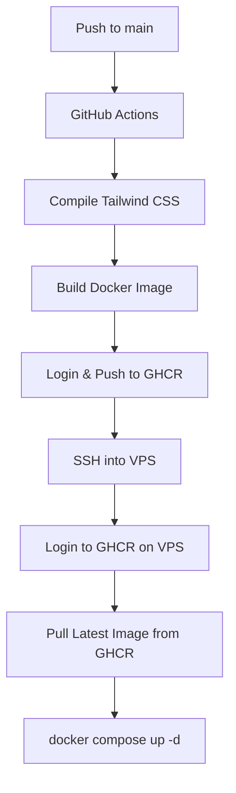

# Design: CI/CD Pipeline via GitHub Actions & GitHub Container Registry (GHCR)

**Date**: 2026-06-03  
**Status**: Proposed  

## 1. Goal
Automate the build and deployment process of the UniTrade Odoo marketplace. Every change pushed to the `main` branch on GitHub will trigger a pipeline that compiles Tailwind CSS, builds a new Docker image containing all modules and static assets, pushes it to GHCR, and deploys it on the VPS.

## 2. Architecture & Data Flow



## 3. Configuration Details

### A. `.dockerignore` [NEW]
To prevent copying unnecessary files (e.g., node modules, git logs, etc.) into the Docker image, we will create a `.dockerignore` file. This reduces build times and image sizes.

```dockerignore
.git
.github
node_modules
*.log
Dockerfile
docker-compose*.yml
README.md
```

### B. `docker-compose.prod.yml` [NEW]
This file will be used on the VPS for production deployment. It references the GHCR custom image and does not mount the source code folder as a volume.

```yaml
version: '3.8'

services:
  web:
    image: ghcr.io/rezkydesyafa/unitrade-odoo:latest
    depends_on:
      - db
    ports:
      - "8069:8069"
    volumes:
      - odoo-web-data:/var/lib/odoo
    environment:
      - HOST=db
      - USER=odoo
      - PASSWORD=odoo
    restart: always

  db:
    image: postgres:15
    environment:
      - POSTGRES_DB=postgres
      - POSTGRES_PASSWORD=odoo
      - POSTGRES_USER=odoo
    volumes:
      - odoo-db-data:/var/lib/postgresql/data
    restart: always

volumes:
  odoo-web-data:
  odoo-db-data:
```

### C. `.github/workflows/deploy.yml` [MODIFY]
We will rewrite this file to implement the build-and-push flow before executing the SSH deployment script.

```yaml
name: Deploy VPS

on:
  push:
    branches:
      - main

jobs:
  build-and-push:
    runs-on: ubuntu-latest
    permissions:
      contents: read
      packages: write

    steps:
      - name: Checkout Code
        uses: actions/checkout@v4

      - name: Setup Node.js
        uses: actions/setup-node@v4
        with:
          node-version: 18
          cache: 'npm'

      - name: Install dependencies
        run: npm ci

      - name: Build Tailwind CSS
        run: npm run build

      - name: Set up Docker Buildx
        uses: docker/setup-buildx-action@v3

      - name: Log in to GHCR
        uses: docker/login-action@v3
        with:
          registry: ghcr.io
          username: ${{ github.actor }}
          password: ${{ secrets.GITHUB_TOKEN }}

      - name: Convert repo name to lowercase
        id: repo_name
        run: echo "IMAGE_NAME=$(echo '${{ github.repository }}' | tr '[:upper:]' '[:lower:]')" >> $GITHUB_OUTPUT

      - name: Build and Push Docker Image
        uses: docker/build-push-action@v5
        with:
          context: .
          push: true
          tags: ghcr.io/${{ steps.repo_name.outputs.IMAGE_NAME }}:latest
          cache-from: type=gha
          cache-to: type=gha,mode=max

  deploy:
    needs: build-and-push
    runs-on: ubuntu-latest

    steps:
      - name: Deploy to VPS
        uses: appleboy/ssh-action@v1
        with:
          host: ${{ secrets.VPS_HOST }}
          username: ${{ secrets.VPS_USER }}
          key: ${{ secrets.VPS_SSH_KEY }}
          script: |
            cd /root/unitrade-app
            
            # Login to GHCR on VPS using a dynamic/temporary runner token
            echo "${{ secrets.GITHUB_TOKEN }}" | docker login ghcr.io -u ${{ github.actor }} --password-stdin

            # We pull the latest docker-compose.prod.yml if we want it updated, 
            # but since we are not pulling code via git on VPS, we can run git pull
            # just to get the updated docker-compose.prod.yml, or we can copy/keep it there.
            # Doing a git pull here is fine as it updates config files like docker-compose.prod.yml.
            git pull origin main

            # Pull and restart
            docker compose -f docker-compose.prod.yml pull
            docker compose -f docker-compose.prod.yml up -d
