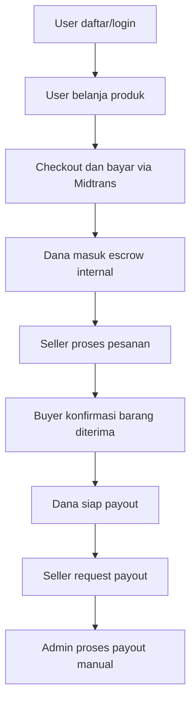
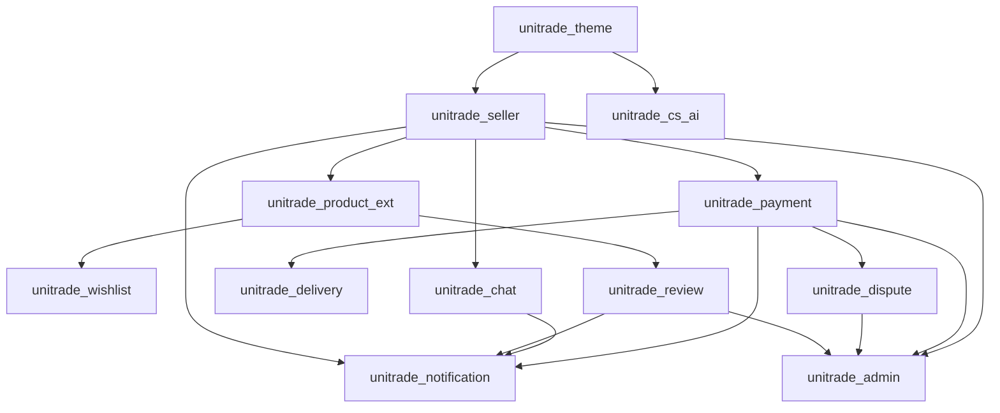

# 01. Project Overview dan Architecture

## Tujuan Dokumen

Dokumen ini menjelaskan gambaran besar UniTrade: siapa penggunanya, module apa saja yang ada, bagaimana struktur foldernya, dan bagaimana cara membaca project ini. Bahasa dibuat cukup umum, tetapi tetap menyebut istilah teknis yang penting untuk belajar kode.

## Apa Itu UniTrade

UniTrade adalah marketplace C2C berbasis Odoo 17 untuk mahasiswa UNISA Yogyakarta. C2C berarti user bisa menjadi pembeli dan, setelah lolos verifikasi, juga bisa menjadi seller. Seller wajib verifikasi KTM agar platform hanya diisi penjual yang jelas identitas kampusnya.

Alur besar marketplace:



## Aktor Utama

| Aktor | Peran | Fitur yang dipakai |
| --- | --- | --- |
| User/Pembeli | Membeli produk dan memakai layanan marketplace | Shop, cart, checkout, order status, review, wishlist, chat, CS |
| Seller | Menjual produk setelah verifikasi KTM | Seller dashboard, product management, order seller, chat seller, payout |
| Admin | Mengelola operasional UniTrade | KTM queue, user/seller management, payout, refund, review, CS, audit |
| Customer Service | Membantu user ketika ada kendala | CS AI, live chat admin, customer ticket |

## Istilah Penting

| Istilah | Arti sederhana | Contoh di kode |
| --- | --- | --- |
| Module | Paket fitur Odoo | `unitrade_chat`, `unitrade_payment` |
| Model | Definisi data dan aturan bisnis | `unitrade.seller`, `unitrade.review` |
| Table | Bentuk model di database | `unitrade_seller`, `unitrade_review` |
| Controller | Kode yang menerima request URL/API | `unitrade_chat/controllers/main.py` |
| Route | Alamat URL yang dipanggil browser/API | `/unitrade/chat/send` |
| View/QWeb | Template tampilan Odoo | file XML di `views/` |
| Asset | CSS/JS/OWL untuk frontend | `static/src/...` |
| Service | Kode pembantu untuk proses tertentu | `unitrade.admin.stats`, Gemini service |
| Hook | Kode yang ikut berjalan saat model lain berubah | notification hooks |
| Cron | Job otomatis berkala | auto confirm receipt |
| Escrow | Dana ditahan sementara | `unitrade.escrow.ledger` |
| Payout | Pencairan dana seller | `unitrade.seller.payout` |

## Struktur Folder Project

Root project berisi custom addon Odoo:

```text
unitrade_admin/
unitrade_chat/
unitrade_cs_ai/
unitrade_delivery/
unitrade_dispute/
unitrade_notification/
unitrade_payment/
unitrade_product_ext/
unitrade_review/
unitrade_seller/
unitrade_theme/
unitrade_wishlist/
docs/
docker-compose.yml
```

Pola umum module:

```text
module_name/
├── __init__.py
├── __manifest__.py
├── models/
├── controllers/
├── views/
├── security/
├── static/
└── tests/
```

## Fungsi Folder Dalam Module

| Folder/file | Fungsi |
| --- | --- |
| `__manifest__.py` | Metadata module, dependency, data XML/CSV, asset bundle |
| `__init__.py` | Import model/controller agar terbaca Odoo |
| `models/` | Model database, business logic, compute, constraint, action |
| `controllers/` | Route website, JSON API, webhook, file upload/download |
| `views/` | QWeb website, backend views, menu, action, template |
| `security/` | Hak akses model dan group |
| `static/src/` | CSS, JS, OWL component, XML frontend |
| `tests/` | Test otomatis Odoo |

## Peta Module



Diagram di atas menjelaskan hubungan konsep. Dependency asli tetap mengacu pada `__manifest__.py` masing-masing module.

## Ringkasan Module

| Module | Fokus | Area kode yang sering dibuka |
| --- | --- | --- |
| `unitrade_theme` | UI utama, auth, OTP, profile, cart, checkout | `controllers/controllers.py`, `controllers/cart.py`, `controllers/checkout.py`, `models/otp.py`, `models/sale_order.py` |
| `unitrade_seller` | Seller, KTM, dashboard seller | `models/seller.py`, `models/seller_verification.py`, `controllers/seller_verification.py`, `controllers/main.py` |
| `unitrade_product_ext` | Product marketplace fields | `models/product_template.py`, `controllers/main.py` |
| `unitrade_payment` | Midtrans, escrow, payout, order status | `models/payment_intent.py`, `models/escrow_ledger.py`, `models/seller_payout.py`, `controllers/main.py` |
| `unitrade_delivery` | Pengiriman | `models/delivery.py`, `models/sale_order_shipping.py` |
| `unitrade_dispute` | Refund/dispute | `models/dispute.py`, `controllers/main.py` |
| `unitrade_chat` | Chat buyer-seller | `models/chat.py`, `controllers/main.py` |
| `unitrade_notification` | Notification center dan hooks | `models/notification.py`, `models/*_hooks.py`, `controllers/main.py` |
| `unitrade_review` | Review, helpful, report | `models/review.py`, `controllers/main.py` |
| `unitrade_wishlist` | Wishlist | `models/wishlist.py`, `controllers/main.py` |
| `unitrade_cs_ai` | CS AI dan live chat | `models/cs_session.py`, `models/cs_ai_service.py`, `controllers/cs_portal.py`, `controllers/cs_admin.py` |
| `unitrade_admin` | Dashboard admin | `models/admin_stats.py`, `models/audit_log.py`, `controllers/admin_dashboard.py` |

## Cara Menelusuri Fitur Dari URL

1. Ambil URL dari browser, misalnya `/unitrade/chat`.
2. Cari route di `04-code-map-functions.md`.
3. Buka controller yang disebutkan.
4. Lihat model/service yang dipanggil controller.
5. Cocokkan model dengan tabel di `02-database-erd.md`.
6. Baca workflow fiturnya di `03-feature-workflows.md`.

Contoh:

```text
/unitrade/seller/products/new
-> unitrade_seller/controllers/main.py
-> product.template + unitrade.seller
-> views/static seller dashboard
-> product_template table + seller table
```

## Area Frontend

| Area | Lokasi umum |
| --- | --- |
| Navbar, homepage, shop, product detail | `unitrade_theme/views/`, `unitrade_theme/static/src/` |
| Seller dashboard | `unitrade_seller/views/`, `unitrade_seller/static/src/` |
| Chat | `unitrade_chat/static/src/`, `unitrade_chat/views/` |
| Notification | `unitrade_notification/static/src/`, `unitrade_notification/views/` |
| Customer service widget | `unitrade_cs_ai/static/src/`, `unitrade_theme/static/src/` |
| Admin dashboard | `unitrade_admin/static/src/`, `unitrade_admin/views/` |

## Area Backend

| Area | Lokasi umum |
| --- | --- |
| Admin dashboard data | `unitrade_admin/models/admin_stats.py` |
| Admin route/API | `unitrade_admin/controllers/admin_dashboard.py` |
| Payment dan webhook | `unitrade_payment/controllers/main.py` |
| Escrow/payout | `unitrade_payment/models/escrow_ledger.py`, `unitrade_payment/models/seller_payout.py` |
| KTM verification | `unitrade_seller/models/seller_verification.py`, `unitrade_seller/models/seller.py` |
| Refund/dispute | `unitrade_dispute/models/dispute.py` |
| Chat realtime | `unitrade_chat/models/chat.py`, `unitrade_chat/controllers/main.py` |

## Jalur Belajar Yang Disarankan

Untuk memahami fitur secara bisnis:

1. Baca `03-feature-workflows.md`.
2. Cocokkan modelnya di `02-database-erd.md`.
3. Baru buka kode di `04-code-map-functions.md`.

Untuk memahami kode:

1. Baca module di `04-code-map-functions.md`.
2. Lihat fungsi yang dipanggil route.
3. Buka model yang diubah function.
4. Cek ERD di `02-database-erd.md`.

## Risiko Umum Antar Module

| Risiko | Penyebab umum | Tempat cek |
| --- | --- | --- |
| User terlihat seller tapi tidak bisa jualan | `res.users` flag tidak sinkron dengan `unitrade.seller` | `unitrade_seller/models/seller.py` |
| KTM pending tidak muncul di admin | Admin membaca sumber data salah atau domain state tidak sesuai | `unitrade.admin.stats.get_ktm_verification_queue` |
| Payment sukses tapi escrow kosong | Webhook tidak update order atau `ensure_for_order` gagal | `unitrade_payment` |
| Payout tidak bisa request | Ledger belum `releasable` atau masih ada dispute | `unitrade_escrow_ledger`, `unitrade_seller_payout` |
| Notifikasi salah redirect | Payload/action URL tidak membawa target ID | `unitrade_notification/models/notification.py` |
| Status online seller salah | Detail produk dan chat memakai sumber status berbeda | `res.users` last seen, `unitrade_chat` presence |
