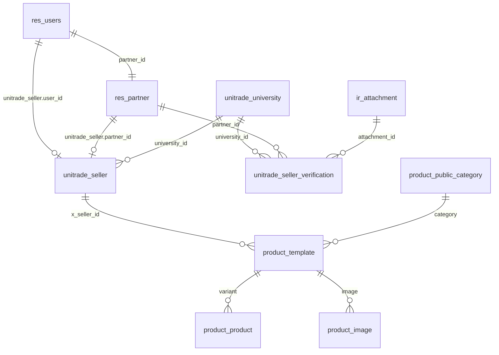
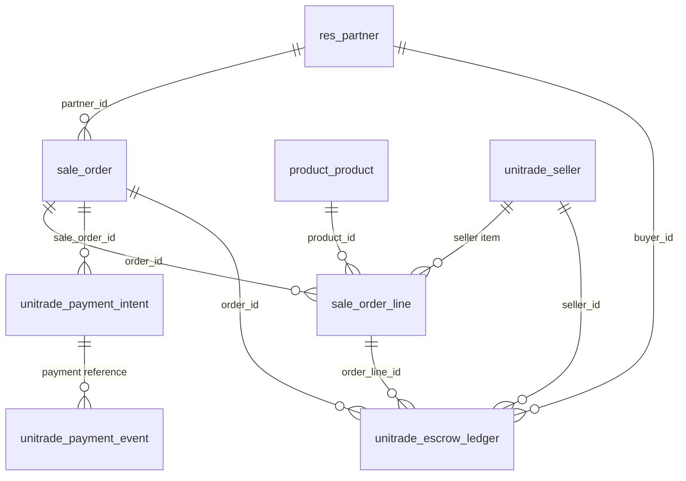
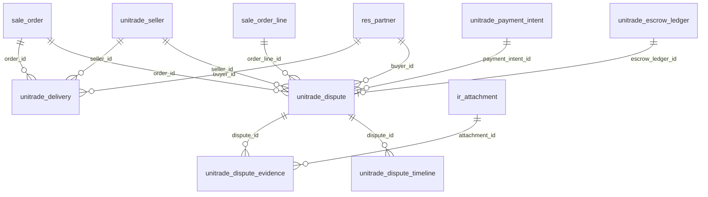
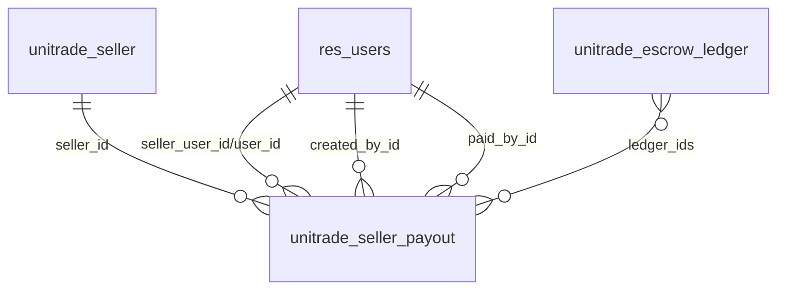
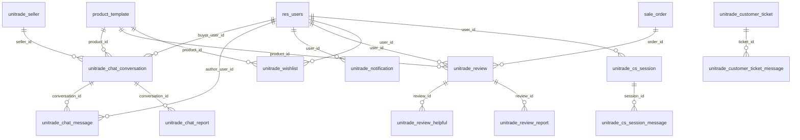
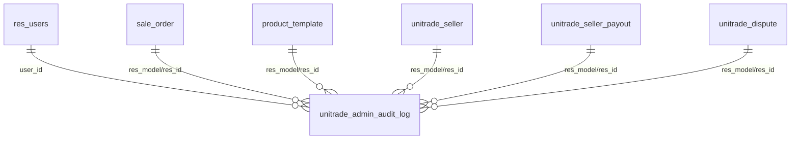

# 02. Database dan ERD

Dokumen ini menggabungkan daftar model/tabel, ERD, field relasi, state penting, dan cara debug data. Tujuannya agar mudah memahami data apa yang dibuat dan berubah ketika fitur berjalan.

## Cara Membaca Model dan Table

Di Odoo, data disebut model. Saat masuk database, model biasanya menjadi tabel dengan titik diganti underscore.

| Model Odoo | Tabel database |
| --- | --- |
| `unitrade.seller` | `unitrade_seller` |
| `unitrade.seller.verification` | `unitrade_seller_verification` |
| `unitrade.chat.message` | `unitrade_chat_message` |
| `sale.order` | `sale_order` |

Field relasi biasanya disimpan sebagai kolom integer dengan akhiran `_id`, misalnya `user_id`, `seller_id`, `order_id`, `partner_id`.

## Tabel Bawaan Odoo Yang Dipakai

| Model | Tabel | Dipakai untuk |
| --- | --- | --- |
| `res.users` | `res_users` | Akun login, buyer, seller user, admin |
| `res.partner` | `res_partner` | Profile, kontak, alamat |
| `product.template` | `product_template` | Produk marketplace |
| `product.product` | `product_product` | Variant produk untuk order line |
| `product.image` | `product_image` | Gambar tambahan produk |
| `product.public.category` | `product_public_category` | Kategori website/shop |
| `sale.order` | `sale_order` | Cart dan order |
| `sale.order.line` | `sale_order_line` | Item dalam cart/order |
| `ir.attachment` | `ir_attachment` | File KTM, bukti transfer, bukti refund, attachment chat |
| `ir.config_parameter` | `ir_config_parameter` | Setting dan credential runtime |
| `mail.message` | `mail_message` | Chatter/email log |

## Tabel Custom UniTrade

| Area | Model | Tabel | Fungsi |
| --- | --- | --- | --- |
| Seller | `unitrade.seller` | `unitrade_seller` | Data toko/seller |
| Seller | `unitrade.seller.verification` | `unitrade_seller_verification` | Pengajuan KTM |
| Seller | `unitrade.university` | `unitrade_university` | Master universitas |
| Seller | `unisa.student` | `unisa_student` | Data mahasiswa pembanding |
| Payment | `unitrade.payment.intent` | `unitrade_payment_intent` | Transaksi pembayaran |
| Payment | `unitrade.payment.event` | `unitrade_payment_event` | Log webhook payment |
| Payment | `unitrade.escrow.ledger` | `unitrade_escrow_ledger` | Dana seller yang ditahan/dilepas |
| Payment | `unitrade.seller.payout` | `unitrade_seller_payout` | Request payout seller |
| Payment | `unitrade.voucher` | `unitrade_voucher` | Voucher/promo |
| Delivery | `unitrade.delivery` | `unitrade_delivery` | Pengiriman |
| Refund | `unitrade.dispute` | `unitrade_dispute` | Kasus refund/dispute |
| Refund | `unitrade.dispute.evidence` | `unitrade_dispute_evidence` | Bukti dispute |
| Refund | `unitrade.dispute.timeline` | `unitrade_dispute_timeline` | Riwayat dispute |
| Chat | `unitrade.chat.conversation` | `unitrade_chat_conversation` | Room chat |
| Chat | `unitrade.chat.message` | `unitrade_chat_message` | Pesan chat |
| Chat | `unitrade.chat.report` | `unitrade_chat_report` | Laporan chat |
| Chat | `unitrade.chat.rate.limit` | `unitrade_chat_rate_limit` | Pembatas spam chat |
| Notification | `unitrade.notification` | `unitrade_notification` | Notifikasi |
| Notification | `unitrade.notification.preference` | `unitrade_notification_preference` | Preferensi notifikasi |
| Notification | `unitrade.announcement` | `unitrade_announcement` | Pengumuman admin |
| Review | `unitrade.review` | `unitrade_review` | Ulasan produk |
| Review | `unitrade.review.helpful` | `unitrade_review_helpful` | Vote "Membantu" |
| Review | `unitrade.review.report` | `unitrade_review_report` | Laporan ulasan |
| Wishlist | `unitrade.wishlist` | `unitrade_wishlist` | Produk favorit user |
| CS | `unitrade.cs.session` | `unitrade_cs_session` | Session CS AI/live chat |
| CS | `unitrade.cs.session.message` | `unitrade_cs_session_message` | Pesan CS |
| CS | `unitrade.customer.ticket` | `unitrade_customer_ticket` | Tiket customer service |
| CS | `unitrade.customer.ticket.message` | `unitrade_customer_ticket_message` | Pesan tiket CS |
| CS | `unitrade.customer.ticket.evidence` | `unitrade_customer_ticket_evidence` | Bukti tiket CS |
| Security | `unitrade.otp` | `unitrade_otp` | Kode OTP |
| Security | `unitrade.security.activity` | `unitrade_security_activity` | Aktivitas keamanan |
| Sponsorship | `unitrade.sponsorship.request` | `unitrade_sponsorship_request` | Pengajuan sponsorship |
| Admin | `unitrade.admin.audit.log` | `unitrade_admin_audit_log` | Audit log admin |

## Model Service dan Wizard

| Model | Jenis | Fungsi |
| --- | --- | --- |
| `unitrade.admin.stats` | AbstractModel/service | Aggregator data dashboard admin |
| `unitrade.cs.ai.service` | AbstractModel/service | Pemanggil Gemini AI |
| `unitrade.escrow.manual.action.wizard` | Wizard | Form aksi escrow manual |
| `unitrade.product.waive.wizard` | Wizard | Form waive listing fee |
| `unitrade.product.reject.wizard` | Wizard | Form reject produk |

## ERD User, Seller, Produk

Field penting:

| Tabel | Field | Relasi | Keterangan |
| --- | --- | --- | --- |
| `unitrade_seller` | `user_id` | `res_users.id` | Akun seller |
| `unitrade_seller` | `partner_id` | `res_partner.id` | Profile/kontak seller |
| `unitrade_seller` | `university_id` | `unitrade_university.id` | Kampus seller |
| `unitrade_seller_verification` | `partner_id` | `res_partner.id` | Pengaju KTM |
| `unitrade_seller_verification` | `attachment_id` | `ir_attachment.id` | File KTM |
| `product_template` | `x_seller_id` | `unitrade_seller.id` | Seller pemilik produk |
| `product_template` | `x_seller_user_id` | `res_users.id` | User seller |

## ERD Cart, Order, Payment, Escrow

Field penting:

| Tabel | Field | Relasi | Keterangan |
| --- | --- | --- | --- |
| `sale_order` | `partner_id` | `res_partner.id` | Buyer/customer |
| `sale_order_line` | `order_id` | `sale_order.id` | Item milik order |
| `sale_order_line` | `product_id` | `product_product.id` | Produk variant |
| `sale_order` | `x_payment_intent_id` | `unitrade_payment_intent.id` | Payment utama |
| `sale_order` | `x_unitrade_voucher_id` | `unitrade_voucher.id` | Voucher |
| `unitrade_payment_intent` | `sale_order_id` | `sale_order.id` | Order yang dibayar |
| `unitrade_payment_intent` | `partner_id` | `res_partner.id` | Buyer |
| `unitrade_payment_intent` | `seller_id` | `unitrade_seller.id` | Seller jika listing fee |
| `unitrade_escrow_ledger` | `order_id` | `sale_order.id` | Order sumber dana |
| `unitrade_escrow_ledger` | `order_line_id` | `sale_order_line.id` | Item terkait |
| `unitrade_escrow_ledger` | `seller_id` | `unitrade_seller.id` | Seller penerima dana |
| `unitrade_escrow_ledger` | `buyer_id` | `res_partner.id` | Buyer |

## ERD Delivery, Refund, Dispute

Field penting:

| Tabel | Field | Relasi | Keterangan |
| --- | --- | --- | --- |
| `unitrade_delivery` | `order_id` | `sale_order.id` | Pesanan |
| `unitrade_delivery` | `seller_id` | `unitrade_seller.id` | Seller |
| `unitrade_dispute` | `order_id` | `sale_order.id` | Order bermasalah |
| `unitrade_dispute` | `order_line_id` | `sale_order_line.id` | Item bermasalah |
| `unitrade_dispute` | `payment_intent_id` | `unitrade_payment_intent.id` | Payment terkait |
| `unitrade_dispute` | `escrow_ledger_id` | `unitrade_escrow_ledger.id` | Dana terkait |
| `unitrade_dispute_evidence` | `dispute_id` | `unitrade_dispute.id` | Bukti kasus |
| `unitrade_dispute_evidence` | `attachment_id` | `ir_attachment.id` | File bukti |
| `unitrade_dispute_timeline` | `dispute_id` | `unitrade_dispute.id` | Riwayat kasus |

## ERD Payout

Field penting:

| Tabel | Field | Relasi | Keterangan |
| --- | --- | --- | --- |
| `unitrade_seller_payout` | `seller_id` | `unitrade_seller.id` | Seller |
| `unitrade_seller_payout` | `seller_user_id` / `user_id` | `res_users.id` | User seller |
| `unitrade_seller_payout` | `ledger_ids` | `unitrade_escrow_ledger.id` | Ledger yang dicairkan |
| `unitrade_seller_payout` | `created_by_id` | `res_users.id` | Admin pembuat |
| `unitrade_seller_payout` | `paid_by_id` | `res_users.id` | Admin yang mark paid |

Catatan: `ledger_ids` adalah Many2many. Di database ada tabel relasi tambahan yang dibuat Odoo. Secara konsep, satu payout berisi banyak ledger, dan satu ledger tidak boleh masuk lebih dari satu payout aktif.

## ERD Chat, Notification, Review, Wishlist, CS

Field penting:

| Tabel | Field | Relasi | Keterangan |
| --- | --- | --- | --- |
| `unitrade_chat_conversation` | `buyer_user_id` | `res_users.id` | Buyer |
| `unitrade_chat_conversation` | `seller_id` | `unitrade_seller.id` | Seller |
| `unitrade_chat_conversation` | `product_id` | `product_template.id` | Produk dibahas |
| `unitrade_chat_message` | `conversation_id` | `unitrade_chat_conversation.id` | Room chat |
| `unitrade_notification` | `user_id` | `res_users.id` | Penerima |
| `unitrade_review` | `product_id` | `product_template.id` | Produk direview |
| `unitrade_review` | `order_id` | `sale_order.id` | Bukti order |
| `unitrade_review_helpful` | `review_id` | `unitrade_review.id` | Review yang divote |
| `unitrade_review_report` | `review_id` | `unitrade_review.id` | Review dilaporkan |
| `unitrade_wishlist` | `user_id` | `res_users.id` | Pemilik wishlist |
| `unitrade_wishlist` | `product_id` | `product_template.id` | Produk favorit |
| `unitrade_cs_session` | `ticket_id` | `unitrade_customer_ticket.id` | Ticket terkait |

## ERD Admin dan Audit

`unitrade_admin_audit_log` memakai `res_model` dan `res_id` sebagai referensi generik. Itu artinya log bisa menunjuk ke banyak model, misalnya order, seller, payout, atau dispute.

## State Penting

| Model/tabel | Field | Nilai yang perlu dipahami |
| --- | --- | --- |
| `unitrade.seller` | `status` | draft, pending, verified, rejected, revoked |
| `unitrade.seller.verification` | `state` | pending, manual_review, approved, rejected |
| `product.template` | `x_listing_status` | draft/pending/published/rejected sesuai implementasi |
| `product.template` | `x_listing_fee_status` | pending/paid/waived/rejected sesuai implementasi |
| `sale.order` | `x_payment_status` | pending/paid/failed/expired sesuai implementasi |
| `sale.order` | `x_escrow_state` | none/held/releasable/released/refunded sesuai implementasi |
| `unitrade.payment.intent` | `state` | draft/pending/paid/expired/failed sesuai implementasi |
| `unitrade.escrow.ledger` | `state` | held, releasable, released, refunded |
| `unitrade.escrow.ledger` | `payout_status` | none, pending, processing, succeeded, failed |
| `unitrade.seller.payout` | `state` | draft, ready, paid, cancelled atau pending/processing/succeeded pada model dasar |
| `unitrade.dispute` | `state` | submitted, under_review, approved, rejected, refunded, closed sesuai implementasi |
| `unitrade.cs.session` | `state` | ai_active, waiting_admin, admin_handling, closed |

## Tabel Pertama Yang Dicek Saat Bug

| Masalah | Cek model/tabel |
| --- | --- |
| User tidak bisa login | `res.users`, `unitrade.otp` |
| Alamat profile tidak tersimpan | `res.partner` |
| KTM pending tidak muncul admin | `unitrade.seller.verification` |
| User sudah seller tapi tidak bisa jualan | `unitrade.seller`, `res.users` |
| Produk tidak tampil di shop | `product.template` |
| Cart kosong padahal sudah tambah produk | `sale.order`, `sale.order.line` |
| Payment sukses tapi order belum paid | `unitrade.payment.intent`, `unitrade.payment.event`, `sale.order` |
| Dana seller tidak bisa payout | `unitrade.escrow.ledger`, `unitrade.seller.payout` |
| Notifikasi salah redirect | `unitrade.notification`, `sale.order` |
| Chat tidak masuk | `unitrade.chat.conversation`, `unitrade.chat.message` |
| Status online seller salah | `res.users`, `unitrade.chat.conversation` |
| Review helpful/report bermasalah | `unitrade.review.helpful`, `unitrade.review.report` |
| CS AI tidak menjawab | `unitrade.cs.session`, `unitrade.cs.session.message`, config Gemini |
| Admin action tidak terlacak | `unitrade.admin.audit.log` |

## Contoh Cara Debug Dengan ERD

KTM pending tapi tidak muncul di admin:

1. Cari record di `unitrade_seller_verification`.
2. Cek `state`.
3. Cek `partner_id`, `university_id`, `attachment_id`.
4. Cek apakah sudah ada `unitrade_seller`.
5. Cek function admin queue di `unitrade.admin.stats`.

Payout tidak bisa diproses:

1. Cari payout di `unitrade_seller_payout`.
2. Cek `seller_id`.
3. Cek ledger di `unitrade_escrow_ledger`.
4. Pastikan ledger `state = releasable`.
5. Pastikan `payout_status` belum pending/succeeded.
6. Cek dispute aktif.
