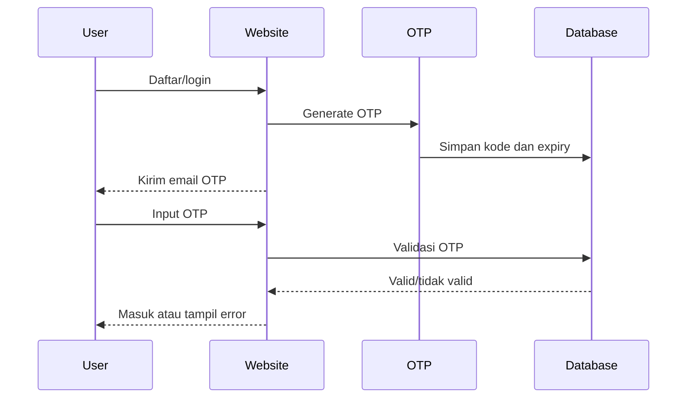
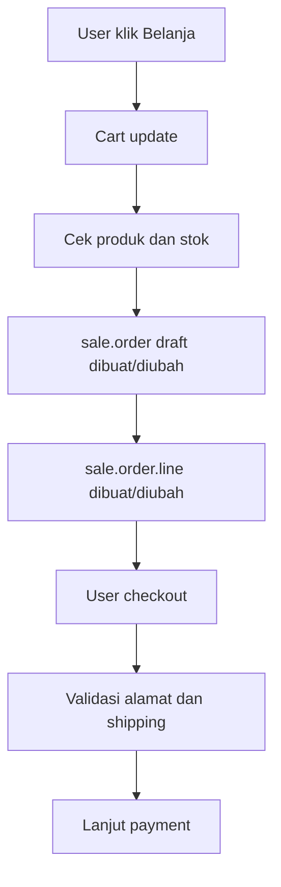
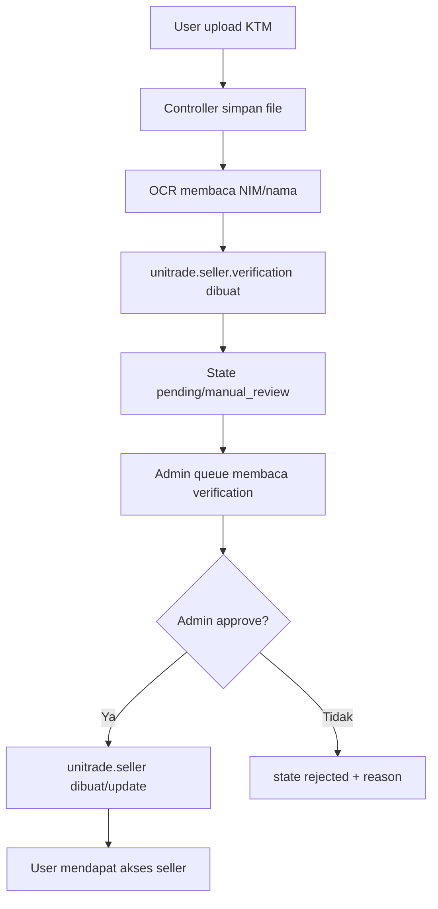
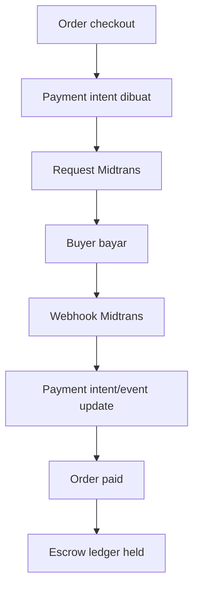
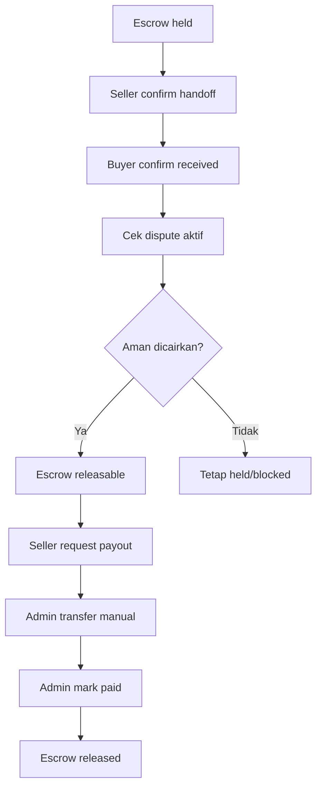

# 03. Feature Workflows

Dokumen ini menjelaskan cara kerja fitur UniTrade dari sisi alur bisnis, service yang terlibat, dan data yang berubah. Untuk lokasi class/function detail, buka `04-code-map-functions.md`.

## 1. OTP, Login, Signup, Profile

Tujuan: memastikan user yang daftar/login benar-benar memegang email yang digunakan, lalu bisa mengatur profile dan alamat.

Service/module:

| Service/module | Peran |
| --- | --- |
| `unitrade_theme` | Login, signup, OTP, profile, alamat |
| Odoo mail | Mengirim email OTP |
| `unitrade.otp` | Menyimpan dan validasi OTP |
| `res.users`, `res.partner` | Akun dan profile |

Flow OTP:

Data berubah:

| Model | Perubahan |
| --- | --- |
| `res.users` | Akun dibuat/diaktifkan |
| `res.partner` | Profile/kontak/alamat |
| `unitrade.otp` | OTP dibuat, expired, verified |
| `unitrade.security.activity` | Aktivitas keamanan |

Hal penting:

- OTP punya masa berlaku dan rate limit.
- Error alamat biasanya berasal dari validasi controller profile.
- Label alamat seperti Rumah/Kantor/Sekolah harus berasal dari input user, bukan otomatis asal terisi.

## 2. Shop, Detail Produk, Wishlist

Tujuan: user melihat produk, filter produk, melihat detail seller, menyimpan wishlist, dan mulai chat/order.

Service/module:

| Module | Peran |
| --- | --- |
| `unitrade_theme` | UI shop/detail |
| `unitrade_product_ext` | Field marketplace produk |
| `unitrade_review` | Rating/review |
| `unitrade_wishlist` | Wishlist |
| `unitrade_chat` | Tombol chat seller |

Flow:

1. User membuka `/shop`.
2. Sistem mencari `product.template` yang publish dan valid.
3. Filter lokasi/harga/kondisi/kategori membentuk domain pencarian.
4. Detail produk mengambil data seller dari `x_seller_id`.
5. Status online seller dihitung dari data aktivitas, bukan hardcode.
6. Wishlist membuat/menghapus record `unitrade.wishlist`.

Data utama:

- `product.template`
- `unitrade.seller`
- `unitrade.review`
- `unitrade.wishlist`
- `res.users` untuk online status

Debug cepat:

- Produk tidak tampil: cek `product.template`, publish status, listing status, seller status.
- Wishlist salah: cek pasangan `user_id` dan `product_id`.
- Seller selalu aktif: cek sumber online status di `res.users`/chat presence.

## 3. Cart dan Checkout

Tujuan: user menambah produk ke cart, validasi stok, memilih alamat/pengiriman, lalu lanjut payment.

Service/module:

| Module | Peran |
| --- | --- |
| `unitrade_theme` | Cart, checkout, voucher, shipping UI |
| Odoo `website_sale` | Dasar cart/order website |
| `unitrade_payment` | Lanjut ke payment |
| `unitrade_product_ext` | Validasi produk marketplace |

Flow:

Data berubah:

| Model | Perubahan |
| --- | --- |
| `sale.order` | Cart/order draft |
| `sale.order.line` | Produk, qty, harga |
| `res.partner` | Alamat checkout jika diubah |
| `unitrade.voucher` | Voucher dipakai jika ada |

Hal penting:

- Cart kosong tetap memakai empty state UI.
- Cart di Odoo adalah `sale.order` yang belum dibayar.
- Stok harus dicek sebelum checkout.

## 4. Seller Onboarding dan Verifikasi KTM

Tujuan: user hanya bisa menjadi seller setelah KTM disetujui.

Service/module:

| Module/service | Peran |
| --- | --- |
| `unitrade_seller` | Submit KTM, OCR, seller status |
| OCR/PaddleOCR | Membaca NIM/nama dari gambar |
| `unitrade_admin` | Queue dan approval admin |
| `unitrade_notification` | Notifikasi status pengajuan |

Flow:

Data berubah:

| Model | Perubahan |
| --- | --- |
| `unitrade.seller.verification` | Pengajuan KTM dan state |
| `unitrade.seller` | Seller dibuat/update |
| `res.users` | Flag seller disinkronkan |
| `ir.attachment` | File KTM |
| `unitrade.notification` | Notifikasi status |

Hal penting:

- Admin queue harus membaca `unitrade.seller.verification`.
- User yang sudah seller harus benar-benar punya record `unitrade.seller`.
- Admin harus bisa revoke seller kapan pun.

## 5. Seller Dashboard dan Product Management

Tujuan: seller mengelola toko, produk, order, chat, dan payout.

Flow produk:

1. Seller terverifikasi membuka dashboard.
2. Seller tambah produk.
3. Seller mengisi nama, kategori, harga, stok, kondisi, lokasi, dan media.
4. Produk masuk ke `product.template`.
5. Produk tampil di shop jika valid/publish.
6. Admin bisa moderasi produk.

Data berubah:

| Model | Perubahan |
| --- | --- |
| `unitrade.seller` | Data toko dan setting seller |
| `product.template` | Produk seller |
| `product.image` | Gambar produk |
| `unitrade.payment.intent` | Jika ada listing fee |

Hal penting:

- Minimal gambar produk perlu divalidasi di UI/business rule sesuai kebutuhan.
- Jika seller revoked, produk marketplace seller sebaiknya tidak aktif.

## 6. Payment Midtrans dan Escrow

Tujuan: buyer membayar order, dana ditahan dulu, lalu dilepas setelah order selesai.

Service/module:

| Service/module | Peran |
| --- | --- |
| `unitrade_payment` | Payment intent, webhook, escrow |
| Midtrans | Provider pembayaran |
| `unitrade_notification` | Notifikasi payment/order |
| `unitrade_dispute` | Menahan dana jika ada refund |

Flow:

Data berubah:

| Model | Perubahan |
| --- | --- |
| `unitrade.payment.intent` | Status payment dan payload |
| `unitrade.payment.event` | Log webhook |
| `sale.order` | Status payment/order |
| `unitrade.escrow.ledger` | Dana seller state held |

Hal penting:

- Webhook harus valid signature dan idempotent.
- Payment event disimpan untuk audit.
- Escrow bisa dibuat per seller/order line.

## 7. Delivery, Confirm Received, Payout

Tujuan: dana seller baru bisa cair setelah barang diserahkan dan order selesai.

Flow:

Data berubah:

| Model | Perubahan |
| --- | --- |
| `unitrade.delivery` | Status pengiriman |
| `unitrade.escrow.ledger` | held -> releasable -> released |
| `unitrade.seller.payout` | Request payout |
| `unitrade.admin.audit.log` | Log admin mark paid |

Syarat umum payout:

- Ledger sudah `releasable`.
- Tidak ada dispute aktif.
- Ledger belum masuk payout aktif lain.
- Seller punya rekening payout.
- Admin memproses manual transfer lalu mark paid.

## 8. Refund dan Dispute

Tujuan: buyer bisa mengajukan refund jika order bermasalah.

Flow:

1. Buyer membuka form refund dari order.
2. Buyer mengisi alasan dan bukti.
3. Sistem membuat `unitrade.dispute`.
4. Bukti masuk `unitrade.dispute.evidence`.
5. Timeline masuk `unitrade.dispute.timeline`.
6. Escrow terkait ditahan.
7. Seller/admin memberi respon.
8. Admin approve/reject.
9. Escrow mengikuti keputusan.

Data berubah:

- `unitrade.dispute`
- `unitrade.dispute.evidence`
- `unitrade.dispute.timeline`
- `unitrade.escrow.ledger`
- `unitrade.notification`

## 9. Chat Buyer-Seller

Tujuan: buyer dan seller bisa komunikasi terkait produk/order.

Service/module:

| Module/service | Peran |
| --- | --- |
| `unitrade_chat` | Conversation, message, report |
| Odoo bus | Realtime update |
| `unitrade_notification` | Notifikasi chat |
| `unitrade_theme` | Status online di detail produk |

Flow:

1. Buyer klik chat seller.
2. Sistem mencari conversation buyer-seller-produk.
3. Jika belum ada, conversation dibuat.
4. Pesan disimpan ke `unitrade.chat.message`.
5. Odoo bus mengirim realtime update.
6. Notification hook membuat notifikasi chat.
7. Presence memperbarui online status.

Data berubah:

- `unitrade.chat.conversation`
- `unitrade.chat.message`
- `res.users` last seen/presence
- `unitrade.notification`

## 10. Notification

Tujuan: user/seller/admin mendapat informasi event penting.

Flow:

1. Event terjadi, misalnya payment sukses, order dikirim, chat masuk, review baru.
2. Hook pada module terkait memanggil notification service.
3. `unitrade.notification.emit` membuat record.
4. Idempotency key mencegah duplikasi.
5. Action URL dihitung dari payload/reference.
6. Navbar dan halaman notifikasi menampilkan unread count.
7. Saat diklik, notifikasi redirect ke target.

Data berubah:

- `unitrade.notification`
- `unitrade.notification.preference`
- `unitrade.announcement`
- `mail.message` jika email/chatter digunakan

Hal penting:

- Notifikasi "Pesanan dikirim" harus membawa order ID.
- URL buyer order status adalah `/unitrade/order/status/[order_id]`.
- Seller notification dan user notification punya scope berbeda.

## 11. Review, Helpful, Report

Tujuan: buyer memberi ulasan, user lain bisa vote membantu, dan review bermasalah bisa dilaporkan.

Flow:

1. Buyer menyelesaikan order.
2. Sistem cek order boleh direview.
3. Review dibuat di `unitrade.review`.
4. Statistik rating produk diperbarui.
5. Helpful membuat/menghapus record `unitrade.review.helpful`.
6. Report membuat `unitrade.review.report`.
7. Admin bisa moderasi report.

Data berubah:

- `unitrade.review`
- `unitrade.review.helpful`
- `unitrade.review.report`
- `product.template` rating/statistik

Aturan:

- Satu user hanya boleh satu helpful vote per review.
- Klik ulang helpful membatalkan vote.
- Satu user hanya boleh report review yang sama satu kali.

## 12. Customer Service AI dan Ticket

Tujuan: user bisa bertanya ke AI dan eskalasi ke CS/admin.

Service/module:

| Module/service | Peran |
| --- | --- |
| `unitrade_cs_ai` | Session AI/live chat |
| Gemini API | Jawaban AI |
| `unitrade_theme` | Ticket CS manual |
| `unitrade_admin` | Queue dan live chat admin |
| Odoo bus | Realtime update |

Flow:

1. User membuka widget CS.
2. Sistem membuat/mengambil `unitrade.cs.session`.
3. AI memberi greeting.
4. User bertanya.
5. Jika AI aktif, Gemini dipanggil.
6. Jika user eskalasi, session menjadi `waiting_admin`.
7. Admin mengambil session.
8. Admin membalas.
9. Session ditutup.

Data berubah:

- `unitrade.cs.session`
- `unitrade.cs.session.message`
- `unitrade.customer.ticket`
- `unitrade.customer.ticket.message`

## 13. Admin Dashboard

Tujuan: admin mengelola data operasional marketplace.

Flow umum:

1. Admin membuka `/unitrade/admin/...`.
2. Controller memastikan user punya akses admin.
3. Controller memanggil `unitrade.admin.stats`.
4. `admin_stats` membaca model terkait.
5. Admin menjalankan action seperti approve KTM, reject KTM, revoke seller, mark payout paid, refund action.
6. Action penting dicatat di `unitrade.admin.audit.log`.

Area admin:

| Area | Data utama |
| --- | --- |
| KTM queue | `unitrade.seller.verification` |
| User/seller management | `res.users`, `unitrade.seller` |
| Product management | `product.template` |
| Transaction | `sale.order`, `unitrade.payment.intent`, `unitrade.escrow.ledger` |
| Payout | `unitrade.seller.payout`, `unitrade.escrow.ledger` |
| Refund | `unitrade.dispute` |
| Review | `unitrade.review`, `unitrade.review.report` |
| CS/live chat | `unitrade.cs.session`, `unitrade.customer.ticket` |
| Audit | `unitrade.admin.audit.log` |

## 14. Sponsorship dan Halaman Informasi

Tujuan: menerima request sponsorship dan menampilkan halaman informasi/legal.

Data utama:

- `unitrade.sponsorship.request`
- legal/contact/customer service templates

Flow:

1. Visitor membuka halaman sponsorship.
2. Visitor submit form.
3. Sistem menyimpan request.
4. Admin melihat request di dashboard admin.
