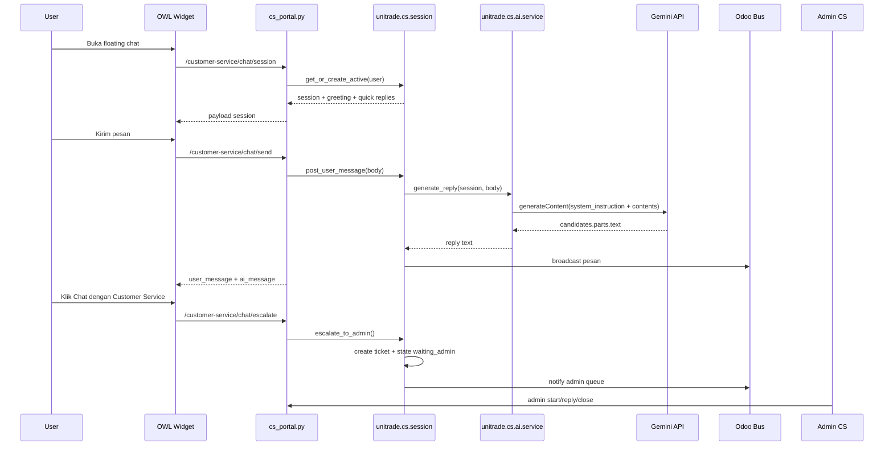

# 06. Dokumentasi Teknis Customer Service AI

Dokumen ini menjelaskan cara kerja fitur Customer Service AI pada UniTrade, mulai dari widget frontend, session chat, prompt Gemini, konteks percakapan, eskalasi admin, data model, konfigurasi, sampai potongan kode inti yang perlu dibaca saat debugging atau pengembangan.

Fitur ini berada di module `unitrade_cs_ai`.

## Ringkasan Fitur

Customer Service AI adalah floating chatbot untuk user yang sudah login. Chatbot ini menggunakan Google Gemini untuk menjawab pertanyaan customer, lalu menyediakan tombol eskalasi ke Customer Service/admin jika masalah perlu ditangani manusia.

Fitur ini punya dua mode utama:

| Mode | State | Penjelasan |
| --- | --- | --- |
| AI aktif | `ai_active` | User bertanya, sistem memanggil Gemini, balasan disimpan sebagai pesan AI |
| Menunggu admin | `waiting_admin` | User menekan tombol eskalasi, sistem membuat ticket dan menunggu admin |
| Admin menangani | `admin_handling` | Admin mengambil sesi dan membalas dari dashboard |
| Selesai | `closed` | Sesi ditutup, frontend akan membuat sesi AI baru saat dibuka lagi |

## File Utama

| File | Peran |
| --- | --- |
| `unitrade_cs_ai/__manifest__.py` | Deklarasi module, dependency, data XML, dan asset frontend |
| `unitrade_cs_ai/views/cs_chat_templates.xml` | Inject mount point floating widget ke `website.layout` |
| `unitrade_cs_ai/static/src/js/cs_chat.js` | OWL component floating chatbot |
| `unitrade_cs_ai/static/src/xml/cs_chat.xml` | Template OWL untuk UI chatbot |
| `unitrade_cs_ai/controllers/cs_portal.py` | JSON route user: bootstrap session, kirim pesan, eskalasi, history |
| `unitrade_cs_ai/controllers/cs_admin.py` | JSON route admin: queue, detail, reply, start, close |
| `unitrade_cs_ai/models/cs_session.py` | Model session, pesan, state, ticket, dan bus realtime |
| `unitrade_cs_ai/models/cs_ai_service.py` | Service prompt, context builder, request Gemini, response parser |
| `unitrade_cs_ai/models/chat_rate_limit.py` | Menambah action rate limit `cs_ai` |
| `unitrade_cs_ai/models/customer_ticket.py` | Extension ticket agar terhubung ke session CS AI |
| `unitrade_cs_ai/data/cs_ai_config.xml` | Default config parameter untuk model, enable flag, jam kerja, rate limit |
| `unitrade_cs_ai/tests/test_cs_ai_service.py` | Test service Gemini dan context limit |
| `unitrade_cs_ai/tests/test_cs_session.py` | Test lifecycle session dan eskalasi |

## Dependency Module

Dari `__manifest__.py`, module ini bergantung pada:

```python
'depends': [
    'website',
    'portal',
    'mail',
    'bus',
    'unitrade_theme',
    'unitrade_chat',
    'unitrade_admin',
],
```

Maknanya:

| Dependency | Dipakai untuk |
| --- | --- |
| `website`, `portal` | Menampilkan widget di website untuk user login |
| `mail` | Infrastruktur pesan dan kebutuhan Odoo umum |
| `bus` | Realtime update antara user dan admin |
| `unitrade_theme` | Layout website dan ticket customer service existing |
| `unitrade_chat` | Reuse model rate limit `unitrade.chat.rate.limit` |
| `unitrade_admin` | Integrasi queue dan live chat admin |

## Cara Widget Dipasang ke Website

Mount point widget ada di `views/cs_chat_templates.xml`.

Kode penting:

```xml
<template id="cs_floating_widget" inherit_id="website.layout"
          name="UniTrade CS Floating Chatbot">
    <xpath expr="//div[@id='wrapwrap']" position="inside">
        <t t-set="ut_csai_path" t-value="request.httprequest.path or ''"/>
        <t t-set="ut_csai_allowed" t-value="ut_csai_path.startswith('/customer-service') or ut_csai_path.startswith('/my/customer-service') or ut_csai_path.startswith('/unitrade/seller') or ut_csai_path.startswith('/my/seller') or ut_csai_path.startswith('/seller') or ut_csai_path in ('/faq', '/help', '/privacy-policy', '/kebijakan-privasi')"/>
        <t t-if="ut_csai_allowed and not request.env.user._is_public()">
            <div id="ut-csai-floating"></div>
        </t>
    </xpath>
</template>
```

Artinya widget hanya muncul pada halaman tertentu dan hanya untuk user yang sudah login. Guest/public user tidak mendapatkan widget.

Asset frontend dimuat lewat `web.assets_frontend`:

```python
'assets': {
    'web.assets_frontend': [
        'unitrade_cs_ai/static/src/css/cs_chat.css',
        'unitrade_cs_ai/static/src/xml/cs_chat.xml',
        'unitrade_cs_ai/static/src/js/cs_chat.js',
    ],
},
```

## Alur End-to-End User



## Route Portal untuk User

Controller: `unitrade_cs_ai/controllers/cs_portal.py`

| Route | Auth | Fungsi |
| --- | --- | --- |
| `/customer-service/chat/session` | `auth='user'` | Membuat/mengambil active session, mengirim history dan quick replies |
| `/customer-service/chat/send` | `auth='user'` | Menyimpan pesan user dan memicu AI jika state `ai_active` |
| `/customer-service/chat/escalate` | `auth='user'` | Mengubah session ke `waiting_admin` dan membuat ticket |
| `/customer-service/chat/history` | `auth='user'` | Mengambil ulang history session |

Potongan kode bootstrap session:

```python
@http.route('/customer-service/chat/session', type='json', auth='user', website=True, methods=['POST'])
def cs_chat_session(self, **kwargs):
    session = request.env['unitrade.cs.session'].get_or_create_active(request.env.user)
    return {
        'success': True,
        'session': session._session_payload(request.env.user),
        'messages': self._history_payload(session),
        'quick_replies': request.env['unitrade.cs.session']._quick_replies(),
    }
```

Potongan kode kirim pesan:

```python
@http.route('/customer-service/chat/send', type='json', auth='user', website=True, methods=['POST'])
def cs_chat_send(self, session_id=None, body=None, **kwargs):
    session = self._active_session(session_id)
    result = session.post_user_message(body)
    payload = {
        'success': True,
        'session': session._session_payload(request.env.user),
        'user_message': result['user_message']._message_payload(),
    }
    if result.get('ai_message'):
        payload['ai_message'] = result['ai_message']._message_payload()
    return payload
```

## Route Admin

Controller: `unitrade_cs_ai/controllers/cs_admin.py`

| Route | Fungsi |
| --- | --- |
| `/unitrade/admin/api/cs/queue` | Mengambil sesi `waiting_admin` dan `admin_handling` |
| `/unitrade/admin/api/cs/detail` | Mengambil detail pesan pada satu session |
| `/unitrade/admin/api/cs/reply` | Admin membalas user |
| `/unitrade/admin/api/cs/start` | Admin mengambil alih session |
| `/unitrade/admin/api/cs/close` | Admin menutup session |

Admin gate:

```python
def _is_admin(self):
    user = request.env.user
    return (
        user.has_group('unitrade_seller.group_unitrade_admin')
        or user.has_group('base.group_system')
    )
```

Queue admin hanya berisi session yang sudah dieskalasi atau sedang ditangani:

```python
sessions = request.env['unitrade.cs.session'].sudo().search([
    ('state', 'in', ('waiting_admin', 'admin_handling')),
], order='last_activity desc')
```

## Model Session

Model: `unitrade.cs.session`

File: `unitrade_cs_ai/models/cs_session.py`

Field penting:

| Field | Tipe | Fungsi |
| --- | --- | --- |
| `user_id` | `Many2one('res.users')` | Customer pemilik session |
| `partner_id` | `Many2one('res.partner')` | Kontak customer |
| `ticket_id` | `Many2one('unitrade.customer.ticket')` | Ticket jika session dieskalasi |
| `order_id` | `Many2one('sale.order')` | Pesanan terkait, saat ini belum dipakai sebagai konteks AI |
| `state` | `Selection` | State session: `ai_active`, `waiting_admin`, `admin_handling`, `closed` |
| `assigned_admin_id` | `Many2one('res.users')` | Admin yang menangani |
| `ai_enabled` | `Boolean` | Apakah AI aktif pada session |
| `message_ids` | `One2many` | Daftar pesan |
| `last_activity` | `Datetime` | Urutan queue dan aktivitas terakhir |
| `escalated_at` | `Datetime` | Waktu eskalasi ke admin |
| `bus_token` | `Char` | Token channel realtime |

State definition:

```python
state = fields.Selection([
    ('ai_active', 'AI Aktif'),
    ('waiting_admin', 'Menunggu Admin'),
    ('admin_handling', 'Ditangani Admin'),
    ('closed', 'Selesai'),
], string='Status', default='ai_active', required=True, index=True, copy=False)
```

## Model Message

Model: `unitrade.cs.session.message`

Field penting:

| Field | Fungsi |
| --- | --- |
| `session_id` | Session pemilik pesan |
| `author_type` | `user`, `ai`, atau `admin` |
| `author_user_id` | User pengirim jika pesan user/admin |
| `body` | Isi pesan |
| `is_ai` | Flag otomatis jika `author_type == 'ai'` |

Saat message dibuat, session `last_activity` diperbarui dan pesan dikirim lewat bus:

```python
@api.model_create_multi
def create(self, vals_list):
    for vals in vals_list:
        vals['is_ai'] = vals.get('author_type') == 'ai'
    messages = super().create(vals_list)
    now = fields.Datetime.now()
    for message in messages:
        message.session_id.sudo().write({'last_activity': now})
        message._notify_bus()
    return messages
```

Payload pesan untuk frontend:

```python
def _message_payload(self):
    self.ensure_one()
    body = self.body or ''
    if self.author_type in ('ai', 'admin'):
        body = body.replace('Chat dengan Admin', 'Chat dengan Customer Service')
        body = body.replace('admin UniTrade', 'Customer Service UniTrade')
    author_label = {
        'user': self.author_user_id.name or _('Customer'),
        'ai': _('Asisten AI'),
        'admin': self.author_user_id.name or _('Customer Service UniTrade'),
    }.get(self.author_type, _('UniTrade'))
    return {
        'id': self.id,
        'session_id': self.session_id.id,
        'author_type': self.author_type,
        'author_name': author_label,
        'body': body,
        'is_ai': self.is_ai,
        'time': self.create_date.strftime('%H:%M') if self.create_date else '',
        'date': self.create_date.strftime('%d %B %Y') if self.create_date else '',
    }
```

## Cara Session Dibuat

Function utama: `get_or_create_active`

```python
@api.model
def get_or_create_active(self, user=None):
    user = (user or self.env.user)
    if user._is_public():
        raise AccessError(_('Login diperlukan untuk memakai Customer Service.'))
    session = self.sudo().search([
        ('user_id', '=', user.id),
        ('state', '!=', 'closed'),
    ], order='last_activity desc, id desc', limit=1)
    if session:
        return session
    ai_enabled = self.env['unitrade.cs.ai.service']._ai_enabled()
    session = self.sudo().create({
        'user_id': user.id,
        'partner_id': user.partner_id.id,
        'ai_enabled': ai_enabled,
        'state': 'ai_active' if ai_enabled else 'waiting_admin',
    })
    session._post_greeting()
    return session
```

Catatan:

- Jika ada session lama yang belum `closed`, session itu dipakai ulang.
- Jika AI aktif, session baru dimulai dengan state `ai_active`.
- Jika AI nonaktif, session baru langsung `waiting_admin`.
- Greeting dibuat otomatis oleh `_post_greeting`.

Greeting:

```python
greeting = _(
    'Halo %s, saya asisten Customer Service UniTrade. Ada yang bisa saya bantu? '
    'Kamu juga bisa memilih "Chat dengan Customer Service" kapan saja.'
) % (self.user_id.name or _('Customer'))
```

## Cara User Message Memicu AI

Function utama: `post_user_message`

```python
def post_user_message(self, body):
    self.ensure_one()
    self._check_participant()
    body = (body or '').strip()
    if not body:
        raise UserError(_('Pesan tidak boleh kosong.'))
    if self.state == 'closed':
        raise UserError(_('Sesi sudah ditutup. Mulai percakapan baru untuk melanjutkan.'))
    body = body[:2000]
    user_message = self._create_message('user', body, author_user=self.env.user)

    ai_message = False
    if self.state == 'ai_active' and self.ai_enabled:
        ai_message = self._maybe_generate_ai_reply(body)
    return {
        'user_message': user_message,
        'ai_message': ai_message,
    }
```

Catatan:

- Pesan user tetap disimpan walaupun AI gagal.
- Pesan dipotong maksimum 2000 karakter.
- AI hanya dipanggil saat `state == 'ai_active'` dan `ai_enabled == True`.
- Kalau session sudah `waiting_admin` atau `admin_handling`, pesan hanya disimpan dan tidak memanggil AI.

## Cara Kerja Rate Limit

Rate limit memakai model existing `unitrade.chat.rate.limit` dari module `unitrade_chat`.

Extension di `chat_rate_limit.py`:

```python
class ChatRateLimitCsAi(models.Model):
    _inherit = 'unitrade.chat.rate.limit'

    action = fields.Selection(
        selection_add=[('cs_ai', 'CS AI Message')],
        ondelete={'cs_ai': 'cascade'},
    )
```

Saat AI akan dipanggil:

```python
self.env['unitrade.chat.rate.limit'].check(
    self.env.user, CS_AI_RATE_ACTION, service._rate_limit(),
)
```

Default limit ada di `data/cs_ai_config.xml`:

```xml
<record id="cs_ai_rate_limit_param" model="ir.config_parameter">
    <field name="key">unitrade.cs.ai_rate_limit</field>
    <field name="value">10</field>
</record>
```

Jika limit terlampaui, AI tidak dipanggil dan user mendapat pesan:

```python
'Terlalu banyak permintaan. Coba lagi sebentar, atau pilih "Chat dengan Customer Service".'
```

## Service Gemini

Model service: `unitrade.cs.ai.service`

File: `unitrade_cs_ai/models/cs_ai_service.py`

Konstanta:

```python
GEMINI_API_BASE = 'https://generativelanguage.googleapis.com/v1beta/models'
GEMINI_TIMEOUT_SECONDS = 20
AI_HISTORY_LIMIT = 5
GEMINI_MAX_RETRIES = 3
GEMINI_RETRY_BACKOFF = 1.2
GEMINI_RETRYABLE_STATUS = (500, 502, 503, 504)
```

Makna:

| Konstanta | Fungsi |
| --- | --- |
| `GEMINI_API_BASE` | Base URL Gemini |
| `GEMINI_TIMEOUT_SECONDS` | Timeout request Gemini |
| `AI_HISTORY_LIMIT` | Jumlah pesan history yang dikirim ke AI |
| `GEMINI_MAX_RETRIES` | Total percobaan request |
| `GEMINI_RETRY_BACKOFF` | Delay retry progresif |
| `GEMINI_RETRYABLE_STATUS` | HTTP status yang boleh dicoba ulang |

## Konfigurasi `ir.config_parameter`

Default config ada di `unitrade_cs_ai/data/cs_ai_config.xml`.

| Key | Default | Fungsi |
| --- | --- | --- |
| `unitrade.gemini.model` | `gemini-2.5-flash` | Nama model Gemini |
| `unitrade.cs.ai_enabled` | `True` | Mengaktifkan atau mematikan AI |
| `unitrade.cs.office_hours` | `08:00-17:00` | Jam operasional, saat ini belum dipakai di service |
| `unitrade.cs.ai_rate_limit` | `10` | Batas request AI per user/action |
| `unitrade.gemini.api_key` | kosong | API key Gemini, wajib diisi admin |

API key tidak boleh hardcode. Service mengambil API key dari system parameter:

```python
def _api_key(self):
    return (self._config('unitrade.gemini.api_key', '') or '').strip()
```

## System Prompt Saat Ini

System prompt dibuat oleh `_build_system_prompt(session)`.

Kode saat ini:

```python
def _build_system_prompt(self, session):
    return _(
        "Kamu adalah asisten Customer Service UniTrade, marketplace jual-beli C2C "
        "untuk mahasiswa UNISA Yogyakarta. Jawab dengan ramah, ringkas, dan dalam "
        "Bahasa Indonesia. Bantu pertanyaan seputar cara belanja, pembayaran (Midtrans), "
        "pengiriman (Ambil Sendiri / GoSend), status escrow, dan kebijakan umum. "
        "Jika pertanyaan menyangkut data pribadi, pembatalan kompleks, refund, sengketa, "
        "atau hal yang tidak kamu ketahui, sarankan customer menekan tombol "
        "'Chat dengan Customer Service'. Jangan mengarang kebijakan yang tidak pasti."
    )
```

Prompt ini mengatur persona, bahasa, ruang lingkup, dan batasan jawaban.

Isi prompt dibagi menjadi:

| Bagian | Isi | Efek |
| --- | --- | --- |
| Persona | "asisten Customer Service UniTrade" | AI menjawab sebagai CS UniTrade |
| Domain | marketplace C2C mahasiswa UNISA Yogyakarta | AI memahami konteks produk |
| Bahasa | Bahasa Indonesia | Jawaban user-facing memakai Bahasa Indonesia |
| Topik boleh | belanja, pembayaran Midtrans, pengiriman, escrow, kebijakan umum | AI diarahkan ke topik UniTrade |
| Topik eskalasi | data pribadi, pembatalan kompleks, refund, sengketa, tidak tahu | AI menyarankan "Chat dengan Customer Service" |
| Anti-halusinasi | jangan mengarang kebijakan | Mengurangi jawaban spekulatif |

## Cara Kerja Konteks Chat

Konteks dikirim oleh `_build_contents(session, user_message)`.

Kode:

```python
def _build_contents(self, session, user_message):
    """Bangun array `contents` Gemini dari 5 pesan terakhir + pesan baru."""
    history = session.message_ids.sorted('id')[-AI_HISTORY_LIMIT:]
    contents = []
    for message in history:
        if message.author_type == 'user':
            role = 'user'
        else:
            role = 'model'
        contents.append({'role': role, 'parts': [{'text': message.body or ''}]})
    if not contents or contents[-1]['role'] != 'user':
        contents.append({'role': 'user', 'parts': [{'text': user_message or ''}]})
    return contents
```

Aturan context:

- Hanya 5 pesan terakhir yang dikirim ke Gemini.
- Pesan dari user dikirim sebagai role `user`.
- Pesan dari AI dan admin dikirim sebagai role `model`.
- Pesan terbaru user ditambahkan jika history belum berakhir dengan role `user`.
- Saat ini belum ada konteks order, produk, ticket, atau data pribadi yang dikirim ke Gemini.

Implikasi:

- AI tidak tahu detail pesanan user kecuali user menulisnya di chat.
- AI tidak membaca database order langsung.
- Ini lebih aman untuk privasi, tetapi jawaban detail order harus dieskalasi ke CS/admin.

## Payload ke Gemini

Payload utama dibuat di `generate_reply`.

Kode:

```python
payload = {
    'system_instruction': {'parts': [{'text': self._build_system_prompt(session)}]},
    'contents': self._build_contents(session, user_message),
    'generationConfig': {'temperature': 0.4, 'maxOutputTokens': 512},
}
```

Makna:

| Field | Fungsi |
| --- | --- |
| `system_instruction` | Prompt sistem untuk membatasi persona dan domain |
| `contents` | Riwayat chat dan pesan user terbaru |
| `temperature` | 0.4, jawaban cukup stabil dan tidak terlalu kreatif |
| `maxOutputTokens` | Maksimum panjang jawaban AI |

Request dikirim ke URL:

```python
url = '%s/%s:generateContent?key=%s' % (GEMINI_API_BASE, self._model_name(), api_key)
```

## Retry dan Error Handling Gemini

Service mencoba request sampai 3 kali untuk error sementara:

```python
for attempt in range(1, GEMINI_MAX_RETRIES + 1):
    try:
        response = requests.post(url, data=body, headers=headers, timeout=GEMINI_TIMEOUT_SECONDS)
    except requests.RequestException as error:
        ...
        if attempt < GEMINI_MAX_RETRIES:
            time.sleep(GEMINI_RETRY_BACKOFF * attempt)
            continue
        raise UserError(_('Gagal menghubungi layanan AI. Coba lagi sebentar.')) from error
```

Status yang di-retry:

```python
GEMINI_RETRYABLE_STATUS = (500, 502, 503, 504)
```

Status khusus:

| Status | Handling |
| --- | --- |
| `429` | UserError: batas pemakaian AI tercapai |
| `>= 400` selain retryable | UserError: layanan AI menolak permintaan |
| JSON tidak valid | UserError: respons AI tidak valid |
| Response kosong | Ditangani di session sebagai fallback |

Jika AI gagal, `_maybe_generate_ai_reply` tetap membuat pesan fallback:

```python
return self._create_message('ai', _(
    'Maaf, asisten AI sedang tidak tersedia saat ini. '
    'Silakan pilih "Chat dengan Customer Service" agar tim kami membantu kamu.'
))
```

## Cara Balasan Gemini Diambil

Function `_extract_text` mengambil `candidates[0].content.parts[].text`.

Kode:

```python
def _extract_text(self, data):
    candidates = (data or {}).get('candidates') or []
    if not candidates:
        return ''
    parts = (candidates[0].get('content') or {}).get('parts') or []
    texts = [part.get('text', '') for part in parts if part.get('text')]
    return '\n'.join(texts).strip()
```

Jika tidak ada text, return string kosong. Session akan menganggapnya error dan membuat fallback message.

## Cara Eskalasi ke Admin

User menekan tombol "Chat dengan Customer Service" dari widget. Frontend memanggil route:

```javascript
const result = await jsonrpc("/customer-service/chat/escalate", {
    session_id: this.state.session.id,
});
```

Backend memanggil `session.escalate_to_admin()`.

Kode inti:

```python
def escalate_to_admin(self):
    self.ensure_one()
    self._check_participant()
    if self.state == 'closed':
        raise UserError(_('Sesi sudah ditutup.'))
    if self.state in ('waiting_admin', 'admin_handling'):
        return self
    ticket = self._ensure_ticket()
    self.sudo().write({
        'state': 'waiting_admin',
        'ticket_id': ticket.id,
        'escalated_at': fields.Datetime.now(),
    })
    self._create_message('ai', _(
        'Kamu sedang dihubungkan dengan Customer Service UniTrade. Mohon tunggu sebentar ya.'
    ))
    self._notify_admin_queue()
    return self
```

Efek eskalasi:

- Membuat atau memakai ulang ticket.
- Mengubah state session menjadi `waiting_admin`.
- Menyimpan waktu eskalasi.
- Menambah pesan AI bahwa user sedang dihubungkan ke CS.
- Mengirim event bus ke queue admin.

## Cara Ticket Dibuat

Function `_ensure_ticket` membuat record `unitrade.customer.ticket`.

Kode inti:

```python
ticket = Ticket.create({
    'user_id': self.user_id.id,
    'partner_id': (self.partner_id or self.user_id.partner_id).id,
    'category': 'contact_cs',
    'title': title,
    'description': description,
    'cs_session_id': self.id,
    'ai_handled': True,
    'escalated_at': fields.Datetime.now(),
})
```

Description ticket berisi transcript singkat:

```python
description = '\n'.join(
    '%s: %s' % (m.author_type.upper(), m.body)
    for m in self.message_ids.sorted('id')
)[:5000] or _('Percakapan Customer Service via chat AI.')
```

Extension ticket ada di `models/customer_ticket.py`:

```python
class CustomerTicketCsAi(models.Model):
    _inherit = 'unitrade.customer.ticket'

    cs_session_id = fields.Many2one(
        'unitrade.cs.session',
        string='Sesi CS AI',
        index=True,
        ondelete='set null',
        copy=False,
    )
    ai_handled = fields.Boolean(string='Pernah Ditangani AI', default=False, copy=False)
    escalated_at = fields.Datetime(string='Waktu Eskalasi', copy=False)
```

## Realtime dengan Odoo Bus

Setiap session memiliki `bus_token`.

Target channel:

```python
def _bus_target(self):
    self.ensure_one()
    if not self.bus_token:
        self.sudo().write({'bus_token': str(uuid.uuid4())})
    return 'unitrade_cs_session_%s' % self.bus_token
```

Message baru dikirim ke channel session:

```python
self.env['bus.bus'].sudo()._sendone(
    self.session_id._bus_target(),
    'unitrade_cs_message',
    {
        'session_id': self.session_id.id,
        'message': self._message_payload(),
        'state': self.session_id.state,
    },
)
```

Queue admin diberi notifikasi:

```python
self.env['bus.bus'].sudo()._sendone(
    self._admin_queue_target(),
    'unitrade_cs_queue_update',
    {'session_id': self.id, 'user_name': self.user_id.name, 'state': self.state},
)
```

## Cara Frontend Bekerja

Frontend ada di `static/src/js/cs_chat.js` dan template `static/src/xml/cs_chat.xml`.

State OWL:

```javascript
this.state = useState({
    open: false,
    loading: false,
    sending: false,
    aiTyping: false,
    error: "",
    session: { id: 0, state: "ai_active", can_escalate: true },
    messages: [],
    quickReplies: [],
});
```

Saat user membuka widget:

```javascript
async toggle() {
    this.state.open = !this.state.open;
    if (this.state.open && !this.bootstrapped) {
        await this.bootstrap();
    } else if (this.state.open) {
        this.scrollToBottom();
    }
}
```

Bootstrap:

```javascript
const result = await jsonrpc("/customer-service/chat/session", {});
this.bootstrapped = true;
this.state.session = result.session;
this.state.messages = result.messages || [];
this.state.quickReplies = result.quick_replies || [];
this.subscribe(result.session.bus_channel);
```

Kirim pesan:

```javascript
const result = await jsonrpc("/customer-service/chat/send", {
    session_id: this.state.session.id,
    body,
});
this.state.session = result.session;
this.appendIfNew(result.user_message);
if (result.ai_message) {
    this.appendIfNew(result.ai_message);
}
```

Subscribe bus:

```javascript
this.busService.addChannel(channel);
this.busService.subscribe("unitrade_cs_message", (payload) => this.onBusMessage(payload));
this.busService.start();
```

Jika session ditutup, frontend membuat session AI baru:

```javascript
if (payload.state === "closed" && !wasClosed) {
    window.setTimeout(() => this.reconnectAi(), 1600);
}
```

## Quick Replies

Quick replies didefinisikan di model session:

```python
@api.model
def _quick_replies(self):
    return [
        'Bagaimana cara melakukan pembayaran?',
        'Bagaimana proses pengiriman GoSend?',
        'Bagaimana cara refund / pengembalian?',
        'Pesanan saya belum sampai, apa yang harus saya lakukan?',
    ]
```

Quick replies hanya tampil saat:

- State session `ai_active`.
- Belum ada pesan user.
- List quick replies tidak kosong.

Frontend:

```javascript
get showQuickReplies() {
    return (
        this.state.session.state === "ai_active"
        && this.state.quickReplies.length
        && this.state.messages.filter((m) => m.author_type === "user").length === 0
    );
}
```

## Keamanan dan Akses

ACL ada di `security/ir.model.access.csv`.

| Access | Group | Hak |
| --- | --- | --- |
| `access_cs_session_user` | `base.group_user` | read/write/create, tidak unlink |
| `access_cs_session_admin` | `unitrade_seller.group_unitrade_admin` | full CRUD |
| `access_cs_session_message_user` | `base.group_user` | read/write/create, tidak unlink |
| `access_cs_session_message_admin` | `unitrade_seller.group_unitrade_admin` | full CRUD |

Validasi peserta dilakukan manual:

```python
def _check_participant(self, user=None):
    user = user or self.env.user
    for record in self:
        if record.user_id.id != user.id and not record._is_admin(user):
            raise AccessError(_('Kamu tidak punya akses ke percakapan ini.'))
    return True
```

Catatan:

- User hanya boleh membuka session miliknya.
- Admin boleh membuka session customer.
- Controller portal memakai `auth='user'`, jadi guest tidak bisa memakai chat.
- Banyak operasi memakai `sudo()` setelah validasi participant/admin.

## Cara AI Dibatasi ke Topik UniTrade

Saat ini pembatasan utama ada pada system prompt. Prompt sudah menyebut AI harus menjawab seputar UniTrade dan menyarankan eskalasi untuk hal yang tidak diketahui.

Namun prompt saja bukan hard rule. Model masih bisa terpancing menjawab pertanyaan umum jika user bertanya di luar domain. Untuk membuat AI benar-benar tidak menjawab hal umum, tambahkan guard deterministik sebelum memanggil Gemini.

Rekomendasi function:

```python
def _is_unitrade_related(self, message):
    text = (message or '').lower()
    keywords = (
        'unitrade', 'pesanan', 'order', 'produk', 'seller', 'penjual',
        'pembeli', 'pembayaran', 'midtrans', 'refund', 'komplain',
        'sengketa', 'escrow', 'gosend', 'pengiriman', 'ambil sendiri',
        'ktm', 'verifikasi', 'akun', 'wishlist', 'voucher', 'checkout',
        'keranjang', 'rating', 'ulasan', 'chat cs', 'customer service',
    )
    return any(keyword in text for keyword in keywords)
```

Rekomendasi fallback:

```python
def _out_of_scope_reply(self):
    return _(
        'Maaf, saya hanya bisa membantu pertanyaan seputar UniTrade, '
        'seperti belanja, pembayaran, pengiriman, seller, refund, akun, dan pesanan.'
    )
```

Tempat pemakaian di awal `generate_reply`:

```python
def generate_reply(self, session, user_message):
    if not self._is_unitrade_related(user_message):
        return self._out_of_scope_reply()
    ...
```

Dengan pola ini:

- Pertanyaan umum tidak dikirim ke Gemini.
- Biaya token lebih hemat.
- Jawaban out-of-scope konsisten.
- Risiko AI menjawab hal di luar UniTrade jauh lebih kecil.

Prompt juga sebaiknya diperketat menjadi:

```python
def _build_system_prompt(self, session):
    return _(
        "Kamu adalah asisten Customer Service UniTrade, marketplace jual-beli C2C "
        "untuk mahasiswa UNISA Yogyakarta. Kamu hanya boleh menjawab pertanyaan "
        "yang berhubungan dengan UniTrade: cara belanja, produk, seller, akun, "
        "pembayaran Midtrans, pengiriman Ambil Sendiri atau GoSend, escrow, "
        "refund, sengketa, rating, ulasan, voucher, wishlist, dan customer service. "
        "Jika user bertanya topik umum di luar UniTrade, jangan menjawab isi pertanyaannya. "
        "Balas singkat: 'Maaf, saya hanya bisa membantu pertanyaan seputar UniTrade.' "
        "Jika pertanyaan menyangkut data pribadi, pembatalan kompleks, refund, sengketa, "
        "atau hal yang tidak kamu ketahui, sarankan customer menekan tombol "
        "'Chat dengan Customer Service'. Jangan mengarang kebijakan yang tidak pasti."
    )
```

## Test yang Sudah Ada

Test service:

| Test | Tujuan |
| --- | --- |
| `test_no_api_key_raises` | API key kosong harus raise UserError |
| `test_success_returns_text` | Response Gemini sukses menghasilkan text |
| `test_rate_limit_error_raises` | HTTP 429 menghasilkan UserError |
| `test_ai_failure_keeps_user_message` | Pesan user tetap tersimpan walau AI gagal |
| `test_context_limited_to_five` | Context maksimal 5 history + pesan baru |

Test session:

| Test | Tujuan |
| --- | --- |
| `test_new_session_ai_active` | Session baru masuk state `ai_active` |
| `test_get_or_create_reuses_active` | Session aktif dipakai ulang |
| `test_user_message_triggers_ai` | Pesan user memicu balasan AI |
| `test_escalation_sets_state_and_ticket` | Eskalasi membuat ticket dan state `waiting_admin` |
| `test_escalation_idempotent_no_duplicate_ticket` | Eskalasi berulang tidak membuat ticket dobel |
| `test_no_ai_when_waiting_admin` | AI tidak dipanggil saat menunggu admin |
| `test_closed_session_rejects_message` | Session closed menolak pesan baru |

Jika guard domain-only ditambahkan, test yang perlu ditambah:

```python
def test_out_of_scope_message_does_not_call_gemini(self):
    with patch('odoo.addons.unitrade_cs_ai.models.cs_ai_service.requests.post') as mocked:
        reply = self.service.generate_reply(self.session, 'Siapa presiden Indonesia?')
        mocked.assert_not_called()
    self.assertIn('seputar UniTrade', reply)
```

## Cara Debug

### AI tidak muncul

Periksa:

1. User sudah login.
2. Path halaman termasuk `ut_csai_allowed`.
3. Element `#ut-csai-floating` ada di HTML.
4. Asset `unitrade_cs_ai/static/src/js/cs_chat.js` masuk ke `web.assets_frontend`.
5. Module `unitrade_cs_ai` sudah di-upgrade setelah perubahan XML/asset.

### AI tidak menjawab

Periksa:

1. `unitrade.cs.ai_enabled` bernilai `True`.
2. `unitrade.gemini.api_key` sudah diisi.
3. `unitrade.gemini.model` benar.
4. Rate limit belum habis.
5. Log Odoo untuk error `Gemini request error` atau `Gemini API error`.

### AI menjawab terlalu umum

Periksa:

1. System prompt di `_build_system_prompt`.
2. Tambahkan `_is_unitrade_related` sebelum request Gemini.
3. Tambahkan test out-of-scope.
4. Turunkan `temperature` jika jawaban terlalu bebas.

### Admin tidak menerima queue

Periksa:

1. Session sudah state `waiting_admin`.
2. Ticket sudah terhubung di `ticket_id`.
3. Bus event `_notify_admin_queue` terkirim.
4. User admin punya group `unitrade_seller.group_unitrade_admin` atau `base.group_system`.

## Cara Menambah Konteks Baru

Saat ini AI hanya mendapat history percakapan. Jika ingin menambah konteks UnitTrade tanpa membocorkan data sensitif, buat function khusus yang hanya mengembalikan ringkasan aman.

Contoh pola:

```python
def _safe_unitrade_context(self, session):
    return _(
        "Aturan ringkas UniTrade: pembayaran memakai Midtrans, "
        "pengiriman bisa Ambil Sendiri atau GoSend, dana ditahan escrow "
        "sampai transaksi selesai, dan refund/sengketa ditangani CS/admin."
    )
```

Lalu gabungkan ke system prompt:

```python
'system_instruction': {'parts': [{'text': self._build_system_prompt(session) + "\n\n" + self._safe_unitrade_context(session)}]},
```

Jangan mengirim:

- Password, token, API key.
- Nomor rekening lengkap.
- Bukti identitas/KTM.
- Detail alamat lengkap jika tidak perlu.
- Data order user lain.

## Batasan Implementasi Saat Ini

| Batasan | Dampak |
| --- | --- |
| AI tidak membaca order langsung | Pertanyaan spesifik order harus eskalasi |
| Prompt belum punya hard out-of-scope guard | AI masih mungkin menjawab topik umum |
| `unitrade.cs.office_hours` belum dipakai | AI/admin flow belum berubah berdasarkan jam kerja |
| History hanya 5 pesan | Konteks panjang bisa hilang |
| Admin dan AI sama-sama dipetakan role `model` saat dikirim ke Gemini | Gemini tidak membedakan admin vs AI di history |

## Checklist Saat Mengubah Fitur CS AI

1. Update prompt di `cs_ai_service.py`.
2. Jika menambah config, daftarkan di `data/cs_ai_config.xml`.
3. Jika menambah field/model, update `security/ir.model.access.csv`.
4. Jika menambah route, gunakan `@http.route` dengan auth dan method yang tepat.
5. Jika mengubah QWeb/OWL asset, upgrade module dan rebuild asset jika diperlukan.
6. Tambahkan test di `tests/test_cs_ai_service.py` atau `tests/test_cs_session.py`.
7. Jangan hardcode API key.
8. Jangan kirim data pribadi sensitif ke Gemini.

